# Podsilo UI — design, seam and brand mark

The whole of Podsilo's user interface, in three parts:

| Part | What it decides | Numbered |
|---|---|---|
| **A** (§1–§19) | The UX: what the screens are, what they show, what every gesture does | `§1`…`§19` |
| **B** (§B0–§B17) | The seam: per-screen state, events, effects, and the ports the screens bind to | `§B0`…`§B17` |
| **C** (§C1–§C6) | The brand mark: construction, placements, and how it ships | `§C1`…`§C6` |

A bare `§n` always means Part A. Parts B and C were separate documents (`UI_interface.md`,
`logo.md`) until 2026-08-13; they are one file now because every rule in B and C is a consequence of
a rule in A, and three files meant three places for the same rule to drift.

The companion is [`docs/architecture.md`](architecture.md) — modules, schema, sync semantics.
Where Part A adds a screen or a rule that the architecture implies but does not state, it is marked
**[gap]** in §2's inventory and argued in the section that owns it.

**Vocabulary:** the user-facing word for the "I don't want this file" decision is **Mark as played**
(never "Skip"). The ledger state behind it is still `SKIPPED` and the emitted GPodder action is still
`PLAY` (architecture §6) — internal names are unchanged, only the UI wording.

## Table of contents

### Part A — design

1. [Design principles](#1-design-principles)
2. [Screen inventory](#2-screen-inventory)
3. [Navigation map](#3-navigation-map)
4. [S1 — Podcast list (home)](#4-s1--podcast-list-home)
5. [S2 — Episode list](#5-s2--episode-list)
6. [S3 — Episode detail sheet](#6-s3--episode-detail-sheet)
7. [S4 — Settings](#7-s4--settings)
8. [S5 — Nextcloud connection dialog](#8-s5--nextcloud-connection-dialog)
9. [S6 — Naming template editor](#9-s6--naming-template-editor)
10. [S7 — Activity (downloads & sync)](#10-s7--activity-downloads--sync)
11. [S8 — Error log](#11-s8--error-log)
12. [Cross-cutting: gestures, filters, badges, theme, errors, notifications, a11y](#12-cross-cutting-rules)
13. [Coverage check against the architecture](#13-coverage-check-against-the-architecture)
14. [Decisions that needed an ADR — all three accepted](#14-decisions-that-needed-an-adr--all-three-accepted)
15. [Adaptations to the code as built](#15-adaptations-to-the-code-as-built)
16. [Motion](#16-motion)
17. [Consistency invariants](#17-consistency-invariants)
18. [Iconography](#18-iconography)
19. [Orientation](#19-orientation)

### Part B — the seam

B0. [Rules the seam enforces](#b0-rules-the-seam-enforces) · B1. [Shared types](#b1-shared-types) ·
B2. [S1 state](#b2-s1--podcast-list) · B3. [S2 state](#b3-s2--episode-list) ·
B4. [S3 state](#b4-s3--episode-detail-sheet) · B5. [S4/S5/S6 state](#b5-s4--s5--s6--settings-connection-naming) ·
B6. [S7 state](#b6-s7--activity) · B7. [Progress](#b7-progress-and-the-rule-about-stale-percentages) ·
B8. [Ports](#b8-what-the-screens-bind-to--all-of-it-built) · B9. [Navigation](#b9-navigation) ·
B10. [Theming](#b10-theming) · B11. [Motion mapping](#b11-motion--the-compose-mapping) ·
B12. [Consistency](#b12-consistency-invariants) · B13. [Declared types](#b13-types-referenced-above-declared) ·
B14. [Corner cases](#b14-corner-cases) · B15. [Notifications](#b15-notifications) ·
B16. [Accessibility](#b16-accessibility-contract) · B17. [Icons, technically](#b17-icons--the-technical-half)

### Part C — the brand mark

C1. [The mark](#c1-the-mark) · C2. [Files](#c2-files) ·
C3. [Launcher and system surfaces](#c3-android-launcher-and-system-surfaces) ·
C4. [Where it appears](#c4-where-the-logo-appears-inside-the-app) ·
C5. [What it never does](#c5-what-the-logo-never-does) · C6. [Compose integration](#c6-compose-integration)

---

## 1. Design principles

1. **Triage is the product.** Every screen exists to answer "which episodes do I still have to
   decide about?" and to let a decision be made in one gesture. Nothing else gets prime screen real
   estate.
2. **Obvious over clever.** Plain Material 3 components, standard app bars, standard pull-to-refresh,
   standard swipe-to-action. No custom navigation metaphors, no gesture the user has to discover.
3. **Every gesture has a visible equivalent.** Swipes are an accelerator, never the only path — each
   swipe action also exists as an overflow item on the row and as a button in the detail sheet.
4. **Nothing happens automatically — but bulk actions the user asks for are allowed.** There are no
   auto-download *rules*, no background triage, and no state change inferred from a scroll or a tap on
   the row body (which opens detail only). A user who explicitly taps *Download all* or selects rows
   and acts on them is not automation: it is one deliberate decision applied to many episodes, always
   behind a confirmation naming the count. See §14.3 — this narrows a README statement and needs an
   ADR.
5. **The default view is the small one.** Filters default to "still to decide" everywhere, because a
   podcast catcher's backlog is otherwise unbounded.
6. **Decisions are reversible by acting again.** A swipe carries a ~5 s undo window because a
   gesture can be started by accident (§12.3); every other decision commits
   at once and is fixed by downloading the episode again, not by racing a timer.
7. **State is truthful and local-first.** The UI renders the Room ledger; network activity is shown
   as *activity*, never as a blocking modal. Failures are surfaced but never destructive, and every
   failure is also written to the error log (S8).
8. **Read-only subscriptions.** No add-feed, rename-feed or delete-feed affordance anywhere,
   confirming README's "not a feed manager". The empty state says where feeds come from instead of
   offering a button.

---

## 2. Screen inventory

| ID | Screen | Type | Requested / added |
|---|---|---|---|
| S1 | Podcast list | full screen, **home / start destination** | requested |
| S2 | Episode list (one feed) | full screen | requested |
| S3 | Episode detail | modal bottom sheet | **[gap]** — `Episode.description` is raw HTML/CDATA; a list row cannot render it. Reachable for **every** episode, including greyed-out ones |
| S4 | Settings | full screen | requested |
| S5 | Nextcloud connection | dialog over S4 | requested |
| S6 | Naming template editor | full screen, pushed from S4 | **[gap]** — required by architecture §11 |
| S7 | Activity — downloads & sync | full screen, pushed from S1 | **[gap]** — `QUEUED`/`DOWNLOADING`/`ERROR` and outbox depth need somewhere to live |
| S8 | Error log | full screen, pushed from S4 or S7 | requested |

Deliberately **not** screens: a player, a queue editor, a feed-add form, a file browser, an episode
search screen, a login *account* screen (one Nextcloud instance only).

---

## 3. Navigation map

Single-activity, one Compose `NavHost`. **S1 is the start destination** and the only screen at the
bottom of the backstack.

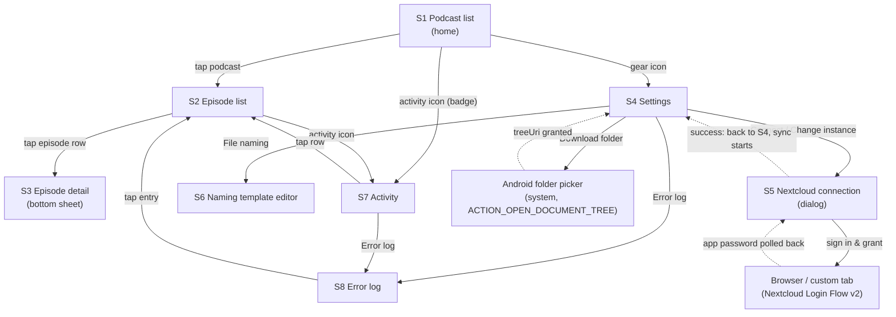

Back behaviour: system back pops one level; back from S2 returns to S1 with its scroll position and
filter intact; the S5 dialog can only be dismissed by Cancel or a successful authorization (no
tap-outside dismiss while an auth request is in flight).

---

## 4. S1 — Podcast list (home)

The launcher screen. One row per subscribed feed, ordered by **most recent episode publication date,
descending** (feeds never fetched sort last, then title A–Z).

**Ordering is frozen between refreshes.** The sort is computed once per explicit pull-to-refresh (and
on cold start) and then held for the life of the screen — a background sync or a triage decision
updates badges and rows *in place* but never reorders the list. Rows must not move under the user's
finger.

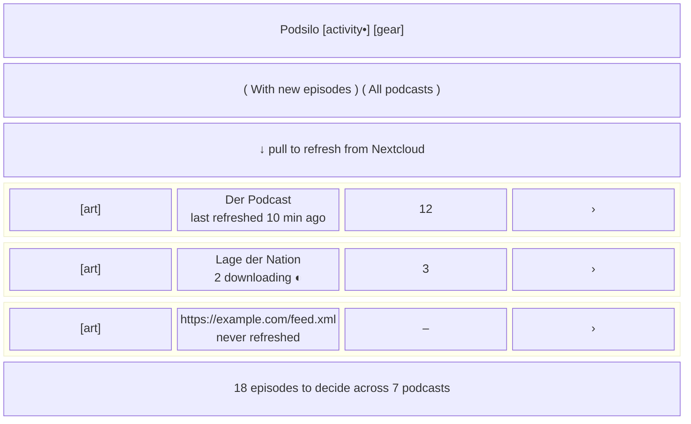

**Row anatomy**

| Element | Source | Rule |
|---|---|---|
| Artwork, 56 dp square | `Feed.imageUrl` | placeholder monogram tile when `null` or not yet fetched |
| Primary line | `Feed.title` | falls back to `Feed.url` until the first successful feed fetch (architecture §4) — never "Unknown podcast" |
| Secondary line | `Feed.lastRefreshedAt` | relative time; `"never refreshed"` when `null`; while that feed has active downloads it reads `"n downloading"` next to a small **indeterminate/aggregate progress circle** (§12.2) |
| Count badge | see §12.5 | number of episodes **available to decide**; `–` when the feed has never been fetched; `0` shown only in "All podcasts" mode |
| Chevron | — | affordance for navigation; whole row is the tap target (≥ 56 dp) |

**Filter (segmented control, top of list)** — `With new episodes` (default) / `All podcasts`.
The default hides feeds whose count is 0, so the home screen is a worklist. Session-scoped, not
persisted.

**Pull to refresh** — enqueues an expedited `SyncWorker` (subscriptions pull → outbox push →
episode-action pull → reconcile, architecture §6) *and* a `FeedRefreshWorker` pass over all feeds.
The Material 3 pull-to-refresh indicator stays visible for the whole chain; counts and rows update
live as Room emits. Completion is silent; failure shows a snackbar (§12.8) **and** appends to the
error log (S8), leaving the previously loaded list on screen — refresh never clears content.

**App bar** — title `Podsilo`; actions: **Activity** (badge dot when any download is running or any
`ERROR`/unsynced row exists) → S7, and **Settings** (gear) → S4.

**Footer/summary line** — total undecided episodes across all feeds.

**States**

- *No Nextcloud configured* (first run): the list is replaced by a centred empty state — one sentence
  ("Podsilo follows the podcast subscriptions in your Nextcloud.") plus a single **Connect Nextcloud**
  button opening S5. No decorative illustration.
- *Configured, no feeds yet* (first sync running): three shimmer rows, no spinner overlay.
- *Configured, zero subscriptions*: empty state explaining subscriptions are managed in Nextcloud,
  with a **Refresh** button. No add-feed affordance.
- *Filter hides everything*: "Nothing new. All caught up." + a link to switch to *All podcasts*.
- *Downloads paused* (folder missing/revoked, or storage full — §12.11): persistent inline banner
  above the list with the reason and the fix (**Choose folder** / **Free up space**). Never a crash,
  never a silent failure.
- *Offline*: see §12.10 — a pull-to-refresh with no connectivity fails immediately with an
  "No network connection" banner; it does not attempt, and does not time out against, any feed.

**First-run checklist** — until the app can actually complete a download, S1 shows a checklist card
above the list instead of discovering the gap at the first swipe:

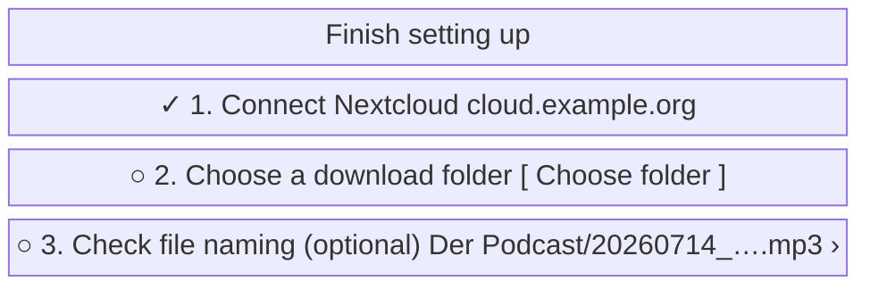

Rules: steps are shown in order, each with a live ✓/○; step 1 is the S5 dialog, step 2 the SAF
picker, step 3 opens S6 and is explicitly optional (a default template exists). Step 2's state comes
straight from the built `DownloadFolderAccess`: `NotChosen` → ○, `Granted` → ✓, `Revoked` → ⚠ with
**Choose folder again**. The card disappears permanently once steps 1 and 2 are satisfied, and
returns only if the grant is lost. Podcasts and episodes remain browsable while the checklist is
incomplete — only the download *action* is blocked, with the row's Download affordance disabled and a
tap explaining which step is missing.

---

## 5. S2 — Episode list

One feed's episodes, newest first by `pubDate` (episodes with a `null` `pubDate` sort last).

**Sticky month headers and fast-scroll** — rows are grouped under sticky `July 2026` headers, and the
list has a draggable fast-scroll thumb that shows the month it is passing over. Both matter because
`All` on a long-running feed is hundreds of rows; `null`-date episodes group under a final
`Date unknown` header.

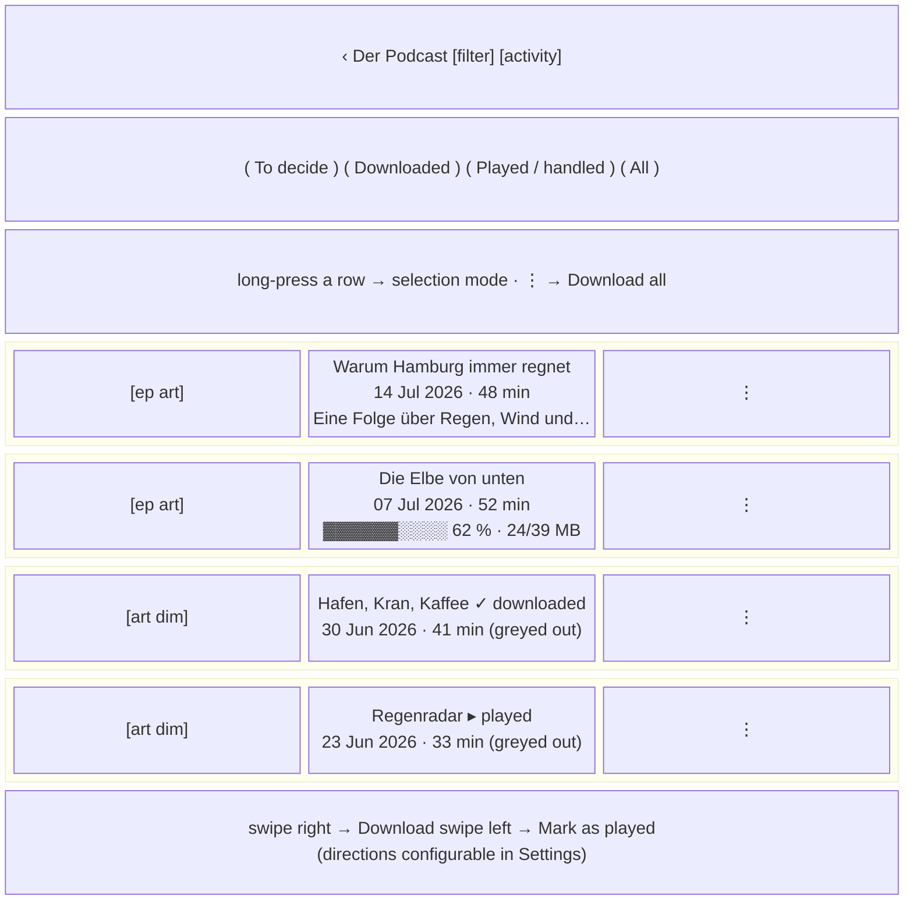

**Row anatomy** — episode artwork (episode image if the feed supplies one, else the feed's), title
(2 lines max), meta line `date · duration · size` (each part omitted when unknown — duration is
"notoriously unreliable", never faked), description snippet (2 lines, HTML stripped for the snippet),
status badge/progress, overflow `⋮`.

**Greyed-out rows** — any episode with a terminal ledger state (`DOWNLOADED`, `SKIPPED`,
`HANDLED_REMOTELY`) renders at reduced emphasis: artwork at ~60 % opacity, title and meta in the
`onSurfaceVariant` role, no accent colour. Greying is **presentation only** — the row stays fully
interactive: tapping it still opens S3, and its overflow still offers **Download again** (§12.3).
Contrast in both themes stays ≥ 4.5:1 for the title — "greyed out" means de-emphasised, not
unreadable (§12.7).

**Tap** on the row body opens **S3**. It never triages — a mis-tap must not queue a download.

**Swipes** — right → **Download**, left → **Mark as played**, both re-mappable in Settings (§12.1).

**Overflow `⋮`** mirrors the swipes and adds context items: *Download* / *Download again*,
*Mark as played*, *Retry* (ERROR only), *Cancel download* (QUEUED/DOWNLOADING only), *Copy episode
link*, *Open in browser*.

**Batch triage** — long-pressing a row enters **selection mode**: the app bar becomes
`n selected` with **Download**, **Mark as played** and **Select all** (scoped to the current filter),
and tapping rows toggles them. Acting applies the same per-episode writes in one pass, behind a
confirmation naming the count ("Download 12 episodes?"). Back or ✕ leaves selection mode. This is the
answer to "12 new episodes, no undo, 12 swipes".

**Download all** — an app-bar `⋮` item on S2, reading **Download all (12)**: queues every episode
currently in the `To decide` filter — i.e. every episode with no ledger row, so anything already
marked as played, downloaded or handled elsewhere is untouched by definition. Confirmation dialog
names the count and, when durations are known, an approximate total size. Disabled (with the reason)
while downloads are paused. It is deliberately in the overflow, not a prominent button, and it exists
only per-podcast — there is no global "download everything" anywhere.

**No count cap.** A bulk download is never refused or warned about for being *large* — only for not
*fitting*. The confirmation dialog gains a warning line **only** when the estimated total exceeds the
free space in the download folder's volume:

> ⚠ Estimated 4.2 GB — only 1.1 GB free on SD card. Some downloads will fail.

The action stays enabled (the estimate is derived from `itunes:duration`, which architecture §4 calls
notoriously unreliable — it must never block a decision). When durations are unknown for some or all
episodes the size is not estimated and no warning is shown. Free space is read once, when the dialog
opens.

**Mark all as played** — on the **Downloaded** filter only, reading *"Mark all n as played"*, behind
a confirmation naming the count. Scoped there because *To decide* already has S4's per-feed preview
and *Played / handled* would be a no-op; it answers "these are all on the phone now, stop offering
them anywhere else". The dialog states that the files stay — Podsilo never deletes them — and that
the state reaches Nextcloud (added 2026-08-03).

**Filter** — chips: `To decide` (default) / `Downloaded` / `Played / handled` / `All`. Mapping to
`LedgerFilter` (architecture §5):

| Chip | Ledger predicate |
|---|---|
| To decide (default) | no ledger row |
| Downloaded | `state = DOWNLOADED` |
| Played / handled | `state = SKIPPED` or `HANDLED_REMOTELY` — the name covers both the user's own "mark as played" and episodes handled on another client, which the user never touched |
| All | everything, including `QUEUED`/`DOWNLOADING`/`ERROR` |

The per-feed filter choice is remembered per feed for the session and resets to `To decide` on cold
start.

**No backlog cutoff in the query.** Old episodes are *not* filtered by `pubDate` at read time; the
"hide old episodes" feature works by **writing** `SKIPPED` rows, so old episodes leave `To decide`
and appear under `Played` like any other handled episode (§12.6, ADR 0013). This keeps the
list query to a single predicate and makes the state visible and reversible.

**Also pull-to-refresh** here, scoped to this feed (conditional GET; a 304 shows "Already up to
date").

**States**

- Never fetched: shimmer rows + the URL as title in the app bar.
- Feed fetch failed: inline banner with the reason in plain words ("Feed server did not respond") +
  **Try again**; the entry is written to S8; previously parsed episodes stay listed.
- Filter empty: "Nothing to decide in this podcast." + link to *All*.
- Episode has no enclosure (architecture §7): row rendered but dimmed, badge **no audio**, download
  disabled, overflow only offers *Open in browser*.

---

## 6. S3 — Episode detail (full screen)

**A full screen** — a read step inside triage, left with the back affordance. Reachable for **every**
episode regardless of state, including greyed-out ones (explicit requirement).

**Amended 2026-08-03.** This was specified as a modal bottom sheet and built as one *inside a
full-screen navigation destination*, which is a contradiction: the destination owned the window and
held nothing, so a downward drag dismissed the sheet and revealed a blank page. Since the sheet was
already `skipPartiallyExpanded` (always full height) and show notes run to paragraphs, it was a full
screen wearing a sheet's clothes. There is no pull-to-dismiss.

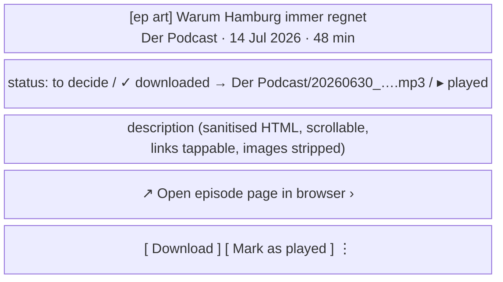

Renders `Episode.description` — stored raw, **sanitised at render time, never at write time**
(architecture §4). Allowed: paragraphs, line breaks, bold/italic, lists, links. Stripped: scripts,
styles, iframes, remote images, tracking pixels.

The status line is state-aware: for `DOWNLOADED` it shows `writtenFileName` and the target folder;
for `DOWNLOADING` it shows the same progress bar as the row; for `ERROR` it shows `lastError` and
the attempt count with a link to S8.

Action bar, by state:

| State | Buttons |
|---|---|
| no row | **Download** · **Mark as played** |
| `QUEUED` / `DOWNLOADING` | **Cancel download** (progress shown above) |
| `DOWNLOADED` | **Download again** · **Mark as played** |
| `SKIPPED` / `HANDLED_REMOTELY` | **Download** (i.e. "download anyway") |
| `ERROR` | **Retry** · **Mark as played** |

**Open episode page in browser** sits between the description and the action bar, on its own
hairline-separated row: it belongs to the *read* step and must not compete with the decision. Rendered
only when the feed supplied an item `<link>` — never synthesised from the enclosure URL, which points
at an audio file rather than a page — so a feed that omits it simply has no row instead of a dead tap.
It opens a Custom Tab (falling back to `ACTION_VIEW`) and the sheet **stays open behind it**: leaving
to read show notes is not a triage decision, and coming back must not cost the user their place. The
same action is in the row overflow on S2. Requires `Episode.link`, which did not exist — see
architecture §4 (schema v2).

Deciding closes the sheet and animates the row into its new state (§16).

---

## 7. S4 — Settings

A plain scrolling list of grouped rows. Reached only from S1's gear icon.

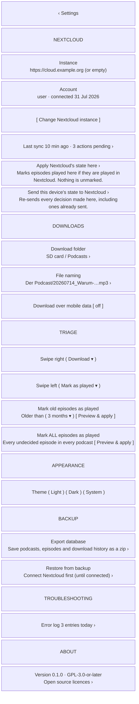

**Nextcloud group**

- **Instance** — the connected base URL from `SettingsRepository`. When nothing is set the value area
  is **empty** (no placeholder text); the row is not tappable.
- **Account** — username and connection date, hidden entirely when not connected. No password is ever
  shown or entered in the app (Login Flow v2 only, §8). An app-bar `⋮` → **Disconnect** clears the
  credentials and warns that the *ledger is kept*, so nothing will be re-downloaded after
  reconnecting.
- **Change Nextcloud instance** — a button *below* the instance row, opening S5. Reads **Connect
  Nextcloud** when nothing is configured.
- **Last sync** **[gap]** — relative timestamp plus outbox depth (`syncedToServer = false` count);
  tapping opens S7.
- **Apply Nextcloud's state here** / **Send this device's state to Nextcloud** (`docs/decisions/0025`)
  — the two directional passes, under *Last sync* because that row already answers "when did this
  happen". Both are absent until an account is connected, both go dead while either runs, and both
  confirm first. The push names its count; **the pull cannot** — the number worth showing is "how
  many of these change anything here", which is only knowable after a fetch, and a view model does
  not touch the network (§B0.3). It says what the operation does and does not do instead.
  - The pull only ever *marks episodes played*; it never un-marks one and never replaces a
    `DOWNLOADED` row. That is a short enough promise to put in the subtitle, and it is why the pull
    needs no new conflict rule: it is the ordinary reconciliation over the whole log.
  - The push is the only way to repair a decision the server never received — a download recorded
    before `docs/decisions/0023` sent `DOWNLOAD` alone, which Nextcloud discards, and its row is
    already synced so no ordinary pass will retry it.

**Downloads group**

- **Download folder** **[gap, required]** — launches the system `ACTION_OPEN_DOCUMENT_TREE` picker;
  shows the resolved tree name. If the permission was revoked the row shows a warning colour and the
  words **not available** (architecture §8).
- **File naming** → S6.
- **Download over mobile data** — switch, **off by default**; off means `DownloadWorker` runs on
  unmetered networks only. Named as a constraint, not a "rule", so it can't be mistaken for
  auto-download.

**Triage group** (new)

- **Swipe right** / **Swipe left** — each a dropdown over the same option set: `Download`,
  `Mark as played`, `Nothing (disable)`. Defaults: right = Download, left = Mark as played. The two
  cannot hold the same action (picking a taken action swaps them, so the pair is always valid). The
  values are persisted in DataStore and read by the episode row; the swipe background label and icon
  always reflect the current mapping, so the UI can never lie about what a swipe does.
- **Mark old episodes as played** — a duration picker (`1 month` / `3 months` / `6 months` /
  `1 year` / `off`) plus **Preview & apply**. This is a *write*, not a filter: it upserts `SKIPPED`
  rows for every currently-known episode older than the cutoff that has no ledger row, exactly as if
  each had been swiped.
- **Mark ALL episodes as played** — the same operation with no age limit: every undecided episode in
  every podcast. A one-shot "start from a clean slate" button, not a persisted rule.

Both share one **preview step** — tapping *Preview & apply* opens a dialog that names the count and
summarises what will happen before anything is written:

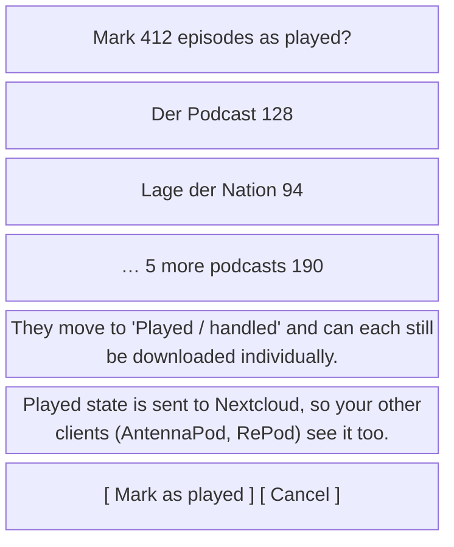

Pushing the resulting `PLAY` actions to Nextcloud is **intended, not a side effect** — sharing triage
state across clients is the point (README), and the Android device is the user's main player. The
second note in the preview states it plainly rather than warning against it. Further rules:

  - the actions enter the normal outbox (`syncedToServer = false`) and are pushed in batches by
    `SyncWorker`, not in one giant POST;
  - the operation is not undoable in bulk (per the no-undo decision) — the preview is the safeguard;
  - each episode remains individually downloadable via **Download** in S3 or the row overflow;
  - when the *older than* value is not `off`, the rule is also applied to newly-parsed episodes after
    each feed refresh (an episode arriving already older than the cutoff is marked immediately,
    without a preview — the user consented once by setting the rule). This **replaces** the
    architecture's read-time `pubDate >= firstSeenAt` backlog cutoff rather than composing with it
    — ADR 0013, which also amends CLAUDE.md §5.

**Appearance group** — **Theme**: 3-option segmented control **Light / Dark / System** (default
`System`), persisted in DataStore, applied immediately without an activity restart (§12.7).

**About group** — version and licence, plus a **Source code** row linking to the repository. GPL-3.0
means little without somewhere to get the code, so the licence line and the link belong together.

**Backup group**

- **Export database** — a SAF `CreateDocument`, offered as `podsilo-backup-YYYY-MM-DD.zip` so
  successive backups sit beside each other rather than one silently replacing the last. The subtitle
  names what is inside; the snackbar afterwards names the counts.
- **Restore from backup** — **disabled until Nextcloud is connected**, reading *"Connect Nextcloud
  first"*. Not about secrecy — the archive carries no credentials by design —
  but about sequencing: the restored ledger would otherwise land behind S1's *not configured* empty
  state, which shows none of it, while the snackbar reports podcasts restored. Connect first and the
  ledger lands somewhere that renders it.
- Once connected it opens a **warning dialog first, then** the file picker. A restore replaces the
  ledger, which is the app's only memory of what has already been handled, and that has to be said
  in words before a file is read — the same rule the bulk-mark preview follows (§7,
  `docs/decisions/0013`). The dialog also states the reassuring half, which is true rather than
  soothing: Nextcloud is untouched, and the next sync pulls back whatever happened after the backup.
- Both rows go **dead while either operation runs**, so a second tap cannot start a second export
  over the same file. They grey out rather than disappearing — a row that vanished mid-operation
  reads as a crash.
- Failures are four separate sentences, not one: *not a Podsilo backup*, *made by a newer Podsilo —
  update the app first*, *couldn't be read, nothing was changed*, *couldn't be written*. Each has a
  different next step for the user.

**Troubleshooting group** — **Error log** row with an entry count → S8.

Settings has no Save button: every control commits on change.

---

## 8. S5 — Nextcloud connection dialog

A modal dialog over S4, using **Nextcloud Login Flow v2** exclusively — the app never sees, asks
for, or stores a user password; it stores only the app password the flow hands back (encrypted,
`AppPasswordCipher`, architecture §2).

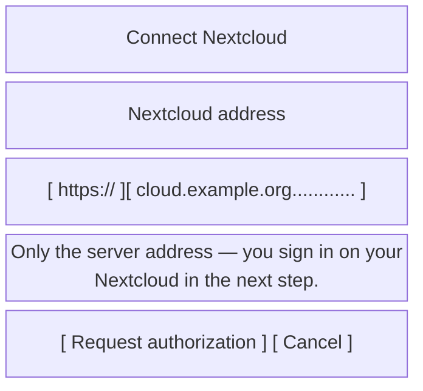

**Input** — one text field with a **non-editable `https://` prefix** rendered inside it. Keyboard
type URI, autocorrect off, IME action Go = the primary button. Validation on submit only: non-empty
host, no spaces, optional `:port` and path allowed (Nextcloud in a subdirectory is common); a typed
`https://` or `http://` is stripped rather than rejected.

**Primary button** — **Request authorization**. The dialog moves to a *busy* state: field read-only,
button replaced by a spinner labelled **Waiting for authorization in your browser…**, Cancel stays
enabled and aborts the poll.

**The poll runs only while this dialog is on screen** (`docs/decisions/0020`). Opening the browser
backgrounds the app, and the poll stops until the user comes back — which they must do anyway, since
the whole point is to return with access granted. On Android 17 a backgrounded process could not
resolve the host at all, and a single failure abandoned the entire flow while the browser was still
reporting success; not making the call is what fixed it. The user sees nothing different: the spinner
is up while they are away, and the login completes moments after they return.

```mermaid
sequenceDiagram
    participant U as User
    participant D as S5 dialog
    participant B as Browser / custom tab
    participant NC as Nextcloud
    participant DS as SettingsRepository
    participant W as SyncWorker

    U->>D: enter host, tap "Request authorization"
    D->>NC: POST /index.php/login/v2
    NC-->>D: { login (URL), poll: { token, endpoint } }
    D->>B: open login URL
    U->>B: sign in, "Grant access"
    loop until granted / cancelled / timeout
        D->>NC: POST poll endpoint (token)
    end
    NC-->>D: { server, loginName, appPassword }
    D->>NC: GET /index.php/apps/gpoddersync/subscriptions (authenticated)
    alt 200
        D->>U: "Connect as {loginName}?"
        alt Connect
            D->>DS: store server URL + loginName + encrypted appPassword
            D->>W: enqueue expedited SyncWorker (pull all subscriptions)
            D->>U: dialog closes, S4 shows the instance; S1 fills in
        else Use a different account
            D->>B: open the server root so the session can be ended
            D->>U: back to the address field, with the browser-session hint
        end
    else 404 / 401 / network
        D->>U: stay open, inline error under the field, input restored
    end
```

Success is only ever claimed after that authenticated `GET /subscriptions` returns 200 — a completed
login flow is not proof that gpoddersync is installed. On failure the app password is discarded, not
stored.

### The account is confirmed before anything is stored

**Amended 2026-08-03.** This section used to store the credentials the
moment gpoddersync answered 200. It no longer does, because Login Flow v2 **has no account chooser**:
if the browser already holds a Nextcloud session, the grant page reads *"Currently logged in as X"*
above a single **Grant access** button, and X is simply whoever that browser was signed in as. The
app sends no username and cannot influence this — verified on a real device, where the flow URL
redirects to `/login/v2/flow?user=&direct=0` with the parameter empty.

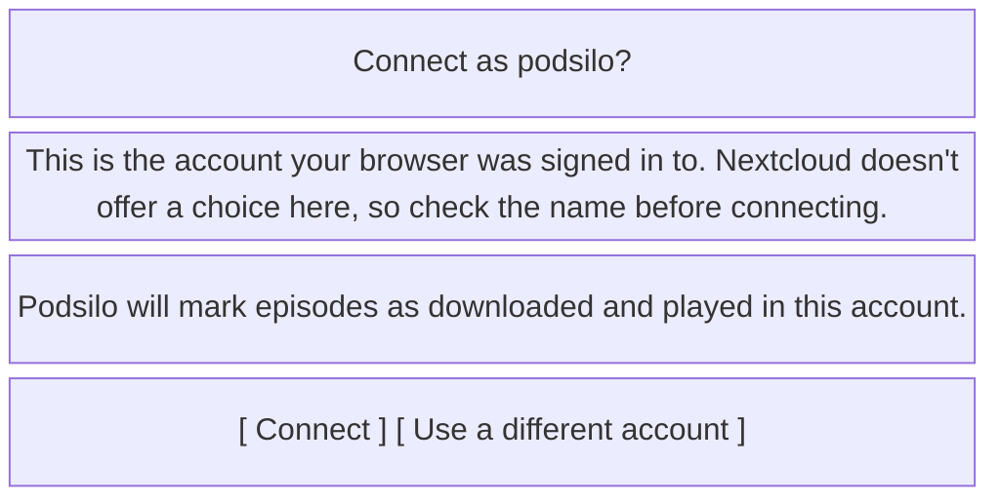

- **The login name is the dialog title**, so it is the question being answered rather than a detail
  inside a paragraph.
- **The consequence is stated**, because it is the reason this confirmation exists at all: connecting
  the wrong account writes `DOWNLOAD` and `PLAY` actions into *that* account's log from then on, and
  those are not retractable.
- ***Use a different account*** discards the app password unstored and opens the **server root** —
  not the flow URL. Requesting authorization again against a live session returns the same account
  however many times it is tried, so the browser is the only place the problem can be fixed. The
  dialog then says so next to the address field.
- **The granted app password is deleted from the server** (`DELETE /ocs/v2.php/core/apppassword`,
  authenticated with that same password — the last moment the app can do it, since it is about to
  forget it). Nextcloud issues the password *before* the user is asked whether it is the right
  account, so declining used to leave a live password listed under *Security* belonging to an account
  they had just refused. Cancelling at the confirmation, and re-submitting from it, revoke on the same
  terms.
- **Nothing waits for that.** The revoke is best-effort: an unreachable server, or one too old to
  have the endpoint, leaves exactly the harmless hand-revocable leftover that existed before, and
  the user sees no difference. A failure is one line in S8 (`AUTH`) and nothing else — it is not
  something they can act on mid-flow.

**Inline error messages** (under the field, plain language, never a stack trace; each also written to
S8):

| Cause | Message |
|---|---|
| DNS / unreachable | "Can't reach that address. Check the spelling and your network." |
| Timed out | "The server didn't answer in time. Nextcloud slows down repeated login attempts — wait a minute and try again." |
| Cleartext refused | "This Nextcloud reports its own address as unencrypted http://, which Android blocks. Set 'overwriteprotocol' => 'https' in the server's config.php." |
| TLS error | "The server's certificate isn't trusted." |
| No Login Flow v2 endpoint | "This doesn't look like a Nextcloud server." |
| 404 on the gpoddersync path | "This Nextcloud doesn't have the GPodder Sync app installed." |
| 401 after authorization | "Authorization was refused. Try again." |
| Flow abandoned / timed out | "Authorization wasn't completed." |

**The connection is HTTPS by default, and stays HTTPS.** The three URLs Login Flow v2 hands back —
the browser page, the poll endpoint, and the `server` every later request is built on — come from
Nextcloud's own `overwriteprotocol` / `overwrite.cli.url`, and behind a TLS-terminating proxy they
are very often left as `http`. Podsilo **upgrades** those to `https` when the flow was started over
`https`, and never downgrades. Following them verbatim would be worse than failing: `server` is
persisted, so one misconfigured field would put the app password on the wire in cleartext on every
sync from then on. A user who explicitly typed `http://` keeps their choice, and Android's refusal is
then reported as *Cleartext refused* rather than as a wrong address.

**Every inline error is also written to S8** with the underlying message — the host that actually
failed and what it did. The dialog has room for one sentence, which is right for it and useless for
diagnosis; the log is where "can't reach that address" becomes answerable.

**A timeout is not an unreachable address.** They are the same exception and were once the same
sentence, which sent the author to re-check a host name that was correct. Nextcloud's bruteforce
protection **deliberately** delays repeated authorization attempts from one address, so "the server
is slow because I just tried three times" is a routine state here, not an exotic one. The message
therefore names waiting as the fix.

**Changing an existing instance** — pre-filled with the current host, title reads *Change Nextcloud
instance*, with a caution line: "Your download history is kept, so episodes you already handled stay
handled." (True: the ledger has no FK to feeds — architecture §4.)

---

## 9. S6 — Naming template editor

Pushed from S4. Exists because the README calls filenames "the entire user experience of a
download", and `:core:naming` is already built and testable.

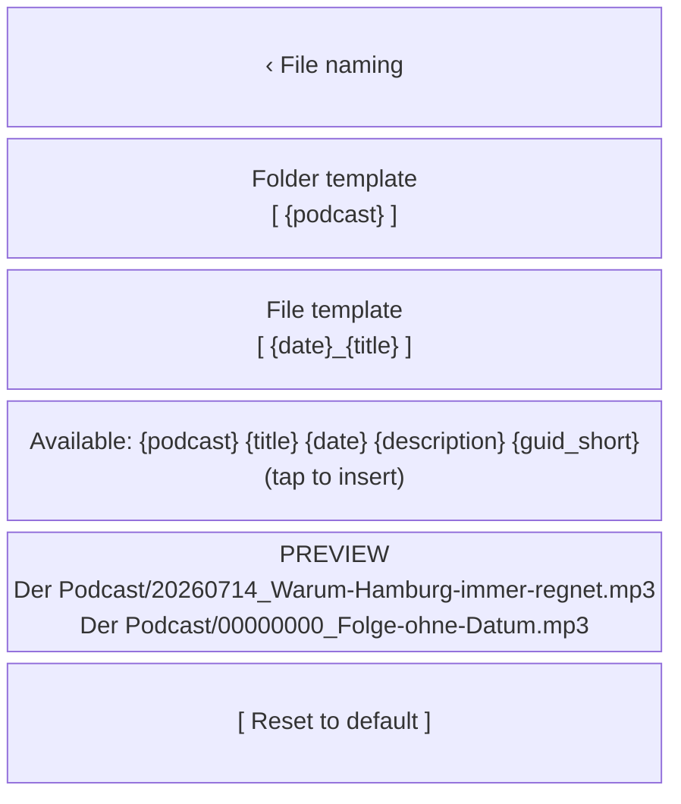

The placeholder chips are exactly the set `DefaultNamingTemplateEngine` resolves — `{podcast}`,
`{title}`, `{description}`, `{date}` (also `{date:pattern}`) and `{guid_short}`. `{ext}` is
deliberately absent: the extension is appended after resolution and is not resolved as a variable
(CLAUDE.md §6). Offering a chip the engine does not know would render it as literal text in a
filename.

Live preview calls the already-tested `NamingTemplateEngine.resolve()` against a real recent episode
plus synthetic worst cases (missing date → `00000000` per architecture §11; over-long title → truncation;
illegal characters → sanitised). An invalid template shows the reason under the field and cannot be
applied. Existing files are never renamed — a note says so.

---

## 10. S7 — Activity (downloads & sync)

Kept as a full screen (confirmed). The one place that answers "what is the app doing, and what is
stuck?".

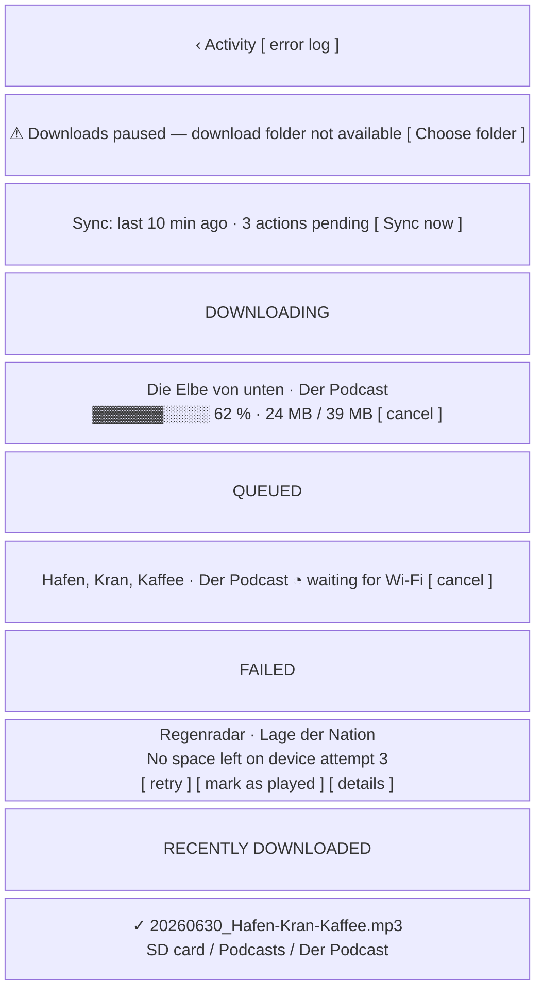

Groups, in the order they appear: a **paused** banner when the queue is held (§12.11), sync status (last sync, outbox depth,
**Sync now** — disabled and labelled "No network connection" when offline), downloading (determinate
progress + bytes), queued (with the reason it is waiting — Wi-Fi, folder missing, resuming after
restart), failed (`lastError` as a human sentence + `attempts`, with **Retry**, **Mark as played**,
and **details** → S8), and the last ~20 completed downloads showing `writtenFileName` and the folder
— the app's only "did it actually land?" affordance.

It is explicitly *not* a file manager: no delete, no open-file, no existence check — matching README
("Podsilo does not delete it, track it, or care whether it still exists").

**Recent actions** (added 2026-08-23, issue #90) is the last group, and the only one that is not
about work in progress. It lists the last ~50 **decisions** — newest first, each naming the episode,
what was decided in the user's words (*Played*, *Downloaded*, *Marked unplayed*, *Handled
elsewhere* — never the ledger constant) and when — with **Mark as unplayed** beside each one that
can still be withdrawn.

It exists because triage is otherwise unrecoverable in practice: a swipe holds its decision for five
seconds (§12.3) and is then silent, so a mis-swipe cannot be *found* again, even though its state can
be changed back from S2 by anyone who knows which episode it was. The group is the finding. It shows
every decided state rather than only *played*, because "what did I just do?" does not distinguish a
wrong *Download* from a wrong *Mark as played*; the in-flight states are excluded because they are
already the three groups above. A row already `UNPLAYED` offers no button — an affordance that does
nothing is worse than none.

Tapping any row jumps to that episode in S2. App-bar action opens S8.

---

## 11. S8 — Error log

A chronological, read-only log of everything that failed, so a single-user self-hosted setup can be
debugged without a laptop, `adb`, or a bug report.

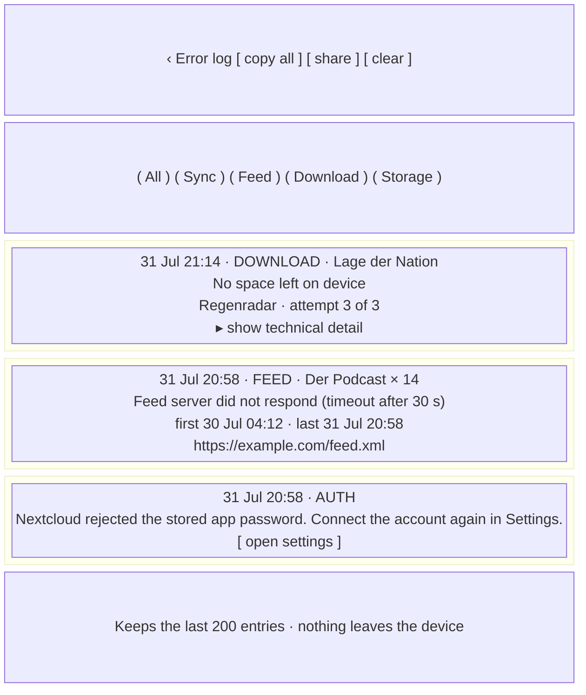

**Entry shape** — timestamp (absolute, local), category (`SYNC` · `FEED` · `DOWNLOAD` · `STORAGE` ·
`AUTH`), the affected feed/episode when known, a **plain-language sentence first**, and a collapsed
*technical detail* section (HTTP status, exception class, URL, worker name, `attempts`). The plain
sentence is what the user reads; the detail is what gets pasted into a GitHub issue.

**Sources** — anything that produced a banner, a snackbar, a row `lastError`, or a worker
`Result.retry()/failure()`: feed fetch failures, sync/auth failures, download failures and
cancellations-by-error, SAF permission loss, disk-full, tag-write partial failures (informational,
since a tag failure never blocks a download — architecture §11), and abandoned Login Flow attempts.

**Rules**

- **Repeated identical failures collapse into one entry** with an occurrence count (`× 14`) and
  *first seen* / *last seen* timestamps, rather than one entry per attempt. Identity = category +
  affected feed/episode + normalised message. Without this, one feed failing every few hours evicts
  every genuinely one-off error from the buffer within a day. The technical detail section keeps the
  **most recent** occurrence's detail.
- Ring buffer, last 200 **collapsed** entries (or 7 days, whichever is larger); stored in Room,
  survives restart.
- **Never** contains the app password, the Basic-auth header, or full URLs with credentials.
- **Copy all** / **Share** produce plain text. Both, and **Clear**, are *disabled rather than hidden*
  when the log is empty, so the affordance stays where the user learned it.
- **Clear** asks for confirmation. The dialog names the count ("Clear all 4 log entries?") and states
  that the log is device-local — there is no copy anywhere else and this is not undoable. It clears
  **the whole ring buffer, not the current filter**: a filtered clear would leave a count the user
  cannot account for. Recording resumes immediately; nothing else is touched — no ledger row, no
  worker, no sync state.
- Tapping an entry that names an episode jumps to it in S2.
- Successes are not logged — this is a failure log, not a journal. (`RECENTLY DOWNLOADED` in S7
  covers the success case.)
- Nothing is uploaded anywhere: no telemetry, per README.

---

## 12. Cross-cutting rules

### 12.1 Swipe gestures

| Gesture | Default action | Ledger write | Sync effect |
|---|---|---|---|
| Swipe **right** (left→right) | **Download** | `QUEUED` → `DOWNLOADING` → `DOWNLOADED` | `DOWNLOAD` action posted |
| Swipe **left** (right→left) | **Mark as played** | `SKIPPED` | `PLAY(started=0, position=total)` |

Both directions are **re-mappable in Settings → Triage** (`Download`, `Mark as played`, `Nothing`);
the swipe background's icon and word are rendered from the current mapping, never hard-coded. Each
swipe is single-direction, must pass a ~40 % threshold to commit (no accidental flicks), and then
holds its decision for a ~5 s **undo window** before anything is written (§12.3) — the threshold guards against the flick, the window against the deliberate
swipe on the wrong row. Non-gesture equivalents are mandatory: the row overflow `⋮`
and the S3 action bar.

**The swipe surface stops short of both screen edges** (§17, issue #92). A row that reaches the edge
competes with the system's own horizontal gestures — back from either side, the app-switch drag along
the bottom — and the user loses: an attempt to leave the app is read as a triage decision on whatever
row the finger crossed, which in this app is posted to a shared server.

Swiping an episode that already has a terminal state performs the same action idempotently:
swipe-right on a `DOWNLOADED` episode means **Download again** (§12.3); swipe-left on an already
`SKIPPED` one is a no-op.

### 12.2 Download progress

A download is never a state you have to guess at. Three surfaces, all driven by the same
`DOWNLOADING` row + WorkManager progress:

| Where | Treatment |
|---|---|
| Episode row (S2) | line 3 becomes a **determinate linear progress bar** with `%` and `MB / MB`; indeterminate while `QUEUED` or before the first byte, with the reason ("waiting for Wi-Fi") |
| Episode detail (S3) | same bar, full width, above the action bar |
| Podcast row (S1) | small **circular** progress ring around the artwork corner + `"n downloading"` — aggregate for that feed |
| Activity (S7) | bar + bytes + **cancel** per download |
| Notification | foreground-service progress notification (§12.9) |

On completion the bar is replaced by the **✓ downloaded** badge (and, in S3, the written filename) —
the transition is a fade, not a disappearance, so the finish is visible. On failure it becomes the
**failed** badge with the reason. Circles are used only where a bar doesn't fit (S1 artwork); lists
use bars.

**Progress updates are throttled to 1 Hz** — matching `DownloadNotifications`' existing throttle, so
the notification, the row and S7 never disagree, and a fast download doesn't repaint the list 60
times a second. The bar animates between updates rather than stepping.

**After process death, never show a stale percentage.** WorkManager progress does not survive the
process. On cold start, any row whose ledger state is `DOWNLOADING` renders as **indeterminate** with
the word *resuming* until the worker reports its first progress update; if WorkManager has no live
work for that `episodeKey` at all (killed before it could re-enqueue), the row shows *queued* and the
work is re-enqueued on first observation. The same rule applies to S7 and to the aggregate ring on S1.
A percentage is only ever drawn from a progress update received in this process.

### 12.3 A swipe has an undo window; everything else is corrected by acting again

**Amended 2026-08-09 (issue #49).** This section was titled *"No undo —
re-download instead"* and argued it from the protocol: a skip becomes a `PLAY` action in an
append-only log that other clients act on, and the GPodder API has no retraction. That argument is
still correct, and it is *why* the amendment takes the shape it does.

**A swipe holds its decision for ~5 s and writes nothing** — no ledger row, no outbox entry, no work
request — and offers *Undo* on a snackbar. Undo discards the held decision; there is nothing to
retract because nothing was written. The row renders the decision immediately, so the gesture does
not look ignored, but that is presentation only. One pending decision at a time: a second swipe
commits the first, and leaving the screen commits rather than discarding. A decision made and then
immediately killed by process death is lost, which is the cost the design accepts.

**Everything else still commits immediately**, and the rest of this section is unchanged:

- **The row's action buttons and S3's action bar** are deliberate presses on a named affordance, not
  a gesture that can be started by trying to scroll. No undo.
- **Bulk actions keep their confirmations and gain no undo** (settled with the author when undo was added):
  selection mode, *Download all* and *Mark old / all episodes as played*. Naming the count before
  writing is a stronger safeguard than five seconds for an action covering hundreds of rows.

Decisions are otherwise corrected by acting again:

- **Download again** is offered on `DOWNLOADED`, `SKIPPED`, `HANDLED_REMOTELY` and `ERROR` episodes
  (row overflow, S3 action bar, swipe-right). It writes `QUEUED` and enqueues `DownloadWorker` as
  usual — a user-initiated transition out of a state the architecture calls terminal (§14).
- **Duplicate-file guard.** Before writing, `EpisodeDownloader` checks whether **this episode's own
  previously written file** (`writtenFileName`) is still present — which the existing
  `DownloadTarget.existingNames(folder)` already answers, so no new port method is needed. If it is,
  the download is **aborted, not overwritten and not suffixed**: the ledger returns to `DOWNLOADED`
  and the UI reports *"Already in your folder — Der Podcast/20260630_Hafen-Kran-Kaffee.mp3"* as a
  snackbar (and in the row/detail status line). This is an informational outcome, not an `ERROR`, and
  is not written to S8. If the file is gone, the download proceeds and produces it again.
  - **This does not change collision suffixing.** `existingNames` keeps doing what architecture §11 says it
    is for — stopping two *different* episodes fighting over one name, with ` (2)`, ` (3)`, … inside
    `:core:naming`. The guard is a separate, narrower question asked of the same data: *is the name
    this episode previously wrote still there?*
  - Note for implementation: this is the *only* place existence is allowed to affect behaviour. It is
    a pre-flight check at explicit user request — it must **not** become the general "have I
    downloaded this?" test, which stays the ledger (architecture §4/§11's central invariant, and ADR
    0011's own KDoc). A first-time download (no `writtenFileName`) performs no existence check at all.
- **Mark as played** on a `DOWNLOADED` episode is allowed too (it changes only the ledger/sync state;
  the file on disk is never touched — Podsilo does not delete files).
- Bulk actions are the exception that keeps a safeguard: selection-mode actions and *Download all*
  (§5) confirm with a count, and *Mark old / all episodes as played* (§7) shows a full preview,
  because those are the actions affecting hundreds of rows at once.

### 12.4 Filter defaults

| Screen | Default | Alternatives | Persisted? |
|---|---|---|---|
| S1 podcasts | With new episodes | All podcasts | no (session) |
| S2 episodes | To decide | Downloaded · Played / handled · All | per feed, session |
| S8 error log | All | Sync · Feed · Download · Storage | no |

### 12.5 What the count badge counts

`Feed.count = episodes with no ledger row` — exactly what the `To decide` filter shows, exactly the
request's "number of available episodes for download". Notes:

- With the *Mark old episodes as played* rule active, old episodes already carry `SKIPPED` rows, so
  they never inflate the badge (this is why the read-time `pubDate` cutoff is no longer needed).
- `QUEUED`/`DOWNLOADING` episodes are **not** counted (already decided); they show as
  "n downloading" instead.
- A feed never fetched shows `–`, not `0` — unknown is not zero.
- Counts come from the same SQL join as the list (architecture §5), never a second code
  path, so a badge can never disagree with the list it opens.

### 12.6 Ledger state → row treatment (single source of truth for the UI)

| State | Badge text | Row treatment | Actions offered |
|---|---|---|---|
| *no row* ("to decide") | none | full emphasis | Download · Mark as played |
| `QUEUED` | queued | normal + indeterminate progress, waiting reason | Cancel |
| `DOWNLOADING` | downloading | determinate progress bar + bytes | Cancel |
| `DOWNLOADED` | ✓ downloaded | **greyed out**, filename in detail | Download again · Mark as played |
| `SKIPPED` | ▸ played | **greyed out** | Download |
| `ERROR` | failed | warning-colour badge, `lastError` on line 3 | Retry · Mark as played · details (S8) |
| `HANDLED_REMOTELY` | handled elsewhere | **greyed out**, small cloud icon | Download |

All greyed-out rows remain tappable and open S3 (explicit requirement).

### 12.7 Theme: light / dark / system

- Three-way choice, persisted in DataStore, default **System**, applied via the Compose theme at the
  root without recreating the activity.
- Material 3 colour roles only — one seed colour, two generated schemes. Dynamic colour (Material
  You) is **off**, so the app looks the same on every device and both schemes can be verified.
- Holds in both schemes: body text ≥ 4.5:1, status badges and swipe backgrounds ≥ 3:1; the
  Download/Mark-as-played swipe colours stay distinguishable in dark mode (do not simply darken
  them); greyed-out rows use `onSurfaceVariant`, not an opacity that drops the title below 4.5:1;
  artwork gets a subtle border in dark mode so black-background covers don't bleed into the surface;
  progress bars use the accent role, never pure white/black.
- Every status is carried by **text**, never colour alone.

### 12.8 Error surfacing

Four levels, chosen by whether the user can act — and everything in levels 1–3 also lands in S8:

1. **Snackbar** — transient outcome of an action just taken (sync failed, "already in your folder").
2. **Inline banner** at the top of the affected list — a persistent blocking condition the user must
   fix: no Nextcloud configured, folder permission revoked, feed unreachable, storage full.
3. **Row-level** — per-episode `lastError` on the row, in S3, and in S7's failed group.
4. **Error log (S8)** — the durable record, with technical detail on demand.

Never a modal error dialog, never a raw exception in the primary sentence, never a silent failure. A
`nextcloud-gpodder` server that discards `DOWNLOAD` actions (ADR 0008) is *not* surfaced as an error —
it returns 200 and the local ledger is authoritative.

### 12.9 Notifications

- **Foreground service notification** while downloads run: "Downloading 2 episodes", current title,
  determinate progress, **Cancel all**. Tapping opens S7.
- **One completion notification** per batch, listing the count; silent by default; tapping opens S7.
- **Failure notification** only after retries are exhausted; tapping opens S8.
- No notification for sync, ever.

### 12.10 Offline handling

Connectivity is checked **before** any network work is started, so the user never waits on a timeout
they could have been told about instantly:

| Situation | Behaviour |
|---|---|
| Pull-to-refresh with no connectivity | the indicator returns immediately; banner "No network connection" on S1/S2; **no** feed or sync request is attempted, and nothing is written to S8 (not a failure, a precondition) |
| **Sync now** (S7) while offline | button disabled with the label "No network connection" |
| Download requested while offline | accepted and left `QUEUED` with the reason *waiting for network*; WorkManager's network constraint releases it later — a download request is never rejected for being offline |
| Metered network with *Download over mobile data* off | `QUEUED`, reason *waiting for Wi-Fi* |
| Connectivity returns | the banner disappears; queued downloads start; no automatic sync or refresh is triggered (refresh stays a user action) |
| Loss mid-download | the worker retries with WorkManager's backoff; the row stays `DOWNLOADING`/*resuming*, and only an exhausted retry chain becomes `ERROR` + an S8 entry |

Browsing is fully available offline: everything on S1, S2, S3 and S8 comes from Room.

### 12.11 One "downloads paused" state

Folder-missing, permission-revoked and disk-full are three causes of **one** user-visible condition:
**Downloads paused**. It is a queue-level state, not a per-episode one.

- Existing `QUEUED` rows stay `QUEUED` (they are not failed, not cancelled, not lost); the row reason
  reads *paused*.
- New download requests are still accepted and join the queue — the app never refuses a decision
  because of a fixable configuration problem.
- Surfaced as a persistent banner at the top of S1, S2 and S7, always with the fix as a button:
  **Choose folder** (missing/revoked) or **Free up space** (disk full). Same wording everywhere.
- The foreground-service notification, if present, shows *Paused* rather than progress.
- Resolving the cause resumes the queue automatically; nothing needs re-queuing by hand.
- An in-flight download interrupted by the cause becomes `ERROR` with its reason (and an S8 entry) —
  the pause applies to the *queue*, and one already-started transfer can still fail properly.
- A `DownloadFolderUnavailableException` failure is **non-retryable** by design (architecture §11), so its row
  must not offer a bare **Retry** — the action is **Choose folder**. Retry only appears on failures
  where retrying can plausibly work (network, 5xx, truncated body).

### 12.12 Accessibility & density

- Tap targets ≥ 48 dp; row height ≥ 72 dp with 3 lines of text. **This includes filter chips and
  segmented options** — they read as labels and are easy to leave at their text height, which is
  exactly the drift this line exists to catch.
- Selection mode is reachable without a long-press (a checkbox appears on the leading artwork when
  the accessibility service is active) and announces `n selected` on every change.
- Sticky month headers are exposed as list headings; the fast-scroll thumb is not the only way to
  move through a long list.
- Swipe actions duplicated as accessibility custom actions and visible overflow items; the announced
  label follows the configured mapping.
- Content descriptions on artwork ("cover art for <podcast>"); progress announced as text
  ("downloading, 62 percent"); greyed-out rows announce their state word, not just a visual change.
- Large font scales supported without truncating decision affordances (title truncates first).
- Type scale: Material 3 `titleMedium` for episode titles, `bodySmall` for meta and snippets; never
  below 12 sp.

---

## 13. Coverage check against the architecture

Every feature in `docs/architecture.md` and the README was audited row by row against a screen or a
rule here while this document was being written. **It passed, and the table it produced was removed
on 2026-08-23:** every row read either ✔ or *added*, and each *added* row's reason is now written
into the section that owns the screen, which is where a reader needs it.

What the audit established, and the reason it is worth keeping a section for at all: **the design
has eight screens where CLAUDE.md §10 originally named two destinations, and the extra six are not
decoration.** Three of them are marked `[gap]` in §2 because the architecture implies them without
stating them — S3, because `Episode.description` is raw HTML that no list row can render; S6, because
the naming templates of architecture §11 need somewhere to be edited and previewed; S7, because
download progress, the outbox and the `ERROR` state had nowhere to live at all. That is the answer to
"why eight screens and not two".

Three rows changed a rule rather than confirming one, and those became ADRs — §14.

---

## 14. Decisions that needed an ADR — all three accepted

Three UX decisions here contradicted statements in `docs/architecture.md`, in CLAUDE.md, or in code
that now exists. **All three were accepted by the author on 2026-08-01** and the documents holding
the old rules were amended in the same pass, so nothing below is still a proposal.

| Here | ADR | What it changed |
|---|---|---|
| §14.1 | [0012](decisions/0012-terminal-states-reopenable-by-user.md) | Terminal states re-open on a UI event only; a re-decision behaves exactly like a first one |
| §14.2 | [0013](decisions/0013-backlog-cutoff-is-written-skipped-rows.md) | Written `SKIPPED` rows **replace** the read-time `firstSeenAt` cutoff — CLAUDE.md §5 amended |
| §14.3 | [0014](decisions/0014-bulk-user-initiated-download-is-allowed.md) | Bulk download allowed as a *command*, never a *rule* — CLAUDE.md §1 and README amended |

**The ADRs are the rationale.** Each subsection below carried a copy of it until 2026-08-23,
together with a note saying the ADR wins wherever the two differed — which is a drift already
declared. What remains here is only the part that is a *UI* rule, plus the anchor, because
`docs/decisions/` and `:feature:episodes` both cite these three numbers.

### 14.1 Terminal ledger states are re-openable **by explicit user action**

Rationale and mechanism: **ADR 0012**, and the four user-initiated edges are drawn in
`docs/architecture.md` §9's state machine. The half that belongs to this document: *Download again*
(§12.3) over a row that still carries its `writtenFileName` runs the pre-flight duplicate guard, and
"already in your folder" is reported as **information** — a snackbar and a status line, never an
`ERROR` and never an error-log entry.

### 14.2 The backlog cutoff moves from read-time filter to a written `SKIPPED` state

Rationale: **ADR 0013**. What it means for the screens: "To decide" is `no ledger row` with no date
clause at all — one predicate for both the list and the badge (§12.5) — and the cutoff is applied by
S4's *Mark old episodes as played* (§7). Its **counted preview dialog is mandatory, not decoration**:
the write reaches the shared log and other clients act on it, so the dialog names the exact count and
the per-feed breakdown, and says in words that the state goes to Nextcloud, before anything is
written.

### 14.3 Bulk, user-initiated download is allowed — README's "no download all" is narrowed

Rationale, and the rule-versus-command table it turns on: **ADR 0014**. In the screens that means
*Download all (n)* sits in S2's overflow rather than being a prominent button, is scoped to one
podcast's current *To decide* filter, and is confirmed by a dialog naming the count (§5). It is
**not** capped; the only guard is a non-blocking warning when the estimated total exceeds free space
in the download volume.

---

## 15. Adaptations to the code as built

Everything this design binds to exists. This section was a 12-row table matching each thing the
design needed against the built code; it was removed on 2026-08-23, because every row's answer is now
stated where it binds — Part B names the type, and `docs/architecture.md` names the port.

Four of its rows were **constraints on the UI rather than descriptions of it**, so they survive here:

- Download progress is throttled to **1 Hz** in `DownloadWorker`, and the UI adopts the same rate
  rather than animating between samples (§12.2).
- A ViewModel enqueues through `WorkScheduler`, **never** `WorkManager` directly — that is what keeps
  §3's data-flow rule intact.
- `DownloadFolderUnavailableException` is not retryable, so the failed row offers **Choose folder**,
  not **Retry** (§12.11).
- The duplicate guard reuses `DownloadTarget.existingNames(folder)`; **no new port method** was added
  for it (§12.3).

---

## 16. Motion

One duration scale and two easings, all Material 3 motion tokens so they map to Compose without
translation. Modernist has no soft edges to hide behind, so motion is short and mechanical: things
slide and rule lines wipe; nothing bounces, scales, or fades in from nothing.

| Transition | Spec |
|---|---|
| S1 → S2 forward | 300 ms emphasized-decelerate, slide from the trailing edge; outgoing screen holds still and dims to 60 % |
| S1 → S2 back | 250 ms emphasized-accelerate — back is always faster than forward, so returning to the worklist never feels like a journey |
| S3 sheet in | 350 ms emphasized-decelerate up; scrim 0 → 55 % over the first 200 ms |
| S3 sheet out | 250 ms emphasized-accelerate, following the finger on a drag — never animating back past a position the user already moved it to |
| Triage commit | 200 ms crossfade to the terminal treatment, badge wiping in over 150 ms, **400 ms hold**, then a 250 ms height collapse |
| Swipe reveal | the accent field is *uncovered*, not faded in; a single 100 ms weight step at the 40 % commit threshold; snap-back 200 ms standard |
| Progress | 1 Hz updates interpolated over **1 000 ms linear** rather than stepping; completion is a 200 ms crossfade to the ✓ badge; indeterminate is a 1 200 ms sweep |
| Chips / segments | 100 ms fill swap with **no** motion — the list beneath rebuilds without a transition, because a filter change is a new question, not a movement |
| Banners | 250 ms standard height expand, pushing content rather than covering it |
| Dialogs | scrim fade plus a 12 px translate up, 200 ms |
| Snackbar | 250 ms up, 3 200 ms hold, 200 ms out; carries an action in exactly one case — *Undo* on a swipe (§12.3) |
| Theme change | instant — a colour-scheme crossfade on a flat, high-contrast palette reads as a rendering fault |

Three rules the table cannot express, and the ones that actually get broken:

1. **The triage hold survives reduced motion.** With *Remove animations* on, everything above
   collapses to an instant state change **except** the 400 ms hold at commit. It is not decoration:
   for a button press, which has no undo window (§12.3), it is the only feedback that the decision
   landed on the row the user meant.
   Implement it as a delay, not an animation, so the accessibility setting does not remove it.
2. **Durable state is never animated into place.** A badge count, an outbox depth and a ledger state
   render at their true value on first paint. Counting a badge up reads as data arriving when it has
   already arrived.
3. **No transition gates an action.** Every affordance stays hittable throughout every transition
   above, and a second tap mid-transition is honoured rather than swallowed. A triage screen that makes
   you wait 350 ms for a sheet is a triage screen you stop using.

---

## 17. Consistency invariants

Spacing and sizing that holds across all eight screens. Collected because drift here is invisible in
review and obvious in use — every value below was found drifting at least once while the screens were
being drawn.

- **App bar** — 2 px bottom rule, title flush left, leading element inset at **14 dp** so its optical
  edge lands on the 16 dp content grid. **Amended 2026-08-08:** this used to record one intentional
  asymmetry — S1 inset at 16 dp because its leading element was the title itself. S1 now leads with
  the 24 dp brand mark (§C4.1), so its leading element is an icon like every other
  screen's and the exception is gone. A simplification, not a new special case.
- **Rows** — 16 dp horizontal inset, ≥ 72 dp tall, 1 dp hairline between rows, 2 px rule between
  *groups*. Artwork is 56 dp on S1, 52 dp on S2, 76 dp on S3.
  - **Amended 2026-08-23 (issue #92):** on S1 and S2 that inset is the **list's gutter**, not the
    row's own padding. The rows carry vertical padding only, and the `LazyColumn` insets them by
    `max(the device's own horizontal gesture inset, 16 dp)`. The optical grid is unchanged on a
    device that reserves the usual 16 dp; the point is that the row — the node carrying the click and
    the swipe — no longer reaches the screen edge, where it was taking the drag the user meant for
    the system. Anything drawn *inside* those lists (month headers, the S1 summary line) must
    therefore not re-apply a horizontal inset of its own.
- **Group labels** — `15dp / 16dp / 7dp` padding, 11 sp at the heading weight, `.12em` tracking, accent
  role, preceded by a 2 px rule. Identical on S4 and S7.
- **Tap targets** — ≥ 48 dp on everything interactive, chips and segmented options included (§12.12).
- **Badges** — `5dp 7dp` padding, ≥ 26 dp wide; accent fill for a count, outlined for a state word.
- **Dialogs** — 18 dp padding on every edge, 2 px border, no radius, actions flush left.
- **Status bar** — `7dp / 16dp`, muted role.

The per-screen state contract, corner cases, notifications and the accessibility semantics behind
§12.12 live in **Part B** alongside these.

---

## 18. Iconography

**Lucide** (ISC, https://lucide.dev), one weight everywhere: 24 dp grid, 2 dp stroke, round caps and
joins. Never mixed with Material Symbols — two icon families in one app read as an unfinished
migration. Icons are always accompanied by text for anything that carries state (§12.7); an icon-only
control exists nowhere except the app bar, where the target is conventional.

This table is the canonical mapping — an allow-list, not a manifest of files. An icon not listed here
has no call site, and adding an affordance means adding a row before adding a glyph.

**How they ship:** Android renders no SVG at runtime, so these become `VectorDrawable`/`ImageVector`.
Preferred route is Lucide's own Compose artifact rather than hand-converting, per CLAUDE.md's
"use existing libraries" rule; approved as a dependency in UI.md §18. Sizing, the conversion
fallback and the reason there is no per-density work to do are in §B17.

| Icon | Used for |
|---|---|
| `arrow-left` | up navigation on S2, S4, S6, S7, S8 |
| `settings` | S1 app bar → S4 |
| `activity` | S1/S2 app bar → S7; carries the badge dot |
| `ellipsis-vertical` | row overflow, app-bar overflow |
| `chevron-right` | row navigation affordance; also the collapsed *show technical detail* on S8 |
| `chevron-down` | the swipe-mapping and *older than* dropdowns on S4 |
| `download` | the Download action, and the swipe-right background |
| `play` | the **played** state badge, and the mark-as-played swipe background |
| `check` | ✓ downloaded badge; the satisfied step in S1's setup checklist; S7's delivered rows |
| `check-check` | "all caught up" and "nothing has failed" empty states |
| `cloud-check` | **handled elsewhere** — the state the user did not create |
| `x` | leave selection mode |
| `square` / `square-check` | selection-mode checkboxes, including the accessibility affordance (§12.12) |
| `triangle-alert` | downloads-paused banner, failure badge, the free-space warning line |
| `circle-alert` | inline field and feed errors |
| `refresh-cw` | sync in progress on S1 |
| `loader` | S5's awaiting-authorization spinner |
| `wifi-off` | offline banner and status bar |
| `inbox` | filter-empty states |
| `file-text` | S7 app bar → S8 |
| `copy` / `share-2` / `trash-2` | S8's copy all / share / clear |
| `external-link` | *Open episode page in browser* (S3, and the S2 row overflow) |
| `volume-off` | the **no audio** badge on an episode with no enclosure |

Three distinctions that make the UI lie if they are used interchangeably:

- **`triangle-alert` is a condition the queue is in** (paused, failed, will not fit).
  **`circle-alert` is input the user can fix** (a bad server address, an invalid template, a feed that
  did not respond). Swapping them makes a typo look like a system fault and vice versa.
- **`cloud-check` is not `check`.** *Handled elsewhere* must never render as the same ✓ as a download
  this device performed — the user did not make that decision here, and the affordances differ
  (§12.6).
- **`play` never means playback.** Podsilo does not play audio (README). It is the *played* state
  marker only, and it appears beside the word, never alone.

**`server` was the 25th row here**, for S1's not-configured empty state. That state now leads with the
brand lockup instead (§C4.2) — it is the app's first screen and the one moment with room
to say its own name, where a server glyph said only that a server was missing. The row is struck
rather than left in place: this table is an allow-list, and an entry with no call site is an
invitation to find it one.

The **brand mark** is not an icon either, and is deliberately absent from the table above. It carries
no action, is never tappable, has exactly four placements, and is governed by
Part C. Adding it to this allow-list would invite call sites to use the logo as a
glyph — do not. In code it lives in `PodsiloLogo.kt`, next to `PodsiloIcons` and outside it.

The **monogram tile** is not an icon: a feed with no `imageUrl` gets a filled surface square with its
first letter, not a generic placeholder glyph. A stock "no image" icon repeated down the list is
noise; a letter is at least identifying. A feed with no artwork never gets the brand mark — repeating
the logo down a list makes every podcast look like it is ours (§C5).

---

## 19. Orientation

Every screen here is designed portrait-first, and deliberately stays a **single scrolling column** in
landscape. That is the whole strategy: there is no landscape layout, because there is nothing to
re-arrange — a triage worklist is a list, and a list in a wider window is the same list.

**Orientation is not locked.** `screenOrientation` stays unset. Locking would break a device in a car
mount, a keyboard case, or a foldable, and Podsilo has no reason to — nothing here depends on aspect
ratio. Rotation preserves state (§B14.2): scroll position, filter, open sheet and open
dialog all survive; one-shot effects do not replay.

Four things genuinely break in a short window, all with cheap fixes. Nothing below justifies a second
layout:

1. **Rows stretch too wide.** At 900 dp the badge ends up an inch from the title it belongs to and the
   row stops reading as one thing. Cap the list content at **~600 dp and centre it**; the rows keep
   their 16 dp internal padding. This is the single highest-value landscape rule and the only one
   that is also a tablet rule.
2. **S3's sheet has no room.** 78 % of a ~400 dp-tall window is ~310 dp, and the header, status line
   and action bar consume most of it, leaving the description a slit. Let the sheet **expand to full
   height** in a short window — standard `ModalBottomSheet` behaviour, so this is a default to keep
   rather than work to do — and drop the header artwork from 76 dp to 56 dp so the title and the
   action bar are both visible without scrolling.
3. **Dialogs overflow.** The bulk-download and mark-as-played previews carry a title, up to three
   per-feed rows, two explanatory notes and two actions. In landscape that exceeds the window. Give
   every dialog a **max height with the body scrolling and the actions pinned** — the count and the
   buttons must never be the parts that scroll off, since they are the whole decision.
4. **S5 with the keyboard up.** Landscape plus the IME leaves roughly 150 dp. The dialog must keep the
   address field **and** the primary button visible; the explanatory line is what gives way. Same
   pinned-actions rule as item 3, so it is one fix, not two.

Display-scale type on the empty states (S1's "Podsilo follows the podcast subscriptions in your
Nextcloud.", "Nothing new. All caught up.") is left alone: an empty state may scroll, and shrinking
type per orientation is more machinery than the problem deserves.

**No two-pane layout, deliberately** — not an omission. A list/detail split would put S1 and S2 side
by side, but S2's own detail is a bottom sheet, so the pattern would need a third pane or a nested
sheet, and every triage gesture would need a "which pane has focus" answer. The product is one
decision at a time on a phone (§1). If a tablet layout is ever wanted it is a new design, and item 1's
content-width cap is the part of it that already applies.

---

# Part B — the seam between the Compose UI and the app logic

Part A says what the screens are. This part defines the **seam**: for every screen, the immutable
state the UI renders, the events it emits, and the ports it reaches through. Nothing here describes
rendering; nothing here describes I/O. If a Composable needs a value that is not in a `UiState`
below, or performs an action that is not a `UiEvent`, the seam is wrong — fix the seam, not the
Composable. `docs/architecture.md` is what sits underneath it.

Sections in this part are numbered **§B0–§B17**; a bare `§n` without the letter refers to Part A.

Designs are **not in this repository**: `Podsilo Screens.dc.html` (every screen and state, light and
dark) and `Podsilo Prototype.dc.html` (tap-through) live in the design project. The only design
assets that are committed are `assets/icons/` (Lucide SVG source, see §B17) and `assets/art/`
(generated placeholder cover art for the mock-ups, never shipped in the app).

Package root for everything below: `net.drehtuer.podsilo`.

---

## B0. Rules the seam enforces

1. **Unidirectional.** DAO `Flow` → repository → ViewModel `StateFlow<UiState>` → Composable.
   Composables emit `UiEvent` upward and never call a repository, `WorkManager`, or an HTTP client.
2. **The ViewModel never enqueues work directly.** All enqueueing goes through `WorkScheduler`
   (`:app`), which already owns it as built in Tier 4b. `WorkManager` is not a ViewModel dependency.
3. **The UI never triggers network.** It writes ledger rows and asks for work; workers do the I/O
   and write back; the UI observes the database (architecture §3).
4. **One state type per screen, always non-null.** No `UiState?`, no `isLoading` plus a nullable
   payload. Loading, empty, error and content are *variants*, not flags — every screen's state is a
   sealed hierarchy or carries an explicit `content:` variant field.
5. **Every list item carries its own affordance set.** The row does not derive "can I download this?"
   from a `when (state)` in the Composable — the ViewModel computes `actions: Set<EpisodeUiAction>`
   so the row, the overflow, the swipe label and the accessibility custom actions all read one
   source (§12.6).
6. **Presentation strings are resolved in the Composable, not the ViewModel.** State carries typed
   values (`Instant`, `LedgerState`, `ErrorCause`); `stringResource` happens at render. The one
   exception is a server-supplied message (`lastError`), which is passed through verbatim alongside
   a typed cause.
7. **Snapshots for one-shot effects.** Snackbars, navigation and system-picker launches are
   `Channel<UiEffect>`/`Flow<UiEffect>`, never state fields — they must not replay on rotation.
8. **The projection runs off the main thread** (issue #91, added 2026-08-23). `stateIn(viewModelScope)`
   collects on `Dispatchers.Main.immediate`, so every `map`/`combine` above it is main-thread work by
   default. A list screen's projection is O(rows) — each row projected, then the whole list grouped
   into month sections — and it re-runs on **every** emission of **every** source it combines, which
   during a download is once a second and on a triage decision is immediately. Each list view model
   therefore takes a `projectionContext` (defaulting to `Dispatchers.Default`) and ends its chain
   `.flowOn(projectionContext).stateIn(...)`. Tests inject their own, or their emissions race the
   test scheduler.
   - The same rule's other half is in the Composable: nothing inside an item body may be O(list).
     S2's month header was looked up with `items.indexOf(episode)` — a linear scan with a data-class
     `equals`, per visible row, per recomposition — and is now a map keyed by the section's first
     index.

---

## B1. Shared types

**Where these live, as built:** `ErrorCause` is in `:core:model` because the ledger stores it;
everything else on this page is UI vocabulary and lives in `:feature:episodes`, which `:app` depends
on for navigation anyway. Keeping `EpisodeUi` out of `:core:model` keeps that module what it is — the
Android-free domain, not a place screens put their projections.

```kotlin
// :feature:episodes, except ErrorCause (:core:model). Everything else already exists.

/**
 * What a row/sheet may currently do. Computed by the ViewModel from the ledger row.
 * NOT `EpisodeAction` — that name is already taken in :core:model by the GPodder wire type
 * (`port.EpisodeAction`, architecture §5). Two different things called EpisodeAction in one
 * module is a compile error at best and a silent mix-up at worst.
 */
enum class EpisodeUiAction { DOWNLOAD, DOWNLOAD_AGAIN, MARK_AS_PLAYED, RETRY, CANCEL, OPEN_IN_BROWSER, COPY_LINK }
// No CHOOSE_FOLDER: a folder failure is carried by FailureUi.remedy, which relabels RETRY rather
// than adding an action. Verified against the code 2026-08-03.

/** One row in S2/S3/S7. Wraps the existing EpisodeListItem with UI-resolved bits. */
data class EpisodeUi(
    val episodeKey: String,
    val feedUrl: String,
    val feedTitle: String,
    val title: String,
    val artworkUrl: String?,          // episode image, else the feed's
    val publishedAt: Instant?,        // null renders as no date part, never a fabricated one
    val duration: Duration?,          // itunes:duration is unreliable — null renders as no part
    val descriptionSnippet: String,   // HTML already stripped, ≤ 2 lines' worth
    val ledgerState: LedgerState?,    // null == "to decide" (there is no NEW state — architecture §9)
    val progress: DownloadProgress?,  // non-null only while this process has seen an update
    val writtenFileName: String?,
    val lastError: FailureUi?,        // carries the cause, so Choose-folder vs Retry is decidable
    val hasEnclosure: Boolean,        // false → dimmed "no audio" row, download disabled
    val episodePageUrl: String?,      // Episode.link; null → no *Open in browser* row
    val actions: Set<EpisodeUiAction>, // computed in an init, not passed in
)

/** Never reconstructed from a stale ledger row — see §B7 "resuming". */
data class DownloadProgress(val bytesDownloaded: Long, val totalBytes: Long?, val percent: Int?)

data class FailureUi(val cause: ErrorCause, val message: String, val attempts: Int, val retryable: Boolean) {
    // What to offer *instead of* Retry when retrying cannot work: CHOOSE_FOLDER, FREE_UP_SPACE, or
    // null for an ordinary Retry. This is §12.11 made checkable.
    val remedy: FailureRemedy?
}

// ErrorCause lives in :core:model and is **stored** on the ledger row (schema v3), not derived from
// the message text — see its KDoc. `retryable` is stored alongside it, because a 404 and a 503 are
// both SERVER and only one is worth retrying.

enum class ErrorCause { NETWORK, SERVER, AUTH, DISK_FULL, FOLDER_UNAVAILABLE, CLEARTEXT_BLOCKED, UNKNOWN }

/** One user-visible condition with three causes (§12.11). */
sealed interface QueueStatus {
    data object Running : QueueStatus
    data class Paused(val cause: PauseCause, val queuedCount: Int) : QueueStatus
    enum class PauseCause { FOLDER_NOT_CHOSEN, FOLDER_REVOKED, DISK_FULL }
}

// NOT IMPLEMENTED — kept as the shape a shared effect type would take if one were ever wanted.
// Each screen declares its own instead (`PodcastListEffect`, `SettingsEffect`, `ConnectEffect`,
// `EpisodeListEffect`, `ErrorLogEvent`), which is what shipped and works; there is no `UiEffect` in
// the codebase. Verified 2026-08-03.
sealed interface UiEffect {
    data class Snackbar(val text: SnackbarText) : UiEffect
    data class Navigate(val route: Route) : UiEffect
    data object LaunchFolderPicker : UiEffect          // ACTION_OPEN_DOCUMENT_TREE
    data class OpenUrl(val url: String) : UiEffect     // custom tab: Login Flow v2, "open in browser"
    data class ShareText(val text: String) : UiEffect
}
```

**`Instant` and `Duration` are `java.time`** — free at `minSdk 33` and already this project's time
vocabulary (`:core:naming`, `:core:sync`, `:core:feed`, `:core:download` all use it). **No
`kotlinx-datetime`, no `kotlin.time.Instant`** — either would be a second vocabulary in a codebase
that has one (architecture §5).

Storage keeps `Long` epoch millis, unchanged. The conversion happens in exactly one place,
`EpochTime` in `:core:model`, whose value is its function names: `ofMillis` for everything, and
`ofServerSeconds` for `SyncState.lastEpisodeActionSyncTs` alone, which is Unix **seconds** verbatim
from the server. A ViewModel projecting `EpisodeListItem` → `EpisodeUi` calls `EpochTime`; nothing
else calls `Instant.ofEpochMilli` directly.

---

## B2. S1 — Podcast list

```kotlin
data class PodcastListUiState(
    val content: Content,
    val filter: PodcastFilter = PodcastFilter.WITH_NEW,
    val isRefreshing: Boolean = false,
    val queueStatus: QueueStatus = QueueStatus.Running,
    val isOffline: Boolean = false,
    val setup: SetupChecklist?,           // null once complete and the grant is intact
    val activityBadge: Boolean,           // any running download, ERROR row, or unsynced row
    val totalUndecided: Int,
) {
    sealed interface Content {
        data object NotConfigured : Content          // no Nextcloud → connect empty state
        data object Loading : Content                // shimmer rows, no spinner overlay
        data object NoSubscriptions : Content        // configured, zero feeds
        data class Feeds(val feeds: List<FeedUi>) : Content
    }
}

data class FeedUi(
    val url: String,
    val title: String?,                   // null → render the URL (architecture §4), never "Unknown"
    val artworkUrl: String?,
    val lastRefreshedAt: Instant?,        // null → "never refreshed"
    val undecidedCount: Int?,             // null → "–": never fetched is not zero (§12.5)
    val activeDownloads: Int,
    val aggregateProgress: Float?,        // 0f..1f, null → indeterminate ring
)

data class SetupChecklist(
    val nextcloudConnected: Boolean,
    val instanceLabel: String?,
    val folderState: FolderState,         // DownloadFolderAccess.State, used verbatim
    val namingPreview: String,
)

enum class PodcastFilter { WITH_NEW, ALL }

sealed interface PodcastListEvent {
    data class FeedClicked(val feedUrl: String) : PodcastListEvent
    data class FilterChanged(val filter: PodcastFilter) : PodcastListEvent
    data object PullToRefresh : PodcastListEvent
    data object ActivityClicked : PodcastListEvent
    data object SettingsClicked : PodcastListEvent
    data object ConnectNextcloudClicked : PodcastListEvent
    data object ChooseFolderClicked : PodcastListEvent
    data object NamingClicked : PodcastListEvent
    data object PausedBannerActionClicked : PodcastListEvent
}
```

**Ports used:** `FeedRepository.observeAll`, `EpisodeLedgerRepository.observeEpisodes(filter)` for
the counts (the *same* query as S2, so a badge can never disagree with the list it opens),
`SettingsRepository`, `DownloadFolderAccess`, `WorkScheduler` (refresh + sync), `ConnectivityMonitor`
(§B8).

**Ordering is frozen.** The ViewModel sorts once per explicit refresh and on cold start, then holds
the key order in a `List<String>` and re-projects updated `FeedUi` values into it. Rows update in
place; they never move under the user's finger (§4). Recomputing the sort inside the `Flow`
combine is the bug this rule exists to prevent.

---

## B3. S2 — Episode list

```kotlin
data class EpisodeListUiState(
    val feedUrl: String,
    val feedTitle: String,                 // falls back to the URL
    val filter: EpisodeFilter = EpisodeFilter.TO_DECIDE,
    val content: Content,
    val sections: List<MonthSection>,      // sticky headers; null pubDate lands in the trailing "Date unknown"
    val selection: Selection?,             // non-null == selection mode
    val isRefreshing: Boolean = false,
    val queueStatus: QueueStatus = QueueStatus.Running,
    val feedError: FailureUi?,             // inline banner; episodes stay listed
    val swipeMapping: SwipeMapping,        // background label/icon are rendered FROM this
    val downloadAllCount: Int,             // overflow item reads "Download all (n)"
) {
    sealed interface Content {
        data object Loading : Content
        data class Empty(val filter: EpisodeFilter) : Content
        data class Episodes(val items: List<EpisodeUi>) : Content
    }
}

data class MonthSection(val label: YearMonth?, val firstIndex: Int, val count: Int)
data class Selection(val keys: Set<String>, val allInFilter: Int)
data class SwipeMapping(val right: SwipeAction, val left: SwipeAction)
enum class SwipeAction { DOWNLOAD, MARK_AS_PLAYED, NONE }
enum class EpisodeFilter { TO_DECIDE, DOWNLOADED, PLAYED_OR_HANDLED, ALL }

sealed interface EpisodeListEvent {
    data class RowClicked(val episodeKey: String) : EpisodeListEvent          // opens S3, never triages
    data object BackClicked : EpisodeListEvent                                 // -> EpisodeListEffect.NavigateUp
    data object ActivityClicked : EpisodeListEvent                             // -> EpisodeListEffect.OpenActivity
    data class Triage(val episodeKey: String, val action: EpisodeUiAction) : EpisodeListEvent
    data class SwipeCommitted(val episodeKey: String, val direction: SwipeDirection) : EpisodeListEvent
    data class FilterChanged(val filter: EpisodeFilter) : EpisodeListEvent
    data class SelectionToggled(val episodeKey: String) : EpisodeListEvent
    data class SelectionStarted(val episodeKey: String) : EpisodeListEvent     // carries its row: a long-press selects the one it landed on
    data object SelectionCleared : EpisodeListEvent
    data object SelectAllInFilter : EpisodeListEvent
    data class SelectionActionRequested(val action: EpisodeUiAction) : EpisodeListEvent  // opens the confirm; writes nothing
    data object SelectionActionDismissed : EpisodeListEvent
    data class BulkConfirmed(val action: EpisodeUiAction, val keys: Set<String>) : EpisodeListEvent
    data object DownloadAllRequested : EpisodeListEvent                        // opens the confirm dialog
    data class DownloadAllConfirmed(val keys: List<String>) : EpisodeListEvent
    data object PullToRefresh : EpisodeListEvent
    data object RetryFeedClicked : EpisodeListEvent
}
```

**Confirmation is a UI-owned dialog, not a state field of the list.** `DownloadAllRequested` makes
the ViewModel produce a `BulkPreview` (below) which the dialog renders; nothing is written until
`DownloadAllConfirmed`.

**Undo** (built 2026-08-09, issue #49; §12.3): a swipe emits `ShowUndo` and holds
its decision in `pendingUndo` for ~5 s, writing **nothing** until the window elapses;
`UndoRequested` discards it. The **view model owns the window**, not the snackbar — the host only
reports a tap, and one arriving after the write finds nothing to discard. The row renders the state
the decision will produce, which is presentation only. Scope is swipes: the row buttons, S3 and
every bulk action still commit immediately.

**The feed-error banner** (built 2026-08-10): `feedError` is a `String?` and not the `FailureUi?` this document once declared — the text is the plain sentence `FeedRefresher` already wrote to the error log, passed through verbatim, so the banner and S8 cannot describe one failure two ways. It shows while that entry is **newer than `Feed.lastRefreshedAt`**, which is why a 304 now moves that timestamp. `RetryFeedClicked` exists and refreshes exactly as the pull gesture does.

**The row overflow** (built 2026-08-10) renders `EpisodeUi.actions` and **replaces** the inline buttons the row used to draw — §5's anatomy ends at "status badge/progress, overflow ⋮". It is also the first row-level call site for `COPY_LINK` and `OPEN_IN_BROWSER`; the former now emits its own `CopyLink` effect, having previously emitted `OpenUrl` and therefore opened a browser.

**Selection mode** (built 2026-08-09, issue #46) replaces the app bar rather than adding to it, and
its actions go through `SelectionActionRequested` rather than reaching `BulkConfirmed` directly —
that indirection is what makes "name the count before you write" structural here as well. The count
is a **live region**, and every row carries a custom accessibility action so selection is reachable
without a long-press (§12.12); `pendingSelectionAction` is its own state field for the same
reason `pendingBulk` and `pendingMarkAll` are, so one confirmation's wording can never be rendered
over another's action.

**The app bar** (added 2026-08-09, issue #48 — S2 had shipped without one, alone among the eight
screens) carries up navigation, the feed title, the Activity action that §3's map draws, and
the overflow holding *Download all (n)*. Both new events resolve to *effects* — `NavigateUp` and
`OpenActivity` — because the screen owns no `NavController` (§B0.2). The overflow renders only when
`downloadAllCount > 0`, since the ViewModel zeroes it outside the *To decide* filter and an overflow
with no items is a button that opens an empty menu. §5.s diagram also shows a `[filter]`
label in the bar; there is no filter *icon* — §18's (Part A) allow-list has none — and the filter is the chip
row directly beneath.

```kotlin
data class BulkPreview(
    val episodeKeys: List<String>,         // `count` is derived from this
    val perFeed: List<FeedBreakdown>,      // named, not Pair: `first`/`second` says nothing about which is which
    val estimatedBytes: Long?,              // null when any duration is unknown → no size shown
    val freeBytes: Long?,                   // read ONCE when the dialog opens
    val exceedsFreeSpace: Boolean,          // warning line only; never disables the action
)
```

**Ports used:** `EpisodeLedgerRepository.observeEpisodes(filter)` (one SQL join — the filter is
resolved in the DAO, not in Kotlin), `EpisodeLedgerRepository.upsert`, `FeedRepository.get`,
`SettingsRepository` (swipe mapping), `WorkScheduler`, `DownloadTarget.existingNames` **only** via
the download path, never from the ViewModel.

---

## B4. S3 — Episode detail sheet

```kotlin
data class EpisodeDetailUiState(
    val episode: EpisodeUi,
    val descriptionHtml: String,      // RAW, straight from Episode.description
    val deliveredTo: String?,         // "SD card / Podcasts" — folder label, only when DOWNLOADED
    val episodePageUrl: String?,      // RSS <link> of the item; null → the row is not rendered
)

sealed interface EpisodeDetailEvent {
    data class Triage(val action: EpisodeUiAction) : EpisodeDetailEvent
    data object Dismissed : EpisodeDetailEvent
    data object ErrorDetailsClicked : EpisodeDetailEvent   // → S8
    data class LinkClicked(val url: String) : EpisodeDetailEvent
    data object OpenInBrowserClicked : EpisodeDetailEvent
}
```

**Opening in the browser is an effect, not navigation.** `OpenInBrowserClicked` emits
`UiEffect.OpenUrl(episodePageUrl)`, which the host Composable hands to a Custom Tab (falling back to
`Intent.ACTION_VIEW`). The sheet stays open behind it — leaving to read show notes is not a triage
decision, and coming back must not cost the user their place. The row renders only when the feed
supplied an item `<link>`; it is never synthesised from the enclosure URL, which points at an audio
file rather than a page. Needs one field on the domain type:

```kotlin
// :core:model — Episode
val link: String?,   // RSS <item><link> / Atom <link rel="alternate">, mapped in :core:feed
```
See §B8.

**Sanitisation happens at render, never at write** (architecture §4). The sanitiser is a UI-layer
function, not a repository concern:

```kotlin
// :feature:episodes
fun sanitizeEpisodeHtml(raw: String): AnnotatedString
```
Allowed: paragraphs, line breaks, bold/italic, lists, links. Stripped: `<script>`, `<style>`,
`<iframe>`, remote images, tracking pixels. It is a pure function and is table-tested; feeding it a
malicious feed is a unit test, not a manual check.

---

## B5. S4 / S5 / S6 — Settings, connection, naming

```kotlin
data class SettingsUiState(
    val nextcloud: NextcloudUi,
    val downloadFolder: FolderUi,
    val namingSummary: String,
    val allowMobileData: Boolean,
    val swipeMapping: SwipeMapping,
    val markOldOlderThan: OlderThan,        // OFF | M1 | M3 | M6 | Y1
    val theme: ThemePreference,             // LIGHT | DARK | SYSTEM
    val errorLogCount: Int,
    val version: String,
    val pendingBulk: BulkPreview?,          // non-null while the preview dialog is up
    val restoreConfirmationVisible: Boolean,// the restore warning, shown BEFORE the file picker
    val archiveBusy: Boolean,               // a zip is being written or read; both backup rows dead
)

data class NextcloudUi(val instanceUrl: String?, val loginName: String?, val connectedAt: Instant?, val lastSyncAt: Instant?, val outboxDepth: Int)
data class FolderUi(val label: String?, val state: FolderState)   // DownloadFolderAccess.State

sealed interface SettingsEvent {
    data object ConnectClicked : SettingsEvent
    data object DisconnectClicked : SettingsEvent
    data object ChooseFolderClicked : SettingsEvent
    data object NamingClicked : SettingsEvent
    data object LastSyncClicked : SettingsEvent
    data object ErrorLogClicked : SettingsEvent
    data class MobileDataChanged(val allowed: Boolean) : SettingsEvent
    data class SwipeChanged(val direction: SwipeDirection, val action: SwipeAction) : SettingsEvent
    data class OlderThanChanged(val value: OlderThan) : SettingsEvent
    data class BulkPreviewRequested(val scope: BulkScope) : SettingsEvent   // OLDER_THAN | ALL
    data object BulkConfirmed : SettingsEvent
    data object BulkCancelled : SettingsEvent
    data class ThemeChanged(val theme: ThemePreference) : SettingsEvent
    data object ExportDatabaseClicked : SettingsEvent
    data object RestoreDatabaseClicked : SettingsEvent      // opens the warning, not the picker
    data object RestoreConfirmed : SettingsEvent
    data object RestoreCancelled : SettingsEvent
    data class BackupDestinationChosen(val uri: String) : SettingsEvent   // back from CreateDocument
    data class BackupSourceChosen(val uri: String) : SettingsEvent       // back from OpenDocument
}
```

The backup rows go through `DatabaseArchive` (§7). The picked document comes back
to the ViewModel as an event rather than being handled in the activity, because S4 has to report what
happened to it — which is why `HostActions` carries a callback for these two and not for the download
folder.

**`RestoreDatabaseClicked` is refused while `nextcloud.instanceUrl` is null** — the row is disabled
and `SettingsViewModel.requestRestore` re-checks the account, so the rule holds however the event
arrives. Restoring before connecting drops the ledger behind S1's `NotConfigured` content variant,
which never consults the feed list (UI.md §7's 2026-08-02 amendment).

The two swipe dropdowns **cannot hold the same action**: `SwipeChanged` swaps them in the ViewModel
rather than rejecting the input, so the pair is always valid and the swipe background can be
rendered from state with no defensive branch.

### S5 — Nextcloud connection dialog

```kotlin
data class ConnectUiState(
    val host: String,
    val phase: Phase,
    val inlineError: ConnectError?,
    val isChangingExisting: Boolean,
    val showSwitchAccountHint: Boolean,        // set by RejectAccount — "log out in the browser"
) {
    sealed interface Phase {
        data object Editing : Phase
        data object RequestingFlow : Phase
        data object AwaitingAuthorization : Phase   // field read-only, Cancel aborts the poll
        data object VerifyingGpodderSync : Phase    // the authenticated GET /subscriptions
        data class ConfirmingAccount(val loginName: String) : Phase   // granted, NOT yet stored
    }
}

enum class ConnectError { UNREACHABLE, TLS, NOT_NEXTCLOUD, NO_GPODDERSYNC, UNAUTHORIZED, ABANDONED }

sealed interface ConnectEvent {
    data class HostChanged(val value: String) : ConnectEvent   // a typed scheme is stripped, not rejected
    data object Submit : ConnectEvent
    data object Cancel : ConnectEvent
    data object ConfirmAccount : ConnectEvent   // the only path that stores credentials
    data object RejectAccount : ConnectEvent    // discards it, opens the server root to log out
    data class ForegroundChanged(val inForeground: Boolean) : ConnectEvent   // gates the poll — ADR 0020
}
```

**The poll runs only while the dialog is on screen** (`docs/decisions/0020`). `ConnectDialog` emits
`ForegroundChanged` from `LifecycleStartEffect` — `ON_START`/`ON_STOP`, because the browser covering
the app is a *stop* while a notification shade is only a pause. The view model holds the started
`LoginFlow` across the trip to the browser and resumes on return; its `isForeground` starts **false**,
so a host that forgets to wire the lifecycle polls never rather than polling in the background.

This is the one place a screen's lifecycle reaches the seam, and it is the **dialog** that reports it,
not the view model observing one: §B0's rule is that Composables emit events upward, and only the
dialog knows whether it is on screen.

**Success is claimed only after `VerifyingGpodderSync` returns 200.** On failure the app password is
discarded, never stored. The dialog is not dismissable by tapping outside while a request is in
flight.

**And a 200 still does not store anything** (UI.md §8). Login Flow v2 has no account chooser, so the
account is whichever one the browser was signed into; `ConfirmingAccount` names it and waits.
`ConfirmAccount` is the only path to `setNextcloudCredentials`.

The granted `NextcloudCredentials` are held in a **private field on the view model**, never in
`ConnectUiState` — the state is a data class whose `toString` gets printed by logs and inspectors,
and it would carry the app password. The UI receives `loginName` and nothing else.

Uses `NextcloudLoginFlowClient` (§B8), implemented in `:core:gpodder`.

### S6 — Naming template editor

```kotlin
data class NamingUiState(
    val folderTemplate: String,
    val fileTemplate: String,
    val validation: Validation,
    val previews: List<NamingPreview>,     // real recent episode + synthetic worst cases
    val placeholders: List<String>,
) {
    sealed interface Validation {
        data object Valid : Validation
        data class Invalid(val field: Field, val reason: String) : Validation   // cannot be applied
    }
}

data class NamingPreview(val label: PreviewCase, val resolved: String)
enum class PreviewCase { RECENT_EPISODE, MISSING_DATE, OVERLONG_TITLE, ILLEGAL_CHARACTERS }
```

Previews call the already-tested `NamingTemplateEngine.resolve()` — the editor contains **zero**
sanitisation, truncation or date logic of its own (architecture §11). The `MISSING_DATE` preview is
expected to render `00000000` (architecture §11); if it ever renders an empty segment, the engine regressed,
not the UI.

---

## B6. S7 — Activity

```kotlin
data class ActivityUiState(
    val queueStatus: QueueStatus,
    val sync: SyncUi,
    val downloading: List<EpisodeUi>,
    val queued: List<QueuedUi>,
    val failed: List<EpisodeUi>,
    val recent: List<DeliveredUi>,          // last ~20, filenames only
    val history: List<ActionUi>,            // last ~50 decisions, newest first (issue #90)
)

data class SyncUi(val lastSyncAt: Instant?, val outboxDepth: Int, val canSyncNow: Boolean, val blockedReason: BlockedReason?)
data class QueuedUi(val episode: EpisodeUi, val reason: WaitReason)  // WIFI, NETWORK, FOLDER, RESUMING
data class DeliveredUi(val fileName: String, val folderLabel: String, val episodeKey: String)
data class ActionUi(                                    // one decision, and its way back
    val episodeKey: String, val feedUrl: String,
    val episodeTitle: String, val feedTitle: String,
    val state: LedgerState, val actionedAt: Instant,
    val canMarkAsUnplayed: Boolean,                     // false once it is already UNPLAYED
)

sealed interface ActivityEvent {
    data object SyncNowClicked : ActivityEvent
    data class CancelClicked(val episodeKey: String) : ActivityEvent
    data class RetryClicked(val episodeKey: String) : ActivityEvent
    data class MarkAsPlayedClicked(val episodeKey: String) : ActivityEvent
    data class DetailsClicked(val episodeKey: String) : ActivityEvent
    data class RowClicked(val episodeKey: String) : ActivityEvent     // opens S3 for that episode
    data class MarkAsUnplayedClicked(val episodeKey: String) : ActivityEvent   // issue #90
    data object PausedBannerActionClicked : ActivityEvent
    data object ErrorLogClicked : ActivityEvent
}
```

`recent` exists to answer "did it actually land?" and nothing else. A **Clear list** button empties it
when it is non-empty. That is a *display cursor* — `SettingsRepository.observeDeliveredClearedAt` —
and deletes no file and no ledger row: those rows are what stop an episode being downloaded again
(CLAUDE.md §11), so the label says "list" (added 2026-08-03). There is **no** delete, no
open-file, and no existence check — Podsilo is not a file manager (README).

A `FOLDER_UNAVAILABLE` failure carries `retryable = false`, so its row renders **Choose folder** and
not **Retry** (§12.11, architecture §11).

`history` is the *recent actions* group (§10, issue #90) and is **not** cursor-filtered: *Clear list*
means "stop showing me delivered files", and a decision the user may need to take back is not
something they asked to hide. It comes from `EpisodeListRepository.observeRecentActions(limit)` —
every decided state, in-flight ones excluded because they are already the groups above it, bounded
in SQL rather than by a `take()` (issue #47's lesson). `MarkAsUnplayedClicked` goes through the same
`TriageWriter.markAsUnplayed` S2 and S3 use, so a decision withdrawn here is indistinguishable from
one withdrawn there: a new `UNPLAYED` row that re-posts, never a deleted one
(`docs/decisions/0024`).

---

### B6b. S8 — Error log

```kotlin
data class ErrorLogUiState(
    val filter: LogCategory?,          // null == All
    val entries: List<LogEntry>,       // already collapsed by the DAO, newest first
    val expanded: Set<Long>,           // ids whose technical-detail section is open
    val canClear: Boolean,             // false when empty — Clear/Copy/Share go disabled, not hidden
    val pendingClear: Boolean,         // the confirmation dialog is up
)

sealed interface ErrorLogEvent {
    data class FilterChanged(val category: LogCategory?) : ErrorLogEvent
    data class DetailToggled(val id: Long) : ErrorLogEvent
    data class EntryClicked(val id: Long) : ErrorLogEvent    // jumps to the episode in S2, when it names one
    data object CopyAllClicked : ErrorLogEvent
    data object ShareClicked : ErrorLogEvent
    data object ClearRequested : ErrorLogEvent               // opens the confirmation
    data object ClearConfirmed : ErrorLogEvent
    data object ClearCancelled : ErrorLogEvent
}
```

**Clearing always confirms** (§11) — the dialog names the count and says the log is
device-local, because there is no copy anywhere else and clearing is not undoable. It clears the
whole ring buffer, **not** the current filter: a filtered view that cleared only the visible
category would leave a count the user cannot account for. Recording resumes immediately; clearing is
`LogRepository.clear()` and touches nothing else — no ledger row, no worker, no sync state. Clear,
Copy all and Share are disabled (not hidden) when the log is empty, so the affordance stays where
the user learned it.

---

## B7. Progress, and the rule about stale percentages

`DownloadProgress` is assembled from `WorkManager`'s `WorkInfo.progress` **for this process only**,
merged with the ledger state:

| Ledger state | Live progress seen this process | What the UI shows |
|---|---|---|
| `DOWNLOADING` | yes | determinate bar, `%` and `MB / MB` |
| `DOWNLOADING` | no, work is live | **indeterminate**, word *resuming* |
| `DOWNLOADING` | no, no live work for the key | *queued*, and the ViewModel re-enqueues on first observation |
| `QUEUED` | — | indeterminate + the wait reason |

**A percentage is only ever drawn from an update received in this process.** Persisting a percentage
to render after process death is the specific bug this table forbids.

Updates are throttled to **1 Hz** — and, as built (2026-08-09, issue #47), that is *the same tick*
that updates the notification rather than a second timer beside it, which is what makes "the
notification, the row, S1's aggregate and S7 never disagree" structural instead of aspirational.

**How it is wired.** `DownloadWorker` publishes `KEY_PROGRESS_BYTES`/`KEY_PROGRESS_TOTAL` through
`setProgressAsync`, tagging each request with its episode key — `WorkInfo` exposes tags and *not* the
unique work name, so without the tag a queued download cannot be mapped back to its episode.
`WorkManagerDownloadMonitor` (`:app`) turns that into `DownloadWork(progress, live)` behind the
`DownloadWorkMonitor` port, and **all three cases above resolve in one place**,
`EpisodeListItem.toUi`, so S2, S3 and S7 cannot answer them differently. `live` and `progress` are
separate because the table needs both questions: *is there work at all* versus *has it reported yet*.

Before this, none of the table was implemented: the worker published nothing, nothing observed
`WorkInfo.progress`, and every `DOWNLOADING` row drew the indeterminate bar for the whole download.

---

## B8. What the screens bind to — all of it built

This was a gap list of ten items the UI needed and the repository did not have. **Every one of them
now exists** (2026-08-01), and each is declared where it is used — B1–B7 name the types, and
`docs/architecture.md` §5 names the ports — so the index was removed on 2026-08-23. What cannot be
read off those declarations is kept:

**Three things came out differently from the sketch, and the built shape is the contract:**

- `previewUndecided` returns `List<FeedUndecidedCount>`, not `List<Pair<String, Int>>` —
  `first`/`second` says nothing about which is the feed and which is the count.
- `BulkScope` is a **data class**, not an enum: `OLDER_THAN` has to carry its cutoff, and both scopes
  need the optional per-feed narrowing *Download all* uses. Both select only episodes with **no
  ledger row**, so a bulk action can never re-touch a decided episode; with a cutoff, episodes with
  an unknown `pubDate` are excluded, because a missing date is not evidence of being old and
  sweeping one up would emit a `PLAY` the user never agreed to.
- `Instant` is **`java.time`**, and nothing was added to get it — see §B1 and `docs/architecture.md` §5.

**All five error-log write points exist** (2026-08-13): feed refresh, the S5 auth flow, sync passes
and failed downloads. The rule that no entry ever carries a credential is enforced by the **store**
rather than by each caller — `LogRepositoryImpl.record` applies `redactSecrets`, so a sixth write
point cannot forget it — and the categories a download failure lands in (`STORAGE` for a lost folder
or a full disk, `DOWNLOAD` otherwise) are what S8's filter chips sort on.

## B9. Navigation

Single activity, one `NavHost`, `S1` the start destination and the only screen at the bottom of the
backstack.

```kotlin
sealed interface Route {
    data object Podcasts : Route                        // S1
    data class Episodes(val feedUrl: String) : Route    // S2
    data class EpisodeDetail(val episodeKey: String) : Route  // S3, bottom sheet destination
    data object Settings : Route                        // S4
    data object Connect : Route                         // S5, dialog destination
    data object Naming : Route                          // S6
    data object Activity : Route                        // S7
    data object ErrorLog : Route                        // S8
}
```

Back from S2 returns to S1 with its scroll position **and** filter intact — the per-feed filter is
held in the ViewModel's `SavedStateHandle`, session-scoped, resetting to `TO_DECIDE` on cold start.
S5 cannot be dismissed by tapping outside while an auth request is in flight.

**Where the screens live, as built:** S1 and S2 in `:feature:episodes` (they share the ledger query
and the `EpisodeUi` projection), S4/S5/S6 in `:feature:settings`, and S7 and S8 in `:app` — they are
cross-cutting (workers, sync and the log, none of which are episode-list concerns) and the module
list was not widened for them.

---

## B10. Theming


```kotlin
@Composable fun PodsiloTheme(preference: ThemePreference, content: @Composable () -> Unit)
```

One seed colour, two generated Material 3 schemes, **dynamic colour off** so the app looks the same
on every device and both schemes can actually be verified. Applied at the root; changing the
preference recomposes and does **not** recreate the activity.

The visual system these screens are drawn in maps onto M3 as: `primary` = the accent (`#ec3013`
light, one ramp step up on the dark ground), `surface`/`background` = the light ground, zero corner
radius on every shape token, `Archivo` for both the display and body type roles, and 2 dp dividers
where M3 would default to 1 dp. Status is always carried by **text** as well as colour, greyed-out
rows use `onSurfaceVariant` rather than an opacity that drops the title below 4.5:1, and swipe
backgrounds stay ≥ 3:1 and distinguishable in dark mode (darkening them is not sufficient).

---

## B11. Motion — the Compose mapping

The durations, easings and the three rules behind them are in **§16**, which is canonical;
this table is only which API carries each one, so a reader implementing a screen does not have to
guess.

| Transition | Carried by |
|---|---|
| S1 → S2, forward and back | `NavHost`'s `enterTransition`/`exitTransition` and `popEnterTransition`/`popExitTransition` — separate values, since back is faster |
| S3 sheet | `ModalBottomSheet`; its default drag-following dismiss is what §16 (Part A) asks for, so do not replace it with an animated visibility |
| Triage commit | `Modifier.animateItem` for the collapse, `AnimatedContent` for the treatment crossfade, and a plain `delay` for the 400 ms hold — a delay, not an animation, so *Remove animations* cannot strip it |
| Swipe | `SwipeToDismissBox`, with the background composed behind rather than faded in |
| Progress | `animateFloatAsState` with a 1 000 ms `tween(easing = LinearEasing)`; `LinearProgressIndicator` |
| Banners | `AnimatedVisibility(expandVertically/shrinkVertically)` |
| Dialogs | `AlertDialog` / `BasicAlertDialog` |
| Snackbar | `SnackbarHost`; `SnackbarDuration.Short` — no action label, ever |
| Chips, segments, theme | no animation API at all; these change state and repaint |

The one thing to get right that no API gives you: the triage hold must survive the reduced-motion
setting, so read it (`AccessibilityManager`/`Settings.Global.ANIMATOR_DURATION_SCALE`) to disable the
*other* transitions and leave the delay alone — not the reverse.

---

## B12. Consistency invariants

The spacing and sizing contract is in **§17** — one canonical list, including the single
intentional asymmetry (leading-icon screens inset 14 dp, S1 16 dp). Two implementation notes that
belong here rather than there:

- Those values want to be **named constants in one file** per feature module, not literals at ~200 call
  sites. Every one of them was found drifting at least once while the screens were being drawn, and
  that was with 37 static frames to compare — it will drift faster in code.
- The ≥ 48 dp floor is a `Modifier.sizeIn(minHeight = 48.dp)` on the control, **not** extra padding
  around the glyph or the label: padding changes the visual, `sizeIn` changes only the target.

---

## B13. Types referenced above, declared

Everything the state classes lean on, so no reader has to infer a shape. These live in
`:core:model` unless marked otherwise.

```kotlin
// All four are built, in :core:model's `port` package beside SettingsRepository, which persists them.
enum class SwipeDirection { LEFT, RIGHT }
enum class ThemePreference { LIGHT, DARK, SYSTEM }

// OlderThan carries its own Period and computes the cutoff: `cutoffMillis(now, zone)`. Calendar
// arithmetic, not `now - 90 days`, so "3 months" means what the label says. Two callers need it (the
// preview dialog and FeedRefresher), which is why it is on the type rather than at a call site.
enum class OlderThan { OFF, MONTH_1, MONTH_3, MONTH_6, YEAR_1 }

// SwipeMapping enforces "the two directions never hold the same action" in `with(direction, action)`,
// which swaps rather than rejects. NONE is exempt — both directions may be disabled.
data class SwipeMapping(val right: SwipeAction, val left: SwipeAction)
enum class LogCategory { SYNC, FEED, DOWNLOAD, STORAGE, AUTH }
enum class WaitReason { WIFI, NETWORK, FOLDER, RESUMING }
enum class BlockedReason { OFFLINE, NOT_CONFIGURED }   // no SYNC_IN_FLIGHT — never produced

/**
 * NOT a new type: this is `DownloadFolderAccess.State`, as built in Tier 4b, reproduced here only
 * so the state classes above read. It lives in `:core:download`; if `:feature:settings` cannot see
 * it from there, promote that one enum to `:core:model` rather than declaring a parallel copy.
 */
enum class FolderState { NOT_CHOSEN, GRANTED, REVOKED }

/**
 * A snackbar's *identity*, not its text — the string is resolved at render (rule §B0.6).
 * Sealed rather than an enum because two of them carry a value.
 */
sealed interface SnackbarText {
    data object SyncFailed : SnackbarText
    data object SyncSucceeded : SnackbarText
    data class AlreadyInFolder(val fileName: String) : SnackbarText   // informational, NOT an error (§12.3, Part A)
    data class BulkApplied(val count: Int) : SnackbarText
    data object LogCleared : SnackbarText
    data class DownloadFailed(val cause: ErrorCause) : SnackbarText
    data object LinkCopied : SnackbarText
}

/** S6's invalid-template target. */
enum class Field { FOLDER_TEMPLATE, FILE_TEMPLATE }

/** :feature:episodes — month grouping key; kotlinx.datetime has no YearMonth. */
data class YearMonth(val year: Int, val month: Int)

data class NewLogEntry(
    val category: LogCategory,
    val feedUrl: String?,
    val episodeKey: String?,
    val message: String,
    val detail: String?,
)
```

`EpisodeUiAction` (§B1) is the full affordance vocabulary; `Route` (§B9) is the full destination set.
Neither is extended anywhere else — a new affordance or destination is an edit to those two
declarations, so the compiler finds every `when` that needs updating.

---

## B14. Corner cases

The cases below are where a plausible implementation is wrong. Each is a test, not a note.

### B14.1 State changes under the user

| Case | Required behaviour |
|---|---|
| Remote `PLAY`/`DOWNLOAD` arrives for an episode the user is mid-swipe on | the swipe still commits — the local write wins, and reconciliation is idempotent (architecture §9). Never cancel a gesture because of a background sync. |
| Remote action arrives for a `DOWNLOADING` episode | the row moves to `HANDLED_REMOTELY` and the worker is cancelled; the partial cache file is deleted. The row animates through the normal terminal treatment so the change is visible, never silent. |
| Remote action arrives for an already-`DOWNLOADED` episode | **no-op.** No state change, no animation, no snackbar. This is the "triage durability" property and it must be observable as *nothing happening*. |
| A feed is unsubscribed on the server while S2 for that feed is open | the screen stays up with its episodes (they are still in Room until the next refresh prunes them) and shows a one-line inline notice that the podcast is no longer in Nextcloud. It does **not** pop the backstack — yanking a screen out from under a reader is worse than a stale one. Triage actions stay enabled: the ledger is keyed by episode, not by current subscription (architecture §6). |
| A feed's title arrives from its first successful fetch while S1 is on screen | the row's primary line swaps from URL to title **in place**, without re-sorting (§B2's frozen ordering). |
| The download folder grant is revoked while S2 is open | the paused banner appears above the list; `QUEUED` rows stay `QUEUED` and read *paused*; new download requests are still accepted (§12.11, Part A). |

### B14.2 Lifecycle and process death

| Case | Required behaviour |
|---|---|
| Process death mid-download | covered by §B7 — never a stale percentage; `DOWNLOADING` with no live work re-enqueues on first observation. |
| Process death in selection mode | selection is **dropped**, not restored. A restored set of checkboxes the user cannot remember choosing is a bulk action waiting to be confirmed by accident. |
| Process death with the S5 dialog open mid-poll | the flow is abandoned and the app password discarded. On return the dialog is closed and S4 shows the previous instance (or none). An abandoned flow is written to the log (`AUTH`). |
| Rotation with a dialog or sheet open | preserved, via `SavedStateHandle` — but one-shot `UiEffect`s must not replay (rule §B0.7). |
| Rotation into landscape | no state consequence — every screen stays one scrolling column (§19). The four short-window adjustments there are layout-only: no `UiState` field describes orientation, and no ViewModel reads a window size class. If one ever needs to, that is a design change first. |
| Cold start while a sync is already running from a previous process | S1 shows the refresh indicator for the live work; it does not start a second pass. `WorkScheduler` uses unique work, so this is a query, not a guard. |

### B14.3 Data shapes that break naive rendering

| Case | Required behaviour |
|---|---|
| `Episode.description` is null or strips to empty | the snippet line is **omitted**, not rendered as an empty line, and S3 shows a single muted "No description." sentence rather than a blank sheet. |
| `durationSeconds` and `pubDate` both absent | meta line renders neither part and shows nothing — never "unknown", never a fabricated value. The row is still fully triageable. |
| Episode has no enclosure | `hasEnclosure = false` → `actions` contains only `OPEN_IN_BROWSER`; the row is dimmed with a **no audio** badge. Download must be *absent*, not present-and-failing. |
| Two episodes in one feed share a `guid` | the ledger is keyed by `episodeKey`, so they are one row and one decision. The list must not show a duplicate — dedup by key when projecting, and do not assume the DAO did it. |
| A title long enough to overflow at the largest font scale | the title truncates first; the decision affordances never do (§12.12, Part A). |
| A feed with 500+ episodes under `All` | a keyed `LazyColumn` with stable `episodeKey`s — **not** Paging 3, settled by measurement in `docs/decisions/0027`. The sticky headers and the fast-scroll thumb both depend on stable keys, and `animateItem` misbehaves without them. |
| `writtenFileName` present but the file is gone | the row still reads `DOWNLOADED`. Podsilo does not check, track, or care whether the file still exists — the only permitted existence check is the pre-flight duplicate guard on an explicit re-download (`docs/decisions/0012`). |

### B14.4 Disconnect

`SettingsEvent.DisconnectClicked` opens a confirmation that states plainly that **the ledger is
kept** — so nothing is re-downloaded after reconnecting — and that only the credentials are cleared.
Same type as the other previews:

```kotlin
data class DisconnectConfirm(val instanceUrl: String, val outboxDepth: Int)
```
A non-zero `outboxDepth` adds a line naming how many decisions have not reached Nextcloud yet: they
survive in the outbox and push after reconnecting, which the user should know before disconnecting
rather than discover afterwards.

---

## B15. Notifications

Not screen state, but part of this seam — they are the UI when the app is closed, and they are
already half-built (`DownloadNotifications`, Tier 4b).

| Notification | Content | Tap target |
|---|---|---|
| Foreground service, while downloads run | "Downloading n episodes", current title, determinate progress, **Cancel all**. Shows *Paused* rather than progress when the queue is paused (§12.11, Part A). | S7 |
| Completion, one per batch | the count only; silent by default | S7 |
| Failure, only after retries are exhausted | the plain-language cause | S8 |
| Sync | **never.** No notification for sync, ever. | — |

Progress uses the same 1 Hz throttle as the UI, from the same source, so the notification and S7 can
never disagree. `FOREGROUND_SERVICE_TYPE_DATA_SYNC`, as built.

---

## B16. Accessibility contract

These are state and semantics decisions, so they belong here rather than in a style guide:

- **Selection mode is reachable without a long-press.** **NOT IMPLEMENTED** —
  `showsSelectionAffordance` does not exist on `EpisodeListUiState`; selection is long-press only.
  Verified 2026-08-03. When a touch-exploration service is active,
  a checkbox appears on the leading artwork of every row. That is a state input the ViewModel needs:
  `EpisodeListUiState.showsSelectionAffordance: Boolean`, driven by `AccessibilityManager`, not by a
  `LocalInspectionMode`-style guess.
- **Swipe actions are duplicated as custom accessibility actions**, with labels read from
  `SwipeMapping` — the announced label follows the configured mapping, so a remapped swipe never
  announces the wrong verb.
- **Every status is carried by text**, never colour alone. Greyed-out rows announce their state word
  ("played", "handled elsewhere"), not just a visual change.
- **Progress is announced as text** ("downloading, 62 percent"), throttled — a 1 Hz announcement is
  correct; a per-frame one is unusable.
- **Artwork carries a content description** ("cover art for <podcast>"); the monogram fallback tile
  carries the same one, not "no image".
- **Selection changes announce `n selected`** on every toggle, and sticky month headers are exposed
  as list headings so the fast-scroll thumb is not the only way through a long list.

---

## B17. Icons — the technical half

Which icon carries which meaning is a UX decision and lives in **§18**, the single
canonical mapping; do not restate it here or the two will drift. What belongs here is how they get
into the app.

### Android has no runtime SVG support

This matters and my first pass got it wrong. Android cannot render an `.svg` at runtime at all — the
platform's vector format is **`VectorDrawable`** (XML in `res/drawable`), and Compose's is
**`ImageVector`**. `stroke="currentColor"` is not valid in either; a converter emits a literal colour
which the call site then overrides with a tint (`Icon(painter, tint = …)`, or `android:tint`).

So an SVG in the repo is *source material*, never a shipped asset. Which raises the real question:

### Prefer the Lucide artifact over converting by hand

CLAUDE.md's guiding rule — **use existing libraries, don't invent replacements** — applies here.
Hand-converting 27 SVGs, keeping their names in step with the table in §18 (Part A), and re-converting whenever
the set changes is exactly the kind of hand-rolled pipeline that rule exists to prevent. Lucide ships
for Compose:

- `com.composables:icons-lucide-android` (Maven Central) — the Android variant bundles the icons as
  **Vector Drawables** reachable through `R.drawable`, so `painterResource` works and Android Studio
  gives XML previews in autocomplete.
- The Compose-Multiplatform variant of the same set exposes them as `ImageVector` extensions
  (`Lucide.Download`), which reads better at the call site but has no IDE preview.

Either is a **new dependency and therefore needs author approval** per CLAUDE.md §3 — it is not
pre-approved, so it is a decision, not a given. The trade is: one dependency carrying ~1.7k icons
where 27 are used (tree-shaking/R8 handles the rest) against 27 checked-in XML files that are ours to
maintain. Recommendation: take the dependency, and treat §18's (Part A) table as the allow-list rather than as
a manifest of files.

If the author would rather not add the dependency, the fallback is Android Studio's **Vector Asset
Studio** (`New → Vector Asset → Local file`) on the exported SVGs in `assets/icons/` — a one-off
conversion producing 27 `res/drawable/ic_*.xml` files. Those exports exist for exactly this path; they
are not intended to be committed as `.svg`.

### Scaling

Neither format has a density problem: both are vector, sized in `dp`, rasterised per-device at
runtime — no `-hdpi`/`-xxhdpi` buckets, no bitmap variants, nothing to re-export per screen size.
Three real caveats, none about screen density:

- **Don't render Lucide below ~20 dp.** The 2 dp stroke is drawn for a 24 dp grid; smaller and the
  strokes thin out and the joins mush. Every icon in these designs is 16–21 dp *drawn* — the smaller
  ones are inline markers beside text, and if any read weakly on a real device, raise the size rather
  than thinning the stroke.
- **Icons do not scale with font scale, deliberately.** At large accessibility font sizes the text
  grows and the icons hold at 24 dp; the title truncates first (§12.12). An icon that
  grows with the type breaks every row height in the app.
- **The glyph is not the target.** 24 dp drawn inside a ≥ 48 dp touch target (§B12) — the padding is
  part of the control, not decoration.

### The brand mark is the one hand-converted asset, and that is on purpose

Everything above argues against hand-converting SVGs. The mark is the exception, because the argument
does not apply to it: there are three drawables, not 27, they are ours and change only when the brand
does, and no library ships them. They live in `core/ui/src/main/res/drawable/` (plus the notification
icon in `:core:download` and the launcher foreground in `:app`), converted from `assets/logos/`.

Two mechanics that differ from the icon pipeline:

- **The mark is never tinted.** Icons are single-colour and take `Icon(painter, tint = …)`; the mark
  is two-colour and tinting it flattens the bars into the vessel. Ground colour is handled by
  *choosing a drawable* — `PodsiloMark` reads the theme's surface luminance and picks the inverse
  build. Not a `-night` qualifier: the theme is a DataStore preference and can disagree with the
  system's night mode.
- **The lockups have no drawable at all.** A `VectorDrawable` cannot hold text, so a lockup is
  composed — mark drawable plus a `Text` — and its wordmark therefore *does* scale with font scale,
  unlike every icon in the app. See §C2 and §C6.

Which surface gets the mark is a brand decision and lives in §C4, the same way §18 owns
which icon means what. Do not restate either here.

The **monogram tile** is not an icon and needs no drawable: when `Feed.imageUrl` is null or not yet
fetched, the artwork slot renders as a filled surface square with the feed's first letter at the
heading weight in the muted role. Same content description as real artwork ("cover art for
<podcast>"), never "no image". It is never the brand mark — that would make every podcast look like
ours (§C5).

---

# Part C — the brand mark

Part A §18 governs **icons** (Lucide, functional glyphs). This part governs the **brand mark**, which
is not an icon: it is never used to mean an action, never appears in a row, and has exactly the
placements listed in §C4.

Sections in this part are numbered **§C1–§C6**; a bare `§n` without the letter refers to Part A.

The mark has been seen on a device (Pixel 10a, Android 17), and the two questions that could only be
answered by eye are now regression tests rather than a memory of having looked.
`MarkLegibilityConformanceTest` (`:core:ui`, instrumented) rasterises each build on the device's real
canvas and counts opaque/transparent alternations down the mark's centre line — separation *is* the
figure — and it holds at 24 dp and at §C1's 16 dp floor.
`NotificationIconConformanceTest` (`:core:download`, instrumented) reduces the icon to what the
system keeps, alpha only, and asserts both that the figure still alternates and that the outer margin
is empty. The luminance switch in §C6 was verified live in exactly the case a resource qualifier gets
wrong: phone in dark mode with the app's own theme set to Light, S1 and S4 correctly showed the
*two-colour* mark.

---

## C1. The mark

Red bars falling into an open black vessel. It reads as a signal being caught and stored — the app's
whole job in one figure.

**Settled 2026-08-08: the mark is the _silo_ build** — a tall, silo-proportioned vessel with two bars
still falling and one band already stored. It was chosen over the *catch* build (a wide tray with
three falling bars, emphasising the catching) because the name pays off in the figure: a silo is
where things are kept, which is the half of the app the user actually lives with.

The catch set has been deleted and the `-silo` suffix dropped from every filename, per the rule this
section used to state — no build should ever have to choose at a call site.

### Construction

A 100-unit square, 10-unit stroke, no curve and no radius anywhere. Everything sits on the same grid
as the Modernist rules used throughout the UI, so a 2 dp app-bar rule and the mark's stroke are
optically the same weight. Colours are the two brand constants only:

- Bars — accent `#ec3013`
- Vessel — ink `#201e1d`
- On the accent field or on ink, the whole mark is `#ffffff`

Never a third colour, never a gradient, never a tint. The mark is either two-colour, all-white, or
all-`currentColor` (mono).

### Clearance and minimum size

- **Clearance** — one grid unit (10 % of the mark's height) clear on all four sides. Nothing crosses
  it, including the app bar's own rule.
- **Minimum size** — mark 16 dp; horizontal lockup 96 dp wide; stacked lockup 64 dp wide. Below 16 dp
  the three bars stop separating; use nothing rather than a smaller mark.

---

## C2. Files

All under `assets/logos/`. **These are source material, not shipped assets** — Android renders no SVG
at runtime (§B17), so each one that the app actually uses has a `VectorDrawable`
counterpart listed in §C6.

| File | Use |
|---|---|
| `podsilo-mark.svg` | two-colour mark on a light ground |
| `podsilo-mark-inverse.svg` | all-white, for the accent field and dark surfaces |
| `podsilo-mark-mono.svg` | `currentColor` — takes the theme's `onSurface`; the themed-icon source |
| `podsilo-notification.svg` | the mono mark at 18 units inside a 24-unit canvas — the notification small icon (§C3) |
| `podsilo-icon.svg` | white mark on the accent field, 144 pt, square |
| `podsilo-lockup-horizontal.svg` | mark + wordmark, one line — **reference only**, see §C6 |
| `podsilo-lockup-stacked.svg` | mark over wordmark, both flush left — **reference only**, see §C6 |
| `ic_launcher_foreground.xml` | Android adaptive-icon foreground layer, 108 dp, mark inside the 66 dp safe zone |

**Wordmark** — Archivo 700, all lowercase, letter-spacing −0.04 em, always flush left, never centred
and never title-cased. The lockup SVGs carry live `<text>`; convert to outlines before shipping any
asset that leaves the app (store listing, README, press), so the file does not depend on Archivo being
installed.

**Inside the app the wordmark is set as type, not imported as art** — §C4.1 already required this of
the app bar, and §C6 extends it to both lockups for a reason that turned out to be structural rather
than stylistic: a `VectorDrawable` cannot hold text at all, so the two lockup SVGs could only ship as
drawables if their `<text>` were outlined first, and Archivo is not in this repo. Setting the wordmark
as type also makes it scale with the user's font setting and follow the theme's `onSurface`, neither
of which baked-in art does. **Consequence, stated plainly: in-app the wordmark is the platform font,
not Archivo.** The SVGs remain the reference for everything that leaves the app.

---

## C3. Android launcher and system surfaces

| Surface | Asset | Status |
|---|---|---|
| Adaptive icon, foreground | `app/src/main/res/drawable/ic_launcher_foreground.xml` | **shipped.** Already scaled to the 66 dp safe zone; do not re-scale |
| Adaptive icon, background | `@color/ic_launcher_background` = `#EC3013` | **shipped.** A colour resource, not a drawable — no texture, no rule, no bleed |
| Themed icon (Android 13+) | `android:monochrome` in `mipmap-anydpi-v26/ic_launcher.xml`, pointing at the same foreground | **shipped.** The system tints it, so the mark must read as a single-colour silhouette — the bars and the vessel both become the tint colour and stay legible by their gaps alone |
| Notification small icon | `core/download/src/main/res/drawable/ic_podsilo_notification.xml` | **shipped.** Android renders it as an alpha mask; the mark is held at 18 of 24 units, or the system's own padding clips the top bar |

**There is no splash screen, by decision (2026-08-08).** This section originally specified one — the
mono mark on `#ec3013`, via `core-splashscreen`. The author declined it: the app opens to S1 well
inside the splash's own minimum, so it would have been a delay dressed as a brand moment, and it cost
a dependency to add. Do not reintroduce it as a "polish" item.

The notification small icon is the one place the mark carries a functional load. That is acceptable
because Android gives no alternative — every notification the download service posts (§12.9) is
stamped with it.

---

## C4. Where the logo appears inside the app

Four places. **That is the complete list.** A logo repeated on every screen stops being a brand and
starts being noise; the screens are already carrying a lot of state.

### C4.1 S1 app bar — mark + wordmark

S1 is the launcher screen and the only screen whose app-bar title is the product name (§4). Put
the **24 dp mark** as the leading element and keep `Podsilo` as live type beside it, at the app bar's
own title style. Do not import the horizontal lockup as an image here: the title has to scale with the
user's font setting, and an SVG will not.

> **Consequence for §17 — done.** That section recorded one intentional asymmetry: S2–S8 inset
> their leading icon at 14 dp so its optical edge lands on the 16 dp grid, while S1 inset at 16 dp
> because its leading element was the title itself. The leading mark removes that exception — S1 now
> insets at 14 dp like every other screen, and §17 (Part A) has been amended to say so.

Gap between mark and wordmark: 8 dp.

**Correction (2026-08-08): the selection-mode rule this paragraph carried does not apply.** It said
that when the app bar becomes `n selected` the mark is dropped along with the title, because a count
is not a brand moment. That reasoning is sound and there is nowhere to apply it: selection mode is an
**S2** affordance (§5), and S2 never carries the mark in the first place (§5 below). S1 has
filter chips and no selection mode. Kept as a rule to apply *if* selection mode ever reaches S1 —
not as a description of anything that exists.

### C4.2 S1 not-configured empty state — stacked lockup

The one large, unhurried appearance. Before any feed exists, S1's empty state led with a `server`
glyph; it now leads with the **stacked lockup**, above the existing explanatory copy and the *Connect
Nextcloud* action. This is the user's first screen and the only moment in the app with room to
introduce itself. `server` has been struck from §18 — that was its only call site.

Sized by its **mark at 56 dp** rather than by a total width. This section originally said "96 dp
wide", which a composed lockup cannot honour directly: the wordmark is live type, so the total width
depends on the font and the user's font scale. Fixing the mark and deriving the type from it (§C6)
keeps the proportion at any scale, and 56 dp clears the 96 dp intent comfortably.

Once even one feed is subscribed the state never returns, so this costs nothing in the steady state.
The other empty states (filter-empty, `inbox`) keep their glyphs — they are momentary and local, not
introductions.

### C4.3 S4 → About — horizontal lockup

The ABOUT group leads with the **horizontal lockup**, above the version string and the licence
notices (including Lucide's ISC). Flush left, on the surface ground, no card and no frame.

Sized by its **mark at 36 dp**, for the same reason as §C4.2 — the "120 dp wide" this originally
specified is not a dimension a live-type lockup has.

### C4.4 Store listing and README — outside the app

Icon asset for the listing; horizontal lockup, outlined, for the README and any press use. The 1024 pt
store icon is `podsilo-icon-{v}.svg` re-exported at size — the geometry does not change with scale.

---

## C5. What the logo never does

- Never in the app bar of S2–S8. Those bars carry a back arrow and a context title; a mark there
  competes with the one thing the user is looking for.
- Never as an episode-row or feed-row element, and never as the artwork placeholder — a feed with no
  image gets its **monogram tile** (§18), not the brand mark. Repeating the logo down a list
  makes every podcast look like it is ours.
- Never as an affordance. It is not tappable, and it never means *home*, *refresh* or *sync*.
- Never recoloured, tinted, outlined, rounded, given a shadow, set on a photograph, or placed on any
  ground other than the light surface, ink, or the accent field.
- Never in a container with a corner radius. `--radius-md` is 0 across the system and the mark's own
  geometry assumes it.
- Never stretched — always uniform scale, always the exported viewBox.

---

## C6. Compose integration

The mark ships as `VectorDrawable`s and reaches the screen through **`core/ui/.../PodsiloLogo.kt`** —
`PodsiloMark` and `PodsiloLockup`. It does not belong in the Lucide allow-list (§18); that table
is an allow-list of *functional* glyphs, and adding a brand asset to it invites call sites to use the
logo as an icon. `PodsiloLogo.kt` deliberately sits beside `PodsiloIcons` rather than inside it.

```
core/ui/src/main/res/drawable/
  ic_podsilo_mark.xml            // two-colour, light grounds
  ic_podsilo_mark_inverse.xml    // all-white, ink and accent grounds
  ic_podsilo_mark_mono.xml       // tintable silhouette
core/download/src/main/res/drawable/
  ic_podsilo_notification.xml    // 18-in-24 canvas, alpha-masked by the system
app/src/main/res/
  drawable/ic_launcher_foreground.xml
  values/ic_launcher_background.xml   // #EC3013
```

**Two drawables, chosen by the ground rather than by the system.** The two-colour mark's vessel is ink
`#201E1D`, invisible against the dark scheme's `#14110F` surface, and §C1 says the whole mark is white
on ink. `PodsiloMark` therefore picks the inverse build from the *theme's* surface luminance — not
from a `drawable-night` qualifier, because the theme is a user preference in DataStore (§12.7)
and can disagree with the device's night mode; a qualifier would then paint a white mark onto a light
surface.

**No lockup drawables.** The two lockups are composed — mark drawable plus live type — for the reasons
in §C2. `ic_podsilo_lockup.xml` and `ic_podsilo_lockup_stacked.xml` were specified here and are not
buildable as written.

**Content description: `null` at every placement**, including the empty-state lockup. This section
previously asked for `"Podsilo"` there because it expected a text-free image; a lockup built from live
type is not text-free, and the wordmark is the announcement. A description on top of it produces
exactly the doubled reading the rule was written to avoid.

Neither mark drawable is tinted at the call site. If a surface needs a single-colour mark, use the
mono drawable and tint that — tinting the two-colour one flattens the bars into the vessel and
destroys the figure.
