# Podsilo UI/UX design

Design reference for the Compose UI (`:feature:episodes`, `:feature:settings`, `:app` navigation).
No implementation — this document decides *what the screens are, what they show, and what every
gesture does*, so that Tier 4c can be built without re-litigating UX mid-code.

Companion documents: [`docs/architecture.md`](architecture.md) (modules, schema, sync semantics) and
[`TODO.md`](../TODO.md) (build order). Where this document adds a screen or a rule that the
architecture implies but does not state, it is marked **[gap]** and listed again in
[§13](#13-coverage-check-against-the-architecture). Three decisions here **change** the architecture
or the README and need an ADR before implementation — all three are collected in
[§14](#14-decisions-that-needed-an-adr--all-three-accepted).

**Vocabulary:** the user-facing word for the "I don't want this file" decision is **Mark as played**
(never "Skip"). The ledger state behind it is still `SKIPPED` and the emitted GPodder action is still
`PLAY` (architecture §6) — internal names are unchanged, only the UI wording.

## Table of contents

1. [Design principles](#1-design-principles)
2. [Screen inventory](#2-screen-inventory)
3. [Navigation map](#3-navigation-map)
4. [S1 — Podcast list (home)](#4-s1--podcast-list-home)
5. [S2 — Episode list](#5-s2--episode-list)
6. [S3 — Episode detail sheet](#6-s3--episode-detail-sheet)
7. [S4 — Settings](#7-s4--settings)
8. [S5 — Nextcloud connection dialog](#8-s5--nextcloud-connection-dialog)
9. [S6 — Naming template editor](#9-s6--naming-template-editor)
10. [S7 — Activity (downloads & sync)](#10-s7--activity-downloads--sync)
11. [S8 — Error log](#11-s8--error-log)
12. [Cross-cutting: gestures, filters, badges, theme, errors, notifications, a11y](#12-cross-cutting-rules)
13. [Coverage check against the architecture](#13-coverage-check-against-the-architecture)
14. [Decisions that needed an ADR — all three accepted](#14-decisions-that-needed-an-adr--all-three-accepted)
15. [Adaptations to the code as built](#15-adaptations-to-the-code-as-built)
16. [Motion](#16-motion)
17. [Consistency invariants](#17-consistency-invariants)
18. [Iconography](#18-iconography)
19. [Orientation](#19-orientation)

---

## 1. Design principles

1. **Triage is the product.** Every screen exists to answer "which episodes do I still have to
   decide about?" and to let a decision be made in one gesture. Nothing else gets prime screen real
   estate.
2. **Obvious over clever.** Plain Material 3 components, standard app bars, standard pull-to-refresh,
   standard swipe-to-action. No custom navigation metaphors, no gesture the user has to discover.
3. **Every gesture has a visible equivalent.** Swipes are an accelerator, never the only path — each
   swipe action also exists as an overflow item on the row and as a button in the detail sheet.
4. **Nothing happens automatically — but bulk actions the user asks for are allowed.** There are no
   auto-download *rules*, no background triage, and no state change inferred from a scroll or a tap on
   the row body (which opens detail only). A user who explicitly taps *Download all* or selects rows
   and acts on them is not automation: it is one deliberate decision applied to many episodes, always
   behind a confirmation naming the count. See §14.3 — this narrows a README statement and needs an
   ADR.
5. **The default view is the small one.** Filters default to "still to decide" everywhere, because a
   podcast catcher's backlog is otherwise unbounded.
6. **Decisions are reversible by acting again.** A swipe carries a ~5 s undo window because a
   gesture can be started by accident (§12.3, `docs/decisions/0021`); every other decision commits
   at once and is fixed by downloading the episode again, not by racing a timer.
7. **State is truthful and local-first.** The UI renders the Room ledger; network activity is shown
   as *activity*, never as a blocking modal. Failures are surfaced but never destructive, and every
   failure is also written to the error log (S8).
8. **Read-only subscriptions.** No add-feed, rename-feed or delete-feed affordance anywhere,
   confirming README's "not a feed manager". The empty state says where feeds come from instead of
   offering a button.

---

## 2. Screen inventory

| ID | Screen | Type | Requested / added |
|---|---|---|---|
| S1 | Podcast list | full screen, **home / start destination** | requested |
| S2 | Episode list (one feed) | full screen | requested |
| S3 | Episode detail | modal bottom sheet | **[gap]** — `Episode.description` is raw HTML/CDATA; a list row cannot render it. Reachable for **every** episode, including greyed-out ones |
| S4 | Settings | full screen | requested |
| S5 | Nextcloud connection | dialog over S4 | requested |
| S6 | Naming template editor | full screen, pushed from S4 | **[gap]** — required by TODO 4c / architecture §11 |
| S7 | Activity — downloads & sync | full screen, pushed from S1 | **[gap]** — `QUEUED`/`DOWNLOADING`/`ERROR` and outbox depth need somewhere to live |
| S8 | Error log | full screen, pushed from S4 or S7 | requested |

Deliberately **not** screens: a player, a queue editor, a feed-add form, a file browser, an episode
search screen, a login *account* screen (one Nextcloud instance only).

---

## 3. Navigation map

Single-activity, one Compose `NavHost`. **S1 is the start destination** and the only screen at the
bottom of the backstack.

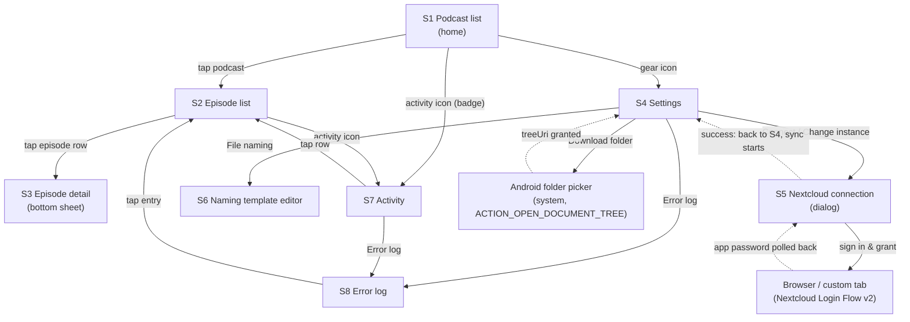

Back behaviour: system back pops one level; back from S2 returns to S1 with its scroll position and
filter intact; the S5 dialog can only be dismissed by Cancel or a successful authorization (no
tap-outside dismiss while an auth request is in flight).

---

## 4. S1 — Podcast list (home)

The launcher screen. One row per subscribed feed, ordered by **most recent episode publication date,
descending** (feeds never fetched sort last, then title A–Z).

**Ordering is frozen between refreshes.** The sort is computed once per explicit pull-to-refresh (and
on cold start) and then held for the life of the screen — a background sync or a triage decision
updates badges and rows *in place* but never reorders the list. Rows must not move under the user's
finger.

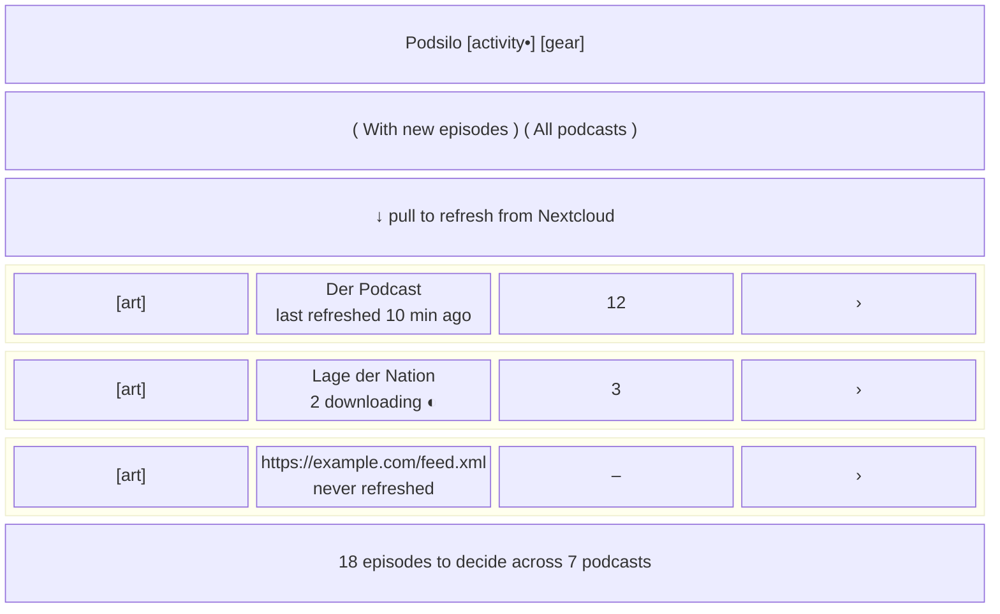

**Row anatomy**

| Element | Source | Rule |
|---|---|---|
| Artwork, 56 dp square | `Feed.imageUrl` | placeholder monogram tile when `null` or not yet fetched |
| Primary line | `Feed.title` | falls back to `Feed.url` until the first successful feed fetch (architecture §4) — never "Unknown podcast" |
| Secondary line | `Feed.lastRefreshedAt` | relative time; `"never refreshed"` when `null`; while that feed has active downloads it reads `"n downloading"` next to a small **indeterminate/aggregate progress circle** (§12.2) |
| Count badge | see §12.5 | number of episodes **available to decide**; `–` when the feed has never been fetched; `0` shown only in "All podcasts" mode |
| Chevron | — | affordance for navigation; whole row is the tap target (≥ 56 dp) |

**Filter (segmented control, top of list)** — `With new episodes` (default) / `All podcasts`.
The default hides feeds whose count is 0, so the home screen is a worklist. Session-scoped, not
persisted.

**Pull to refresh** — enqueues an expedited `SyncWorker` (subscriptions pull → outbox push →
episode-action pull → reconcile, architecture §6) *and* a `FeedRefreshWorker` pass over all feeds.
The Material 3 pull-to-refresh indicator stays visible for the whole chain; counts and rows update
live as Room emits. Completion is silent; failure shows a snackbar (§12.8) **and** appends to the
error log (S8), leaving the previously loaded list on screen — refresh never clears content.

**App bar** — title `Podsilo`; actions: **Activity** (badge dot when any download is running or any
`ERROR`/unsynced row exists) → S7, and **Settings** (gear) → S4.

**Footer/summary line** — total undecided episodes across all feeds.

**States**

- *No Nextcloud configured* (first run): the list is replaced by a centred empty state — one sentence
  ("Podsilo follows the podcast subscriptions in your Nextcloud.") plus a single **Connect Nextcloud**
  button opening S5. No decorative illustration.
- *Configured, no feeds yet* (first sync running): three shimmer rows, no spinner overlay.
- *Configured, zero subscriptions*: empty state explaining subscriptions are managed in Nextcloud,
  with a **Refresh** button. No add-feed affordance.
- *Filter hides everything*: "Nothing new. All caught up." + a link to switch to *All podcasts*.
- *Downloads paused* (folder missing/revoked, or storage full — §12.11): persistent inline banner
  above the list with the reason and the fix (**Choose folder** / **Free up space**). Never a crash,
  never a silent failure.
- *Offline*: see §12.10 — a pull-to-refresh with no connectivity fails immediately with an
  "No network connection" banner; it does not attempt, and does not time out against, any feed.

**First-run checklist** — until the app can actually complete a download, S1 shows a checklist card
above the list instead of discovering the gap at the first swipe:

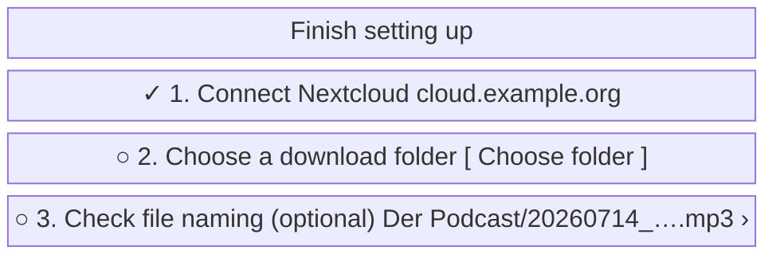

Rules: steps are shown in order, each with a live ✓/○; step 1 is the S5 dialog, step 2 the SAF
picker, step 3 opens S6 and is explicitly optional (a default template exists). Step 2's state comes
straight from the built `DownloadFolderAccess`: `NotChosen` → ○, `Granted` → ✓, `Revoked` → ⚠ with
**Choose folder again**. The card disappears permanently once steps 1 and 2 are satisfied, and
returns only if the grant is lost. Podcasts and episodes remain browsable while the checklist is
incomplete — only the download *action* is blocked, with the row's Download affordance disabled and a
tap explaining which step is missing.

---

## 5. S2 — Episode list

One feed's episodes, newest first by `pubDate` (episodes with a `null` `pubDate` sort last).

**Sticky month headers and fast-scroll** — rows are grouped under sticky `July 2026` headers, and the
list has a draggable fast-scroll thumb that shows the month it is passing over. Both matter because
`All` on a long-running feed is hundreds of rows; `null`-date episodes group under a final
`Date unknown` header.

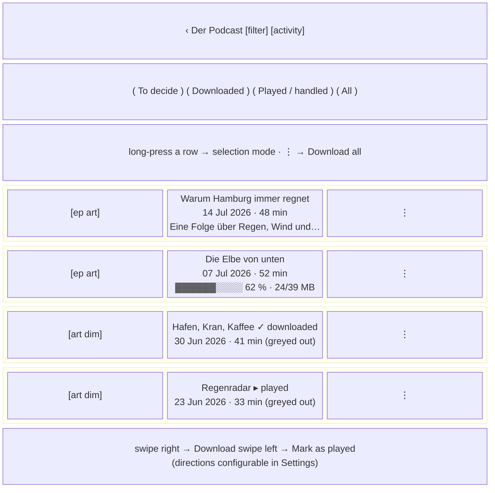

**Row anatomy** — episode artwork (episode image if the feed supplies one, else the feed's), title
(2 lines max), meta line `date · duration · size` (each part omitted when unknown — duration is
"notoriously unreliable", never faked), description snippet (2 lines, HTML stripped for the snippet),
status badge/progress, overflow `⋮`.

**Greyed-out rows** — any episode with a terminal ledger state (`DOWNLOADED`, `SKIPPED`,
`HANDLED_REMOTELY`) renders at reduced emphasis: artwork at ~60 % opacity, title and meta in the
`onSurfaceVariant` role, no accent colour. Greying is **presentation only** — the row stays fully
interactive: tapping it still opens S3, and its overflow still offers **Download again** (§12.3).
Contrast in both themes stays ≥ 4.5:1 for the title — "greyed out" means de-emphasised, not
unreadable (§12.7).

**Tap** on the row body opens **S3**. It never triages — a mis-tap must not queue a download.

**Swipes** — right → **Download**, left → **Mark as played**, both re-mappable in Settings (§12.1).

**Overflow `⋮`** mirrors the swipes and adds context items: *Download* / *Download again*,
*Mark as played*, *Retry* (ERROR only), *Cancel download* (QUEUED/DOWNLOADING only), *Copy episode
link*, *Open in browser*.

**Batch triage** — long-pressing a row enters **selection mode**: the app bar becomes
`n selected` with **Download**, **Mark as played** and **Select all** (scoped to the current filter),
and tapping rows toggles them. Acting applies the same per-episode writes in one pass, behind a
confirmation naming the count ("Download 12 episodes?"). Back or ✕ leaves selection mode. This is the
answer to "12 new episodes, no undo, 12 swipes".

**Download all** — an app-bar `⋮` item on S2, reading **Download all (12)**: queues every episode
currently in the `To decide` filter — i.e. every episode with no ledger row, so anything already
marked as played, downloaded or handled elsewhere is untouched by definition. Confirmation dialog
names the count and, when durations are known, an approximate total size. Disabled (with the reason)
while downloads are paused. It is deliberately in the overflow, not a prominent button, and it exists
only per-podcast — there is no global "download everything" anywhere.

**No count cap.** A bulk download is never refused or warned about for being *large* — only for not
*fitting*. The confirmation dialog gains a warning line **only** when the estimated total exceeds the
free space in the download folder's volume:

> ⚠ Estimated 4.2 GB — only 1.1 GB free on SD card. Some downloads will fail.

The action stays enabled (the estimate is derived from `itunes:duration`, which architecture §4 calls
notoriously unreliable — it must never block a decision). When durations are unknown for some or all
episodes the size is not estimated and no warning is shown. Free space is read once, when the dialog
opens.

**Mark all as played** — on the **Downloaded** filter only, reading *"Mark all n as played"*, behind
a confirmation naming the count. Scoped there because *To decide* already has S4's per-feed preview
and *Played / handled* would be a no-op; it answers "these are all on the phone now, stop offering
them anywhere else". The dialog states that the files stay — Podsilo never deletes them — and that
the state reaches Nextcloud (added 2026-08-03).

**Filter** — chips: `To decide` (default) / `Downloaded` / `Played / handled` / `All`. Mapping to
`LedgerFilter` (architecture §5):

| Chip | Ledger predicate |
|---|---|
| To decide (default) | no ledger row |
| Downloaded | `state = DOWNLOADED` |
| Played / handled | `state = SKIPPED` or `HANDLED_REMOTELY` — the name covers both the user's own "mark as played" and episodes handled on another client, which the user never touched |
| All | everything, including `QUEUED`/`DOWNLOADING`/`ERROR` |

The per-feed filter choice is remembered per feed for the session and resets to `To decide` on cold
start.

**No backlog cutoff in the query.** Old episodes are *not* filtered by `pubDate` at read time; the
"hide old episodes" feature works by **writing** `SKIPPED` rows, so old episodes leave `To decide`
and appear under `Played` like any other handled episode (§12.6, ADR 0013). This keeps the
list query to a single predicate and makes the state visible and reversible.

**Also pull-to-refresh** here, scoped to this feed (conditional GET; a 304 shows "Already up to
date").

**States**

- Never fetched: shimmer rows + the URL as title in the app bar.
- Feed fetch failed: inline banner with the reason in plain words ("Feed server did not respond") +
  **Try again**; the entry is written to S8; previously parsed episodes stay listed.
- Filter empty: "Nothing to decide in this podcast." + link to *All*.
- Episode has no enclosure (architecture §7): row rendered but dimmed, badge **no audio**, download
  disabled, overflow only offers *Open in browser*.

---

## 6. S3 — Episode detail (full screen)

**A full screen** — a read step inside triage, left with the back affordance. Reachable for **every**
episode regardless of state, including greyed-out ones (explicit requirement).

**Amended 2026-08-03.** This was specified as a modal bottom sheet and built as one *inside a
full-screen navigation destination*, which is a contradiction: the destination owned the window and
held nothing, so a downward drag dismissed the sheet and revealed a blank page. Since the sheet was
already `skipPartiallyExpanded` (always full height) and show notes run to paragraphs, it was a full
screen wearing a sheet's clothes. There is no pull-to-dismiss.

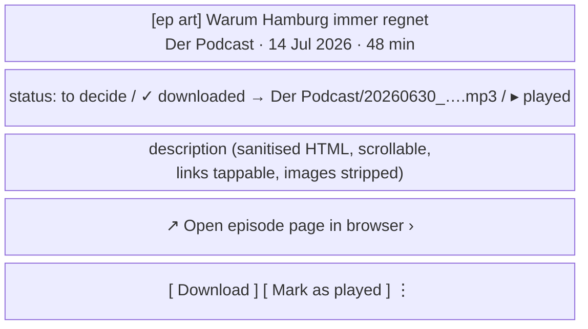

Renders `Episode.description` — stored raw, **sanitised at render time, never at write time**
(architecture §4). Allowed: paragraphs, line breaks, bold/italic, lists, links. Stripped: scripts,
styles, iframes, remote images, tracking pixels.

The status line is state-aware: for `DOWNLOADED` it shows `writtenFileName` and the target folder;
for `DOWNLOADING` it shows the same progress bar as the row; for `ERROR` it shows `lastError` and
the attempt count with a link to S8.

Action bar, by state:

| State | Buttons |
|---|---|
| no row | **Download** · **Mark as played** |
| `QUEUED` / `DOWNLOADING` | **Cancel download** (progress shown above) |
| `DOWNLOADED` | **Download again** · **Mark as played** |
| `SKIPPED` / `HANDLED_REMOTELY` | **Download** (i.e. "download anyway") |
| `ERROR` | **Retry** · **Mark as played** |

**Open episode page in browser** sits between the description and the action bar, on its own
hairline-separated row: it belongs to the *read* step and must not compete with the decision. Rendered
only when the feed supplied an item `<link>` — never synthesised from the enclosure URL, which points
at an audio file rather than a page — so a feed that omits it simply has no row instead of a dead tap.
It opens a Custom Tab (falling back to `ACTION_VIEW`) and the sheet **stays open behind it**: leaving
to read show notes is not a triage decision, and coming back must not cost the user their place. The
same action is in the row overflow on S2. Requires `Episode.link`, which did not exist — see
architecture §4 (schema v2).

Deciding closes the sheet and animates the row into its new state (§16).

---

## 7. S4 — Settings

A plain scrolling list of grouped rows. Reached only from S1's gear icon.

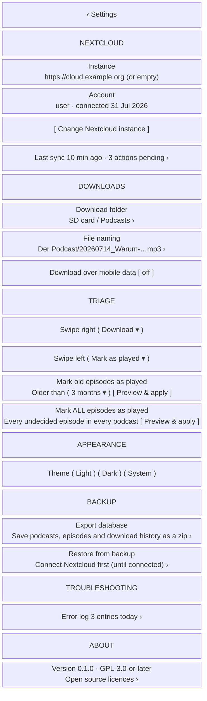

**Nextcloud group**

- **Instance** — the connected base URL from `SettingsRepository`. When nothing is set the value area
  is **empty** (no placeholder text); the row is not tappable.
- **Account** — username and connection date, hidden entirely when not connected. No password is ever
  shown or entered in the app (Login Flow v2 only, §8). An app-bar `⋮` → **Disconnect** clears the
  credentials and warns that the *ledger is kept*, so nothing will be re-downloaded after
  reconnecting.
- **Change Nextcloud instance** — a button *below* the instance row, opening S5. Reads **Connect
  Nextcloud** when nothing is configured.
- **Last sync** **[gap]** — relative timestamp plus outbox depth (`syncedToServer = false` count);
  tapping opens S7.

**Downloads group**

- **Download folder** **[gap, required]** — launches the system `ACTION_OPEN_DOCUMENT_TREE` picker;
  shows the resolved tree name. If the permission was revoked the row shows a warning colour and the
  words **not available** (architecture §8).
- **File naming** → S6.
- **Download over mobile data** — switch, **off by default**; off means `DownloadWorker` runs on
  unmetered networks only. Named as a constraint, not a "rule", so it can't be mistaken for
  auto-download.

**Triage group** (new)

- **Swipe right** / **Swipe left** — each a dropdown over the same option set: `Download`,
  `Mark as played`, `Nothing (disable)`. Defaults: right = Download, left = Mark as played. The two
  cannot hold the same action (picking a taken action swaps them, so the pair is always valid). The
  values are persisted in DataStore and read by the episode row; the swipe background label and icon
  always reflect the current mapping, so the UI can never lie about what a swipe does.
- **Mark old episodes as played** — a duration picker (`1 month` / `3 months` / `6 months` /
  `1 year` / `off`) plus **Preview & apply**. This is a *write*, not a filter: it upserts `SKIPPED`
  rows for every currently-known episode older than the cutoff that has no ledger row, exactly as if
  each had been swiped.
- **Mark ALL episodes as played** — the same operation with no age limit: every undecided episode in
  every podcast. A one-shot "start from a clean slate" button, not a persisted rule.

Both share one **preview step** — tapping *Preview & apply* opens a dialog that names the count and
summarises what will happen before anything is written:

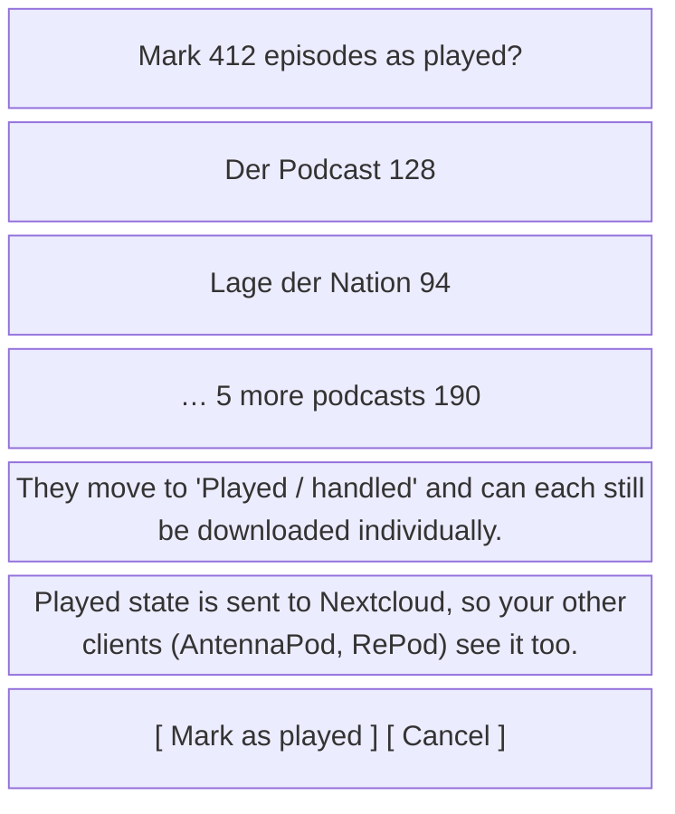

Pushing the resulting `PLAY` actions to Nextcloud is **intended, not a side effect** — sharing triage
state across clients is the point (README), and the Android device is the user's main player. The
second note in the preview states it plainly rather than warning against it. Further rules:

  - the actions enter the normal outbox (`syncedToServer = false`) and are pushed in batches by
    `SyncWorker`, not in one giant POST;
  - the operation is not undoable in bulk (per the no-undo decision) — the preview is the safeguard;
  - each episode remains individually downloadable via **Download** in S3 or the row overflow;
  - when the *older than* value is not `off`, the rule is also applied to newly-parsed episodes after
    each feed refresh (an episode arriving already older than the cutoff is marked immediately,
    without a preview — the user consented once by setting the rule). This **replaces** the
    architecture's read-time `pubDate >= firstSeenAt` backlog cutoff rather than composing with it
    — ADR 0013, which also amends CLAUDE.md §5.

**Appearance group** — **Theme**: 3-option segmented control **Light / Dark / System** (default
`System`), persisted in DataStore, applied immediately without an activity restart (§12.7).

**About group** — version and licence, plus a **Source code** row linking to the repository. GPL-3.0
means little without somewhere to get the code, so the licence line and the link belong together.

**Backup group** (`docs/decisions/0018`)

- **Export database** — a SAF `CreateDocument`, offered as `podsilo-backup-YYYY-MM-DD.zip` so
  successive backups sit beside each other rather than one silently replacing the last. The subtitle
  names what is inside; the snackbar afterwards names the counts.
- **Restore from backup** — **disabled until Nextcloud is connected**, reading *"Connect Nextcloud
  first"* (`docs/decisions/0018`). Not about secrecy — the archive carries no credentials by design —
  but about sequencing: the restored ledger would otherwise land behind S1's *not configured* empty
  state, which shows none of it, while the snackbar reports podcasts restored. Connect first and the
  ledger lands somewhere that renders it.
- Once connected it opens a **warning dialog first, then** the file picker. A restore replaces the
  ledger, which is the app's only memory of what has already been handled, and that has to be said
  in words before a file is read — the same rule the bulk-mark preview follows (§7,
  `docs/decisions/0013`). The dialog also states the reassuring half, which is true rather than
  soothing: Nextcloud is untouched, and the next sync pulls back whatever happened after the backup.
- Both rows go **dead while either operation runs**, so a second tap cannot start a second export
  over the same file. They grey out rather than disappearing — a row that vanished mid-operation
  reads as a crash.
- Failures are four separate sentences, not one: *not a Podsilo backup*, *made by a newer Podsilo —
  update the app first*, *couldn't be read, nothing was changed*, *couldn't be written*. Each has a
  different next step for the user.

**Troubleshooting group** — **Error log** row with an entry count → S8.

Settings has no Save button: every control commits on change.

---

## 8. S5 — Nextcloud connection dialog

A modal dialog over S4, using **Nextcloud Login Flow v2** exclusively — the app never sees, asks
for, or stores a user password; it stores only the app password the flow hands back (encrypted,
`AppPasswordCipher`, ADR 0010).

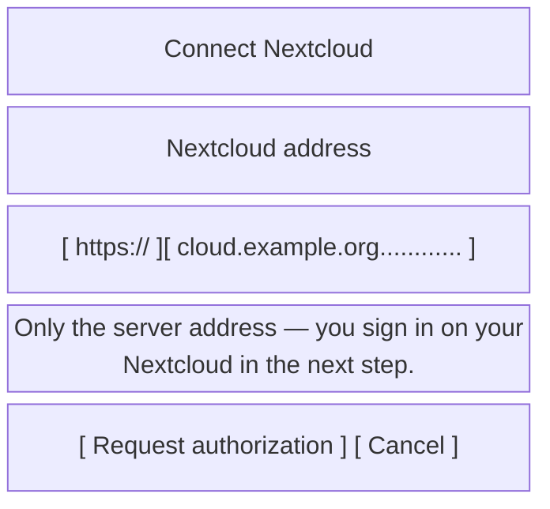

**Input** — one text field with a **non-editable `https://` prefix** rendered inside it. Keyboard
type URI, autocorrect off, IME action Go = the primary button. Validation on submit only: non-empty
host, no spaces, optional `:port` and path allowed (Nextcloud in a subdirectory is common); a typed
`https://` or `http://` is stripped rather than rejected.

**Primary button** — **Request authorization**. The dialog moves to a *busy* state: field read-only,
button replaced by a spinner labelled **Waiting for authorization in your browser…**, Cancel stays
enabled and aborts the poll.

**The poll runs only while this dialog is on screen** (`docs/decisions/0020`). Opening the browser
backgrounds the app, and the poll stops until the user comes back — which they must do anyway, since
the whole point is to return with access granted. On Android 17 a backgrounded process could not
resolve the host at all, and a single failure abandoned the entire flow while the browser was still
reporting success; not making the call is what fixed it. The user sees nothing different: the spinner
is up while they are away, and the login completes moments after they return.

```mermaid
sequenceDiagram
    participant U as User
    participant D as S5 dialog
    participant B as Browser / custom tab
    participant NC as Nextcloud
    participant DS as SettingsRepository
    participant W as SyncWorker

    U->>D: enter host, tap "Request authorization"
    D->>NC: POST /index.php/login/v2
    NC-->>D: { login (URL), poll: { token, endpoint } }
    D->>B: open login URL
    U->>B: sign in, "Grant access"
    loop until granted / cancelled / timeout
        D->>NC: POST poll endpoint (token)
    end
    NC-->>D: { server, loginName, appPassword }
    D->>NC: GET /index.php/apps/gpoddersync/subscriptions (authenticated)
    alt 200
        D->>U: "Connect as {loginName}?"
        alt Connect
            D->>DS: store server URL + loginName + encrypted appPassword
            D->>W: enqueue expedited SyncWorker (pull all subscriptions)
            D->>U: dialog closes, S4 shows the instance; S1 fills in
        else Use a different account
            D->>B: open the server root so the session can be ended
            D->>U: back to the address field, with the browser-session hint
        end
    else 404 / 401 / network
        D->>U: stay open, inline error under the field, input restored
    end
```

Success is only ever claimed after that authenticated `GET /subscriptions` returns 200 — a completed
login flow is not proof that gpoddersync is installed. On failure the app password is discarded, not
stored.

### The account is confirmed before anything is stored

**Amended 2026-08-03 — see `docs/decisions/0019`.** This section used to store the credentials the
moment gpoddersync answered 200. It no longer does, because Login Flow v2 **has no account chooser**:
if the browser already holds a Nextcloud session, the grant page reads *"Currently logged in as X"*
above a single **Grant access** button, and X is simply whoever that browser was signed in as. The
app sends no username and cannot influence this — verified on a real device, where the flow URL
redirects to `/login/v2/flow?user=&direct=0` with the parameter empty.

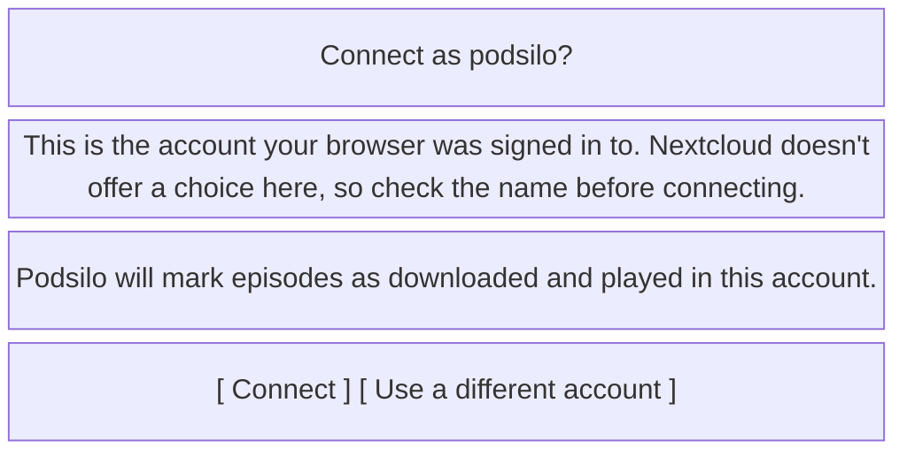

- **The login name is the dialog title**, so it is the question being answered rather than a detail
  inside a paragraph.
- **The consequence is stated**, because it is the reason this confirmation exists at all: connecting
  the wrong account writes `DOWNLOAD` and `PLAY` actions into *that* account's log from then on, and
  those are not retractable.
- ***Use a different account*** discards the app password unstored and opens the **server root** —
  not the flow URL. Requesting authorization again against a live session returns the same account
  however many times it is tried, so the browser is the only place the problem can be fixed. The
  dialog then says so next to the address field.
- The granted app password is left on the server. It is harmless and revocable under *Security* in
  Nextcloud; revoking it automatically is in `docs/backlog.md`.

**Inline error messages** (under the field, plain language, never a stack trace; each also written to
S8):

| Cause | Message |
|---|---|
| DNS / unreachable | "Can't reach that address. Check the spelling and your network." |
| Timed out | "The server didn't answer in time. Nextcloud slows down repeated login attempts — wait a minute and try again." |
| Cleartext refused | "This Nextcloud reports its own address as unencrypted http://, which Android blocks. Set 'overwriteprotocol' => 'https' in the server's config.php." |
| TLS error | "The server's certificate isn't trusted." |
| No Login Flow v2 endpoint | "This doesn't look like a Nextcloud server." |
| 404 on the gpoddersync path | "This Nextcloud doesn't have the GPodder Sync app installed." |
| 401 after authorization | "Authorization was refused. Try again." |
| Flow abandoned / timed out | "Authorization wasn't completed." |

**The connection is HTTPS by default, and stays HTTPS.** The three URLs Login Flow v2 hands back —
the browser page, the poll endpoint, and the `server` every later request is built on — come from
Nextcloud's own `overwriteprotocol` / `overwrite.cli.url`, and behind a TLS-terminating proxy they
are very often left as `http`. Podsilo **upgrades** those to `https` when the flow was started over
`https`, and never downgrades. Following them verbatim would be worse than failing: `server` is
persisted, so one misconfigured field would put the app password on the wire in cleartext on every
sync from then on. A user who explicitly typed `http://` keeps their choice, and Android's refusal is
then reported as *Cleartext refused* rather than as a wrong address.

**Every inline error is also written to S8** with the underlying message — the host that actually
failed and what it did. The dialog has room for one sentence, which is right for it and useless for
diagnosis; the log is where "can't reach that address" becomes answerable.

**A timeout is not an unreachable address.** They are the same exception and were once the same
sentence, which sent the author to re-check a host name that was correct. Nextcloud's bruteforce
protection **deliberately** delays repeated authorization attempts from one address, so "the server
is slow because I just tried three times" is a routine state here, not an exotic one. The message
therefore names waiting as the fix.

**Changing an existing instance** — pre-filled with the current host, title reads *Change Nextcloud
instance*, with a caution line: "Your download history is kept, so episodes you already handled stay
handled." (True: the ledger has no FK to feeds — architecture §4.)

---

## 9. S6 — Naming template editor

Pushed from S4. Exists because the README calls filenames "the entire user experience of a
download", and `:core:naming` is already built and testable.

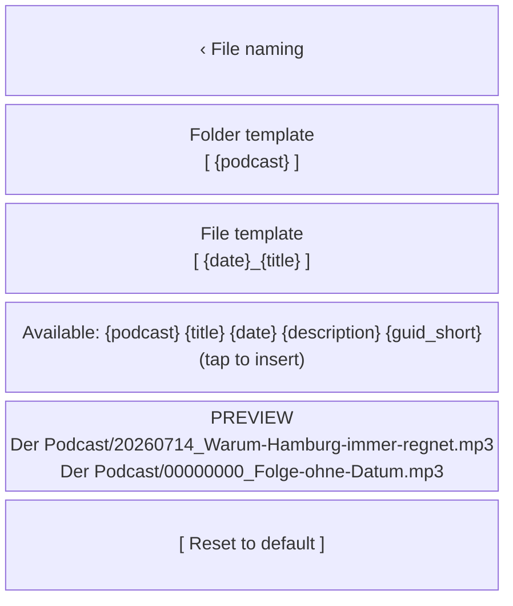

The placeholder chips are exactly the set `DefaultNamingTemplateEngine` resolves — `{podcast}`,
`{title}`, `{description}`, `{date}` (also `{date:pattern}`) and `{guid_short}`. `{ext}` is
deliberately absent: the extension is appended after resolution and is not resolved as a variable
(CLAUDE.md §6). Offering a chip the engine does not know would render it as literal text in a
filename.

Live preview calls the already-tested `NamingTemplateEngine.resolve()` against a real recent episode
plus synthetic worst cases (missing date → `00000000` per ADR 0004; over-long title → truncation;
illegal characters → sanitised). An invalid template shows the reason under the field and cannot be
applied. Existing files are never renamed — a note says so.

---

## 10. S7 — Activity (downloads & sync)

Kept as a full screen (confirmed). The one place that answers "what is the app doing, and what is
stuck?".

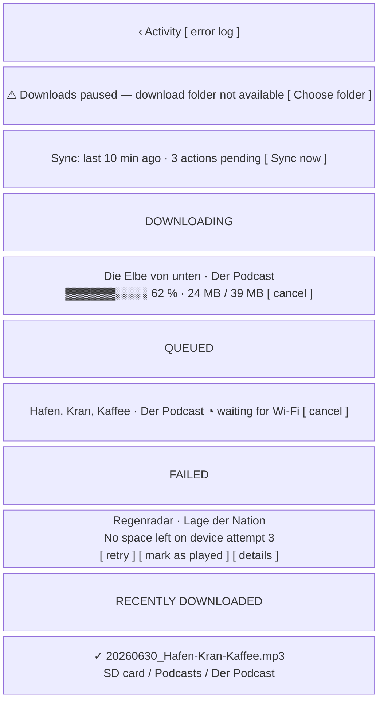

Groups: a **paused** banner when the queue is held (§12.11), sync status (last sync, outbox depth,
**Sync now** — disabled and labelled "No network connection" when offline), downloading (determinate
progress + bytes), queued (with the reason it is waiting — Wi-Fi, folder missing, resuming after
restart), failed (`lastError` as a human sentence + `attempts`, with **Retry**, **Mark as played**,
and **details** → S8), and the last ~20 completed downloads showing `writtenFileName` and the folder
— the app's only "did it actually land?" affordance.

It is explicitly *not* a file manager: no delete, no open-file, no existence check — matching README
("Podsilo does not delete it, track it, or care whether it still exists").

Tapping any row jumps to that episode in S2. App-bar action opens S8.

---

## 11. S8 — Error log

A chronological, read-only log of everything that failed, so a single-user self-hosted setup can be
debugged without a laptop, `adb`, or a bug report.

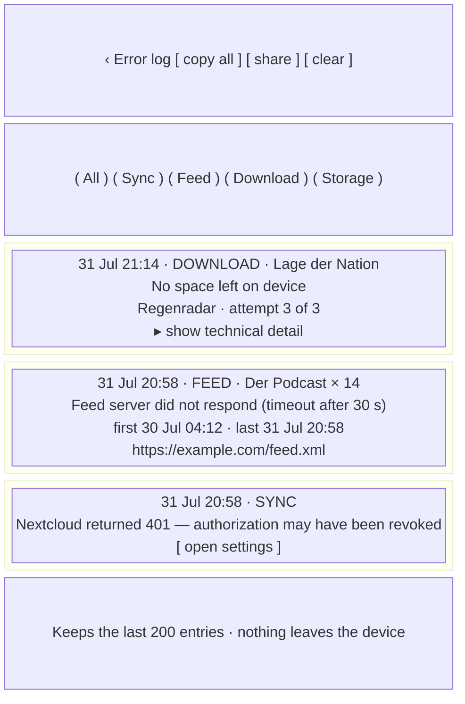

**Entry shape** — timestamp (absolute, local), category (`SYNC` · `FEED` · `DOWNLOAD` · `STORAGE` ·
`AUTH`), the affected feed/episode when known, a **plain-language sentence first**, and a collapsed
*technical detail* section (HTTP status, exception class, URL, worker name, `attempts`). The plain
sentence is what the user reads; the detail is what gets pasted into a GitHub issue.

**Sources** — anything that produced a banner, a snackbar, a row `lastError`, or a worker
`Result.retry()/failure()`: feed fetch failures, sync/auth failures, download failures and
cancellations-by-error, SAF permission loss, disk-full, tag-write partial failures (informational,
since a tag failure never blocks a download — architecture §11), and abandoned Login Flow attempts.

**Rules**

- **Repeated identical failures collapse into one entry** with an occurrence count (`× 14`) and
  *first seen* / *last seen* timestamps, rather than one entry per attempt. Identity = category +
  affected feed/episode + normalised message. Without this, one feed failing every few hours evicts
  every genuinely one-off error from the buffer within a day. The technical detail section keeps the
  **most recent** occurrence's detail.
- Ring buffer, last 200 **collapsed** entries (or 7 days, whichever is larger); stored in Room,
  survives restart.
- **Never** contains the app password, the Basic-auth header, or full URLs with credentials.
- **Copy all** / **Share** produce plain text. Both, and **Clear**, are *disabled rather than hidden*
  when the log is empty, so the affordance stays where the user learned it.
- **Clear** asks for confirmation. The dialog names the count ("Clear all 4 log entries?") and states
  that the log is device-local — there is no copy anywhere else and this is not undoable. It clears
  **the whole ring buffer, not the current filter**: a filtered clear would leave a count the user
  cannot account for. Recording resumes immediately; nothing else is touched — no ledger row, no
  worker, no sync state.
- Tapping an entry that names an episode jumps to it in S2.
- Successes are not logged — this is a failure log, not a journal. (`RECENTLY DOWNLOADED` in S7
  covers the success case.)
- Nothing is uploaded anywhere: no telemetry, per README.

---

## 12. Cross-cutting rules

### 12.1 Swipe gestures

| Gesture | Default action | Ledger write | Sync effect |
|---|---|---|---|
| Swipe **right** (left→right) | **Download** | `QUEUED` → `DOWNLOADING` → `DOWNLOADED` | `DOWNLOAD` action posted |
| Swipe **left** (right→left) | **Mark as played** | `SKIPPED` | `PLAY(started=0, position=total)` |

Both directions are **re-mappable in Settings → Triage** (`Download`, `Mark as played`, `Nothing`);
the swipe background's icon and word are rendered from the current mapping, never hard-coded. Each
swipe is single-direction, must pass a ~40 % threshold to commit (no accidental flicks), and then
holds its decision for a ~5 s **undo window** before anything is written (§12.3,
`docs/decisions/0021`) — the threshold guards against the flick, the window against the deliberate
swipe on the wrong row. Non-gesture equivalents are mandatory: the row overflow `⋮`
and the S3 action bar.

Swiping an episode that already has a terminal state performs the same action idempotently:
swipe-right on a `DOWNLOADED` episode means **Download again** (§12.3); swipe-left on an already
`SKIPPED` one is a no-op.

### 12.2 Download progress

A download is never a state you have to guess at. Three surfaces, all driven by the same
`DOWNLOADING` row + WorkManager progress:

| Where | Treatment |
|---|---|
| Episode row (S2) | line 3 becomes a **determinate linear progress bar** with `%` and `MB / MB`; indeterminate while `QUEUED` or before the first byte, with the reason ("waiting for Wi-Fi") |
| Episode detail (S3) | same bar, full width, above the action bar |
| Podcast row (S1) | small **circular** progress ring around the artwork corner + `"n downloading"` — aggregate for that feed |
| Activity (S7) | bar + bytes + **cancel** per download |
| Notification | foreground-service progress notification (§12.9) |

On completion the bar is replaced by the **✓ downloaded** badge (and, in S3, the written filename) —
the transition is a fade, not a disappearance, so the finish is visible. On failure it becomes the
**failed** badge with the reason. Circles are used only where a bar doesn't fit (S1 artwork); lists
use bars.

**Progress updates are throttled to 1 Hz** — matching `DownloadNotifications`' existing throttle, so
the notification, the row and S7 never disagree, and a fast download doesn't repaint the list 60
times a second. The bar animates between updates rather than stepping.

**After process death, never show a stale percentage.** WorkManager progress does not survive the
process. On cold start, any row whose ledger state is `DOWNLOADING` renders as **indeterminate** with
the word *resuming* until the worker reports its first progress update; if WorkManager has no live
work for that `episodeKey` at all (killed before it could re-enqueue), the row shows *queued* and the
work is re-enqueued on first observation. The same rule applies to S7 and to the aggregate ring on S1.
A percentage is only ever drawn from a progress update received in this process.

### 12.3 A swipe has an undo window; everything else is corrected by acting again

**Amended 2026-08-09 (issue #49, `docs/decisions/0021`).** This section was titled *"No undo —
re-download instead"* and argued it from the protocol: a skip becomes a `PLAY` action in an
append-only log that other clients act on, and the GPodder API has no retraction. That argument is
still correct, and it is *why* the amendment takes the shape it does.

**A swipe holds its decision for ~5 s and writes nothing** — no ledger row, no outbox entry, no work
request — and offers *Undo* on a snackbar. Undo discards the held decision; there is nothing to
retract because nothing was written. The row renders the decision immediately, so the gesture does
not look ignored, but that is presentation only. One pending decision at a time: a second swipe
commits the first, and leaving the screen commits rather than discarding. A decision made and then
immediately killed by process death is lost, which is the cost the design accepts.

**Everything else still commits immediately**, and the rest of this section is unchanged:

- **The row's action buttons and S3's action bar** are deliberate presses on a named affordance, not
  a gesture that can be started by trying to scroll. No undo.
- **Bulk actions keep their confirmations and gain no undo** (`docs/decisions/0021`, decision D2):
  selection mode, *Download all* and *Mark old / all episodes as played*. Naming the count before
  writing is a stronger safeguard than five seconds for an action covering hundreds of rows.

Decisions are otherwise corrected by acting again:

- **Download again** is offered on `DOWNLOADED`, `SKIPPED`, `HANDLED_REMOTELY` and `ERROR` episodes
  (row overflow, S3 action bar, swipe-right). It writes `QUEUED` and enqueues `DownloadWorker` as
  usual — a user-initiated transition out of a state the architecture calls terminal (§14).
- **Duplicate-file guard.** Before writing, `EpisodeDownloader` checks whether **this episode's own
  previously written file** (`writtenFileName`) is still present — which the existing
  `DownloadTarget.existingNames(folder)` already answers, so no new port method is needed. If it is,
  the download is **aborted, not overwritten and not suffixed**: the ledger returns to `DOWNLOADED`
  and the UI reports *"Already in your folder — Der Podcast/20260630_Hafen-Kran-Kaffee.mp3"* as a
  snackbar (and in the row/detail status line). This is an informational outcome, not an `ERROR`, and
  is not written to S8. If the file is gone, the download proceeds and produces it again.
  - **This does not change collision suffixing.** `existingNames` keeps doing what ADR 0011 says it
    is for — stopping two *different* episodes fighting over one name, with ` (2)`, ` (3)`, … inside
    `:core:naming`. The guard is a separate, narrower question asked of the same data: *is the name
    this episode previously wrote still there?*
  - Note for implementation: this is the *only* place existence is allowed to affect behaviour. It is
    a pre-flight check at explicit user request — it must **not** become the general "have I
    downloaded this?" test, which stays the ledger (architecture §4/§11's central invariant, and ADR
    0011's own KDoc). A first-time download (no `writtenFileName`) performs no existence check at all.
- **Mark as played** on a `DOWNLOADED` episode is allowed too (it changes only the ledger/sync state;
  the file on disk is never touched — Podsilo does not delete files).
- Bulk actions are the exception that keeps a safeguard: selection-mode actions and *Download all*
  (§5) confirm with a count, and *Mark old / all episodes as played* (§7) shows a full preview,
  because those are the actions affecting hundreds of rows at once.

### 12.4 Filter defaults

| Screen | Default | Alternatives | Persisted? |
|---|---|---|---|
| S1 podcasts | With new episodes | All podcasts | no (session) |
| S2 episodes | To decide | Downloaded · Played / handled · All | per feed, session |
| S8 error log | All | Sync · Feed · Download · Storage | no |

### 12.5 What the count badge counts

`Feed.count = episodes with no ledger row` — exactly what the `To decide` filter shows, exactly the
request's "number of available episodes for download". Notes:

- With the *Mark old episodes as played* rule active, old episodes already carry `SKIPPED` rows, so
  they never inflate the badge (this is why the read-time `pubDate` cutoff is no longer needed).
- `QUEUED`/`DOWNLOADING` episodes are **not** counted (already decided); they show as
  "n downloading" instead.
- A feed never fetched shows `–`, not `0` — unknown is not zero.
- Counts come from the same SQL join as the list (architecture §5), never a second code
  path, so a badge can never disagree with the list it opens.

### 12.6 Ledger state → row treatment (single source of truth for the UI)

| State | Badge text | Row treatment | Actions offered |
|---|---|---|---|
| *no row* ("to decide") | none | full emphasis | Download · Mark as played |
| `QUEUED` | queued | normal + indeterminate progress, waiting reason | Cancel |
| `DOWNLOADING` | downloading | determinate progress bar + bytes | Cancel |
| `DOWNLOADED` | ✓ downloaded | **greyed out**, filename in detail | Download again · Mark as played |
| `SKIPPED` | ▸ played | **greyed out** | Download |
| `ERROR` | failed | warning-colour badge, `lastError` on line 3 | Retry · Mark as played · details (S8) |
| `HANDLED_REMOTELY` | handled elsewhere | **greyed out**, small cloud icon | Download |

All greyed-out rows remain tappable and open S3 (explicit requirement).

### 12.7 Theme: light / dark / system

- Three-way choice, persisted in DataStore, default **System**, applied via the Compose theme at the
  root without recreating the activity.
- Material 3 colour roles only — one seed colour, two generated schemes. Dynamic colour (Material
  You) is **off**, so the app looks the same on every device and both schemes can be verified.
- Holds in both schemes: body text ≥ 4.5:1, status badges and swipe backgrounds ≥ 3:1; the
  Download/Mark-as-played swipe colours stay distinguishable in dark mode (do not simply darken
  them); greyed-out rows use `onSurfaceVariant`, not an opacity that drops the title below 4.5:1;
  artwork gets a subtle border in dark mode so black-background covers don't bleed into the surface;
  progress bars use the accent role, never pure white/black.
- Every status is carried by **text**, never colour alone.

### 12.8 Error surfacing

Four levels, chosen by whether the user can act — and everything in levels 1–3 also lands in S8:

1. **Snackbar** — transient outcome of an action just taken (sync failed, "already in your folder").
2. **Inline banner** at the top of the affected list — a persistent blocking condition the user must
   fix: no Nextcloud configured, folder permission revoked, feed unreachable, storage full.
3. **Row-level** — per-episode `lastError` on the row, in S3, and in S7's failed group.
4. **Error log (S8)** — the durable record, with technical detail on demand.

Never a modal error dialog, never a raw exception in the primary sentence, never a silent failure. A
`nextcloud-gpodder` server that discards `DOWNLOAD` actions (ADR 0008) is *not* surfaced as an error —
it returns 200 and the local ledger is authoritative.

### 12.9 Notifications

- **Foreground service notification** while downloads run: "Downloading 2 episodes", current title,
  determinate progress, **Cancel all**. Tapping opens S7.
- **One completion notification** per batch, listing the count; silent by default; tapping opens S7.
- **Failure notification** only after retries are exhausted; tapping opens S8.
- No notification for sync, ever.

### 12.10 Offline handling

Connectivity is checked **before** any network work is started, so the user never waits on a timeout
they could have been told about instantly:

| Situation | Behaviour |
|---|---|
| Pull-to-refresh with no connectivity | the indicator returns immediately; banner "No network connection" on S1/S2; **no** feed or sync request is attempted, and nothing is written to S8 (not a failure, a precondition) |
| **Sync now** (S7) while offline | button disabled with the label "No network connection" |
| Download requested while offline | accepted and left `QUEUED` with the reason *waiting for network*; WorkManager's network constraint releases it later — a download request is never rejected for being offline |
| Metered network with *Download over mobile data* off | `QUEUED`, reason *waiting for Wi-Fi* |
| Connectivity returns | the banner disappears; queued downloads start; no automatic sync or refresh is triggered (refresh stays a user action) |
| Loss mid-download | the worker retries with WorkManager's backoff; the row stays `DOWNLOADING`/*resuming*, and only an exhausted retry chain becomes `ERROR` + an S8 entry |

Browsing is fully available offline: everything on S1, S2, S3 and S8 comes from Room.

### 12.11 One "downloads paused" state

Folder-missing, permission-revoked and disk-full are three causes of **one** user-visible condition:
**Downloads paused**. It is a queue-level state, not a per-episode one.

- Existing `QUEUED` rows stay `QUEUED` (they are not failed, not cancelled, not lost); the row reason
  reads *paused*.
- New download requests are still accepted and join the queue — the app never refuses a decision
  because of a fixable configuration problem.
- Surfaced as a persistent banner at the top of S1, S2 and S7, always with the fix as a button:
  **Choose folder** (missing/revoked) or **Free up space** (disk full). Same wording everywhere.
- The foreground-service notification, if present, shows *Paused* rather than progress.
- Resolving the cause resumes the queue automatically; nothing needs re-queuing by hand.
- An in-flight download interrupted by the cause becomes `ERROR` with its reason (and an S8 entry) —
  the pause applies to the *queue*, and one already-started transfer can still fail properly.
- A `DownloadFolderUnavailableException` failure is **non-retryable** by design (ADR 0011), so its row
  must not offer a bare **Retry** — the action is **Choose folder**. Retry only appears on failures
  where retrying can plausibly work (network, 5xx, truncated body).

### 12.12 Accessibility & density

- Tap targets ≥ 48 dp; row height ≥ 72 dp with 3 lines of text. **This includes filter chips and
  segmented options** — they read as labels and are easy to leave at their text height, which is
  exactly the drift this line exists to catch.
- Selection mode is reachable without a long-press (a checkbox appears on the leading artwork when
  the accessibility service is active) and announces `n selected` on every change.
- Sticky month headers are exposed as list headings; the fast-scroll thumb is not the only way to
  move through a long list.
- Swipe actions duplicated as accessibility custom actions and visible overflow items; the announced
  label follows the configured mapping.
- Content descriptions on artwork ("cover art for <podcast>"); progress announced as text
  ("downloading, 62 percent"); greyed-out rows announce their state word, not just a visual change.
- Large font scales supported without truncating decision affordances (title truncates first).
- Type scale: Material 3 `titleMedium` for episode titles, `bodySmall` for meta and snippets; never
  below 12 sp.

---

## 13. Coverage check against the architecture

| Architecture / README feature | Covered by | Verdict |
|---|---|---|
| Mirror read-only subscriptions | S1 (no add/remove affordance anywhere) | ✔ |
| Per-feed undecided counts (§13 step 9) | S1 badge, §12.5 | ✔ |
| Manual refresh / sync pass (§6) | S1 & S2 pull-to-refresh, S4 "Last sync", S7 "Sync now" | ✔ |
| Episode list with image/title/description/date | S2, S3 | ✔ (raw HTML forces S3 — **added**) |
| Download triage → `QUEUED` (§10) | S2 swipe right, S3, overflow | ✔ |
| Skip triage → `SKIPPED`/`PLAY` (§10) | S2 swipe left ("Mark as played"), S3, overflow | ✔ |
| Filter decided/undecided (architecture §5) | S2 chips (To decide · Downloaded · Played · All) | ✔ |
| Backlog handling (`firstSeenAt` cutoff) | replaced by S4's *Mark old episodes as played* write | ✔ **changed — ADR 0013, accepted (§14.2)** |
| Theme light/dark/system, persisted | S4 Appearance, §12.7 | ✔ |
| Nextcloud instance display + change + auth (§8) | S4, S5 (Login Flow v2 only) | ✔ |
| **SAF download-folder grant + re-grant (§8)** | S4 Download folder row + S1 banner | **added — downloads cannot work without it** |
| **Naming templates + live preview (§6, §11)** | S6 | **added** |
| **`QUEUED`/`DOWNLOADING` progress + cancel (§9, §10)** | S2/S3 progress bars, S1 ring, S7, notification (§12.2) | **added** |
| **`ERROR` state + retry (§9)** | S7 failed group, row badge, S8 | **added** |
| **`HANDLED_REMOTELY` visibility (§6 inbound)** | §12.6 badge "handled elsewhere", greyed out | **added** |
| **Outbox depth / unsynced actions (§5, §10)** | S4 "Last sync", S7 sync row | **added** |
| **Failure diagnostics** | S8 error log | **added** |
| Re-download of a handled episode | §12.3 Download again + duplicate-file guard | ✔ **changed — ADR 0012, accepted (§14.1)** |
| Feed titles unknown before first fetch (§4) | S1 falls back to URL | ✔ |
| Episodes without enclosure (§7) | S2 dimmed "no audio" row | ✔ |
| Foreground service notification (TODO 4b) | §12.9 | ✔ |
| No auto-download invariant (§7 item 6) | no rules, no background triage; *Download all* / selection mode are explicit user actions behind a counted confirmation | ✔ **narrowed — ADR 0014, accepted (§14.3)** |
| Setup completeness before first download | S1 first-run checklist (§4) | **added** |
| Offline / metered behaviour (§8 "never throw") | §12.10 | **added** |
| Folder-missing + disk-full as one condition | §12.11 downloads-paused state | **added** |
| Progress across process death | §12.2 *resuming* rule | **added** |
| Failure-log flooding | §11 collapsed repeated entries | **added** |
| Batch triage / long backlog ergonomics | S2 selection mode, *Download all*, sticky headers, fast-scroll | **added** |
| Episode page link (`<item><link>`) | S3 *Open in browser* (§6), §18's `external-link` | **added — needs `Episode.link`, architecture §4 (schema v2)** |
| Motion / transitions | §16 | **added** |
| Spacing consistency across screens | §17 | **added** |
| Icon set and per-affordance mapping | §18 | **added — nothing recorded it before** |
| Brand mark, lockups, launcher and notification icon | `docs/logo.md`; §18 says why it is not in the icon table | **added** |
| Landscape / orientation | §19 | **added** |
| UI ↔ app-logic contract | `docs/UI_interface.md` | **added — the handover surface for Tier 4c** |
| Not a player / not a file manager | no playback controls; S7 shows filenames only, never deletes | ✔ |

---

## 14. Decisions that needed an ADR — all three accepted

Three UX decisions here contradicted statements in `docs/architecture.md`, in CLAUDE.md, or in code
that now exists. **All three were accepted by the author on 2026-08-01** and the documents holding
the old rules were amended in the same pass, so nothing below is still a proposal.

| Here | ADR | What it changed |
|---|---|---|
| §14.1 | [0012](decisions/0012-terminal-states-reopenable-by-user.md) | Terminal states re-open on a UI event only; a re-decision behaves exactly like a first one |
| §14.2 | [0013](decisions/0013-backlog-cutoff-is-written-skipped-rows.md) | Written `SKIPPED` rows **replace** the read-time `firstSeenAt` cutoff — CLAUDE.md §5 amended |
| §14.3 | [0014](decisions/0014-bulk-user-initiated-download-is-allowed.md) | Bulk download allowed as a *command*, never a *rule* — CLAUDE.md §1 and README amended |

The subsections below are kept as the design rationale that fed each ADR; where a detail differs,
the ADR is current. [§15](#15-adaptations-to-the-code-as-built) lists the smaller,
non-contentious adaptations.

### 14.1 Terminal ledger states are re-openable **by explicit user action**

Architecture §9 states `DOWNLOADED`, `SKIPPED` and `HANDLED_REMOTELY` are terminal and "never
automatically revisited". That property is preserved for *automatic* logic — sync still never
revisits them. What changes: the **user** may transition any of them back to `QUEUED` via
**Download again** (§12.3), adding these edges to the state machine:

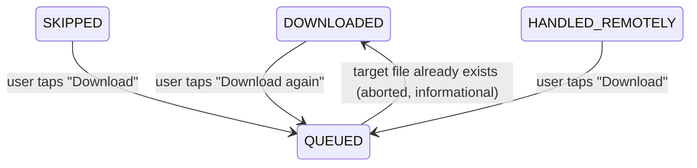

**Settled by ADR 0012**, which is where the detail now lives. In short: a re-decision behaves
exactly like a first one — the new row re-posts its action (`syncedToServer = false`), `attempts`
resets to 0, `lastError` clears, and *Mark as played* over a terminal row follows the identical
rules. The one field that survives a re-decision is `writtenFileName`, because §12.3's duplicate
guard depends on it.

The mechanism is `KEY_USER_REQUESTED` on the work request, set **only** from a UI event: Tier 4b's
`DownloadWorker` refuses terminal ledger rows, and that refusal is what makes the no-auto-download
invariant structural rather than a matter of care. The flag opens the door for the user without
removing it. `writtenFileName` as a pre-flight existence check stays the *single* licensed exception
to architecture §11's "never use `writtenFileName` as an existence check" — the guard runs **because
the user asked for this file**, never to decide whether an episode is new.

### 14.2 The backlog cutoff moves from read-time filter to a written `SKIPPED` state

Architecture §4/§5 define "New" as `no ledger row AND pubDate >= Feed.firstSeenAt`, with
the cutoff resolved in SQL. This design instead **writes** `SKIPPED` rows for old episodes (S4's
*Mark old episodes as played*, §7), which means:

- `LedgerFilter`'s "new" predicate simplifies to `no ledger row` — `firstSeenAt` is no longer part of
  the episode-list or badge query;
- the state is visible (`Played` filter), per-episode reversible (`Download`), and shared with other
  clients as `PLAY` actions — the read-time filter was none of those;
- it is a bulk write of hundreds of rows plus hundreds of outbox entries — **batched on both sides**
  (one `upsertAll` transaction, batched outbox POSTs), and the rule **does** run automatically
  against newly-parsed episodes after a feed refresh once an *older than* value is set;
- `Feed.firstSeenAt` stays in the schema — it is the natural default for the cutoff on a
  newly-appearing feed.

**Settled by ADR 0013: this mechanism is authoritative, and the read-time cutoff is retired.**
Tier 4a's SQL cutoff inside `EpisodeLedgerDao.observeNewEpisodes` is **removed**, parameter and all,
rather than left in place unused — an unused capability is one flag away from becoming a second
mechanism, which is the exact confusion this decision exists to end. CLAUDE.md §5, which forbade
writing ledger rows for the backlog, is amended; the reason it gave — that a bulk write to a shared
log cannot be taken back — survives as the justification for the preview dialog being mandatory.

### 14.3 Bulk, user-initiated download is allowed — README's "no download all" is narrowed

README states plainly: **"Not automatic. No auto-download rules, no 'download all'."** This design
adds both a per-podcast **Download all (n)** overflow action and a selection-mode **Download** (§5),
at the author's request. The distinction to record, because it is the whole reason the original rule
exists:

| Forbidden (unchanged) | Allowed (new) |
|---|---|
| A *rule* that downloads episodes without being asked | A *command* the user issues now, to a set they can see |
| Anything triggered by sync, refresh, or app start | Only a tap, followed by a confirmation naming the count |
| Global scope | Scoped to one podcast's current `To decide` filter |
| Invisible | Every queued episode appears in S7 and can be cancelled individually |

The no-auto-download invariant test (CLAUDE.md §7 item 6 / `NoAutoDownloadInvariantTest`) is
unaffected: it asserts that sync and parsing create **zero** ledger rows and post **zero** actions,
and nothing here changes that — the new rows only ever originate from a UI event. *Download all* is
**not** capped by count: the only guard is a non-blocking warning when the estimated total exceeds
free space in the download volume (§5).

**Settled by ADR 0014.** README's "Not automatic" bullet and CLAUDE.md §1's non-goal are reworded to
the rule-versus-command distinction above; the rest of the non-goal — no auto-download setting, no
per-feed rules, no global bulk scope — stands exactly as it was.

---

## 15. Adaptations to the code as built

Everything this design binds to now exists (339 tests). These are the points
where this document meets that code — recorded so Tier 4c doesn't rediscover them.

| This design needs | Status in the built code | Action |
|---|---|---|
| Download progress, cancel, foreground notification | `DownloadWorker` + `DownloadNotifications`, progress throttled to 1 Hz | UI adopts the same 1 Hz throttle (§12.2) |
| Folder states for the checklist and the paused banner | `DownloadFolderAccess` → `NotChosen` / `Granted` / `Revoked` | used verbatim (§4, §12.11) |
| "File still there?" for the duplicate guard | `DownloadTarget.existingNames(folder)` (ADR 0011) | reuse; **no new port method** (§12.3) |
| Non-retryable folder failure | `DownloadFolderUnavailableException`, no backoff | that row offers **Choose folder**, not **Retry** (§12.11) |
| Enqueueing from a ViewModel | `WorkScheduler` owns all enqueueing; `SyncTrigger` in `:core:download` | ViewModels call `WorkScheduler`, never `WorkManager` directly — keeps §3's data-flow rule intact |
| Credential change takes effect immediately after S5 | `SyncOrchestratorFactory` builds the client per pass from current credentials | nothing to do; no restart needed after connecting |
| Re-download of a terminal episode | `KEY_USER_REQUESTED` is the only way past `DownloadWorker`'s terminal-row refusal | set it from a triage event and nowhere else (ADR 0012) |
| "To decide" list + counts | `EpisodeLedgerRepository.observeEpisodes(filter)` → `EpisodeListItem` | matches §12.5; the `firstSeenAt` cutoff variant is retired (ADR 0013) |
| **S8 error log** | `LogRepository` over the `error_log` table (schema v2) | collapse and eviction are DAO queries, so the screen just renders (§11) |
| S2's scoped pull-to-refresh | `FeedRefreshWorker.KEY_FEED_URL` | same worker, not a second one |
| S5 | `NextcloudLoginFlowClient`, with typed failures | each `ConnectError` in §8 maps to one of them |
| Artwork and icons | Coil and `icons-lucide-android`, pinned | ADR 0015; §18's table is the allow-list |

**One thing S8 still lacks is content, not a backend.** Only `FeedRefresher` records failures so far;
`SyncOrchestrator`/`SyncWorker`, `EpisodeDownloader`/`DownloadWorker` and the S5 auth flow are not
wired yet, so the screen will render an honest but very quiet log until they are.

---

## 16. Motion

One duration scale and two easings, all Material 3 motion tokens so they map to Compose without
translation. Modernist has no soft edges to hide behind, so motion is short and mechanical: things
slide and rule lines wipe; nothing bounces, scales, or fades in from nothing.

| Transition | Spec |
|---|---|
| S1 → S2 forward | 300 ms emphasized-decelerate, slide from the trailing edge; outgoing screen holds still and dims to 60 % |
| S1 → S2 back | 250 ms emphasized-accelerate — back is always faster than forward, so returning to the worklist never feels like a journey |
| S3 sheet in | 350 ms emphasized-decelerate up; scrim 0 → 55 % over the first 200 ms |
| S3 sheet out | 250 ms emphasized-accelerate, following the finger on a drag — never animating back past a position the user already moved it to |
| Triage commit | 200 ms crossfade to the terminal treatment, badge wiping in over 150 ms, **400 ms hold**, then a 250 ms height collapse |
| Swipe reveal | the accent field is *uncovered*, not faded in; a single 100 ms weight step at the 40 % commit threshold; snap-back 200 ms standard |
| Progress | 1 Hz updates interpolated over **1 000 ms linear** rather than stepping; completion is a 200 ms crossfade to the ✓ badge; indeterminate is a 1 200 ms sweep |
| Chips / segments | 100 ms fill swap with **no** motion — the list beneath rebuilds without a transition, because a filter change is a new question, not a movement |
| Banners | 250 ms standard height expand, pushing content rather than covering it |
| Dialogs | scrim fade plus a 12 px translate up, 200 ms |
| Snackbar | 250 ms up, 3 200 ms hold, 200 ms out; carries an action in exactly one case — *Undo* on a swipe (§12.3, `docs/decisions/0021`) |
| Theme change | instant — a colour-scheme crossfade on a flat, high-contrast palette reads as a rendering fault |

Three rules the table cannot express, and the ones that actually get broken:

1. **The triage hold survives reduced motion.** With *Remove animations* on, everything above
   collapses to an instant state change **except** the 400 ms hold at commit. It is not decoration:
   for a button press, which has no undo window (§12.3), it is the only feedback that the decision
   landed on the row the user meant.
   Implement it as a delay, not an animation, so the accessibility setting does not remove it.
2. **Durable state is never animated into place.** A badge count, an outbox depth and a ledger state
   render at their true value on first paint. Counting a badge up reads as data arriving when it has
   already arrived.
3. **No transition gates an action.** Every affordance stays hittable throughout every transition
   above, and a second tap mid-transition is honoured rather than swallowed. A triage screen that makes
   you wait 350 ms for a sheet is a triage screen you stop using.

---

## 17. Consistency invariants

Spacing and sizing that holds across all eight screens. Collected because drift here is invisible in
review and obvious in use — every value below was found drifting at least once while the screens were
being drawn.

- **App bar** — 2 px bottom rule, title flush left, leading element inset at **14 dp** so its optical
  edge lands on the 16 dp content grid. **Amended 2026-08-08:** this used to record one intentional
  asymmetry — S1 inset at 16 dp because its leading element was the title itself. S1 now leads with
  the 24 dp brand mark (`docs/logo.md` §4.1), so its leading element is an icon like every other
  screen's and the exception is gone. A simplification, not a new special case.
- **Rows** — 16 dp horizontal padding, ≥ 72 dp tall, 1 dp hairline between rows, 2 px rule between
  *groups*. Artwork is 56 dp on S1, 52 dp on S2, 76 dp on S3.
- **Group labels** — `15dp / 16dp / 7dp` padding, 11 sp at the heading weight, `.12em` tracking, accent
  role, preceded by a 2 px rule. Identical on S4 and S7.
- **Tap targets** — ≥ 48 dp on everything interactive, chips and segmented options included (§12.12).
- **Badges** — `5dp 7dp` padding, ≥ 26 dp wide; accent fill for a count, outlined for a state word.
- **Dialogs** — 18 dp padding on every edge, 2 px border, no radius, actions flush left.
- **Status bar** — `7dp / 16dp`, muted role.

The per-screen state contract, corner cases, notifications and the accessibility semantics behind
§12.12 live in **`docs/UI_interface.md`** alongside these.

---

## 18. Iconography

**Lucide** (ISC, https://lucide.dev), one weight everywhere: 24 dp grid, 2 dp stroke, round caps and
joins. Never mixed with Material Symbols — two icon families in one app read as an unfinished
migration. Icons are always accompanied by text for anything that carries state (§12.7); an icon-only
control exists nowhere except the app bar, where the target is conventional.

This table is the canonical mapping — an allow-list, not a manifest of files. An icon not listed here
has no call site, and adding an affordance means adding a row before adding a glyph.

**How they ship:** Android renders no SVG at runtime, so these become `VectorDrawable`/`ImageVector`.
Preferred route is Lucide's own Compose artifact rather than hand-converting, per CLAUDE.md's
"use existing libraries" rule; approved as a dependency in ADR 0015. Sizing, the conversion
fallback and the reason there is no per-density work to do are in `docs/UI_interface.md` §17.

| Icon | Used for |
|---|---|
| `arrow-left` | up navigation on S2, S4, S6, S7, S8 |
| `settings` | S1 app bar → S4 |
| `activity` | S1/S2 app bar → S7; carries the badge dot |
| `ellipsis-vertical` | row overflow, app-bar overflow |
| `chevron-right` | row navigation affordance; also the collapsed *show technical detail* on S8 |
| `chevron-down` | the swipe-mapping and *older than* dropdowns on S4 |
| `download` | the Download action, and the swipe-right background |
| `play` | the **played** state badge, and the mark-as-played swipe background |
| `check` | ✓ downloaded badge; the satisfied step in S1's setup checklist; S7's delivered rows |
| `check-check` | "all caught up" and "nothing has failed" empty states |
| `cloud-check` | **handled elsewhere** — the state the user did not create |
| `x` | leave selection mode |
| `square` / `square-check` | selection-mode checkboxes, including the accessibility affordance (§12.12) |
| `triangle-alert` | downloads-paused banner, failure badge, the free-space warning line |
| `circle-alert` | inline field and feed errors |
| `refresh-cw` | sync in progress on S1 |
| `loader` | S5's awaiting-authorization spinner |
| `wifi-off` | offline banner and status bar |
| `inbox` | filter-empty states |
| `file-text` | S7 app bar → S8 |
| `copy` / `share-2` / `trash-2` | S8's copy all / share / clear |
| `external-link` | *Open episode page in browser* (S3, and the S2 row overflow) |
| `volume-off` | the **no audio** badge on an episode with no enclosure |

Three distinctions that make the UI lie if they are used interchangeably:

- **`triangle-alert` is a condition the queue is in** (paused, failed, will not fit).
  **`circle-alert` is input the user can fix** (a bad server address, an invalid template, a feed that
  did not respond). Swapping them makes a typo look like a system fault and vice versa.
- **`cloud-check` is not `check`.** *Handled elsewhere* must never render as the same ✓ as a download
  this device performed — the user did not make that decision here, and the affordances differ
  (§12.6).
- **`play` never means playback.** Podsilo does not play audio (README). It is the *played* state
  marker only, and it appears beside the word, never alone.

**`server` was the 25th row here**, for S1's not-configured empty state. That state now leads with the
brand lockup instead (`docs/logo.md` §4.2) — it is the app's first screen and the one moment with room
to say its own name, where a server glyph said only that a server was missing. The row is struck
rather than left in place: this table is an allow-list, and an entry with no call site is an
invitation to find it one.

The **brand mark** is not an icon either, and is deliberately absent from the table above. It carries
no action, is never tappable, has exactly four placements, and is governed by
[`docs/logo.md`](logo.md). Adding it to this allow-list would invite call sites to use the logo as a
glyph — do not. In code it lives in `PodsiloLogo.kt`, next to `PodsiloIcons` and outside it.

The **monogram tile** is not an icon: a feed with no `imageUrl` gets a filled surface square with its
first letter, not a generic placeholder glyph. A stock "no image" icon repeated down the list is
noise; a letter is at least identifying. A feed with no artwork never gets the brand mark — repeating
the logo down a list makes every podcast look like it is ours (`docs/logo.md` §5).

---

## 19. Orientation

Every screen here is designed portrait-first, and deliberately stays a **single scrolling column** in
landscape. That is the whole strategy: there is no landscape layout, because there is nothing to
re-arrange — a triage worklist is a list, and a list in a wider window is the same list.

**Orientation is not locked.** `screenOrientation` stays unset. Locking would break a device in a car
mount, a keyboard case, or a foldable, and Podsilo has no reason to — nothing here depends on aspect
ratio. Rotation preserves state (`docs/UI_interface.md` §14.2): scroll position, filter, open sheet and open
dialog all survive; one-shot effects do not replay.

Four things genuinely break in a short window, all with cheap fixes. Nothing below justifies a second
layout:

1. **Rows stretch too wide.** At 900 dp the badge ends up an inch from the title it belongs to and the
   row stops reading as one thing. Cap the list content at **~600 dp and centre it**; the rows keep
   their 16 dp internal padding. This is the single highest-value landscape rule and the only one
   that is also a tablet rule.
2. **S3's sheet has no room.** 78 % of a ~400 dp-tall window is ~310 dp, and the header, status line
   and action bar consume most of it, leaving the description a slit. Let the sheet **expand to full
   height** in a short window — standard `ModalBottomSheet` behaviour, so this is a default to keep
   rather than work to do — and drop the header artwork from 76 dp to 56 dp so the title and the
   action bar are both visible without scrolling.
3. **Dialogs overflow.** The bulk-download and mark-as-played previews carry a title, up to three
   per-feed rows, two explanatory notes and two actions. In landscape that exceeds the window. Give
   every dialog a **max height with the body scrolling and the actions pinned** — the count and the
   buttons must never be the parts that scroll off, since they are the whole decision.
4. **S5 with the keyboard up.** Landscape plus the IME leaves roughly 150 dp. The dialog must keep the
   address field **and** the primary button visible; the explanatory line is what gives way. Same
   pinned-actions rule as item 3, so it is one fix, not two.

Display-scale type on the empty states (S1's "Podsilo follows the podcast subscriptions in your
Nextcloud.", "Nothing new. All caught up.") is left alone: an empty state may scroll, and shrinking
type per orientation is more machinery than the problem deserves.

**No two-pane layout, deliberately** — not an omission. A list/detail split would put S1 and S2 side
by side, but S2's own detail is a bottom sheet, so the pattern would need a third pane or a nested
sheet, and every triage gesture would need a "which pane has focus" answer. The product is one
decision at a time on a phone (§1). If a tablet layout is ever wanted it is a new design, and item 1's
content-width cap is the part of it that already applies.
