# Podsilo Architecture

This document is the implementation reference for Podsilo. It turns CLAUDE.md's requirements (§5, §6)
into a concrete module design, database schema, interface contracts, and sequence diagrams. Follow
CLAUDE.md's build order (§10) for *when* to build each piece; use this document for *what* to build
and *how the pieces fit together*. The checklist at the end cross-references both.

Diagrams use [Mermaid](https://mermaid.js.org/), which GitHub renders natively in Markdown.

## Table of contents

1. [System context](#1-system-context)
2. [Module architecture](#2-module-architecture)
3. [Data flow](#3-data-flow)
4. [Database schema](#4-database-schema)
5. [Domain model & repository ports](#5-domain-model--repository-ports)
6. [External interface: Nextcloud GPodder API](#6-external-interface-nextcloud-gpodder-api)
7. [External interface: podcast RSS/Atom feeds](#7-external-interface-podcast-rssatom-feeds)
8. [External interface: Storage Access Framework](#8-external-interface-storage-access-framework)
9. [Episode ledger state machine](#9-episode-ledger-state-machine)
10. [Key flows](#10-key-flows)
11. [Naming & tagging pipeline](#11-naming--tagging-pipeline)
12. [Decision record — resolved, and still open](#12-decision-record--resolved-and-still-open)
13. [Build-order checklist](#13-build-order-checklist)

---

## 1. System context

Podsilo talks to three external systems and one external human process (the user's own audio
player, which we never call into — it just reads the folder). Nothing here is optional or
swappable; all three integrations are core requirements from CLAUDE.md §1.

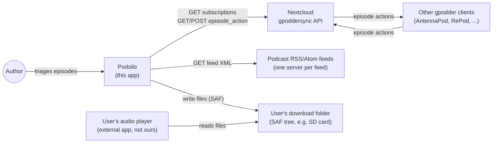

Podsilo never writes to the subscription list (no `subscription_change/create`, ever — CLAUDE.md
§1/§5) and never talks to the user's audio player. The only two-way relationship with another system
is the GPodder episode-action log, and that's mediated entirely through Nextcloud, not directly with
other clients.

---

## 2. Module architecture

### The constraint that shapes everything else

CLAUDE.md §5 mandates `:core:model` and `:core:sync` (and §10 adds `:core:naming`) have **no Android
dependency**, so their logic is plain-JVM testable (Tier 1, no emulator). But sync reconciliation
needs the Room-backed ledger and the GPodder HTTP client — and both Room (`:core:database`) and, as
built, `:core:gpodder` are Android library modules. **A `kotlin("jvm")` module cannot depend on a
`com.android.library` module** (Gradle/AGP variant resolution doesn't support that direction) — only
the reverse works.

**Resolution: ports and adapters.** `:core:model` — already the one dependency-free module every
other module can safely depend on — hosts plain Kotlin **repository/client interfaces** ("ports").
`:core:sync` depends only on `:core:model` and orchestrates against those interfaces; it never
imports Room, Retrofit, or any Android type. The concrete implementations ("adapters") live in the
Android modules that actually need Android APIs (`:core:database` for Room, `:core:gpodder` for
Retrofit) and are bound to the interfaces via Hilt `@Binds` in each adapter module's own Hilt module
— `:app` doesn't need bespoke wiring code beyond `@HiltAndroidApp`.

This is the single most important structural decision in this document — every module boundary below
follows from it.

### Module responsibilities

| Module | Type | Responsibility |
|---|---|---|
| `:core:model` | JVM | Domain types (`Feed`, `Episode`, `EpisodeLedgerRow`, ...), repository/client **interfaces**, `LedgerState` enum, `SyncOutcome` sealed result types. Zero dependencies beyond Kotlin stdlib + coroutines-core (for `Flow`). |
| `:core:naming` | JVM | Template resolution, sanitisation, truncation, collision suffixing (CLAUDE.md §6). Depends on `:core:model` for `Feed`/`Episode`. |
| `:core:sync` | JVM | Reconciliation logic + `SyncOrchestrator` (order-of-operations per CLAUDE.md §5). Depends on `:core:model` only — receives repository/client implementations via constructor injection. |
| `:core:database` | Android library | Room entities, DAOs, migrations; **implements** `FeedRepository`, `EpisodeRepository`, `EpisodeLedgerRepository`, `SyncStateRepository` from `:core:model`. |
| `:core:datastore` | Android library | Settings storage (Nextcloud URL/credentials, folder URI, sync interval, naming templates) via Jetpack DataStore + Keystore-backed encryption for the app password. Implements `SettingsRepository`. |
| `:core:feed` | Android library | Wraps rssparser (docs/decisions/0005, not Stalla); fetches + parses feed XML into `Feed`/`Episode`. Hosts `FeedRefreshWorker`. |
| `:core:gpodder` | **JVM** (converted from Android library — `docs/decisions/0007`) | Retrofit client for the three GPodder endpoints Podsilo calls; **implements** `GpodderClient` from `:core:model`. |
| `:core:download` | Android library | Download queue (`DownloadWorker`), cache→tag→SAF-copy pipeline, WorkManager state. Depends on `:core:model`, `:core:naming`. |
| `:feature:episodes` | Android library (Compose) | Episode list + filters + triage actions. Depends on `:core:model` (ports only); Hilt-injected ViewModel gets real repositories from `:app`'s graph. |
| `:feature:settings` | Android library (Compose) | Credentials, folder picker, naming template editor + live preview. |
| `:app` | Android application | Hilt wiring (binds every port to its adapter), navigation, `SyncWorker` (see below), app-level `WorkManager` scheduling. |

### Why `SyncWorker` lives in `:app`, not `:core:sync`

A `CoroutineWorker` subclass requires `androidx.work`, an Android dependency — so it cannot live in
the Android-free `:core:sync`. `:core:sync` exposes a plain `SyncOrchestrator` class (constructor
takes the four ports); `:app` contains a thin `SyncWorker : CoroutineWorker` that Hilt-injects a
`SyncOrchestrator` and calls `orchestrator.sync()`, translating `SyncOutcome` to
`Result.success()/retry()/failure()`. `DownloadWorker` and `FeedRefreshWorker` have no such problem
— `:core:download` and `:core:feed` are already Android modules — and live where the architecture
table above says.

### Dependency graph

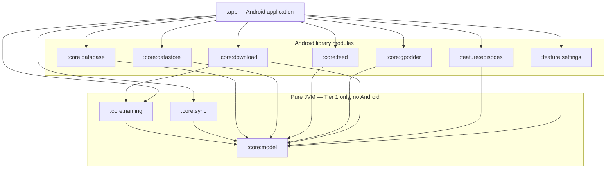

**Rule to enforce in code review:** an arrow only ever points from an Android module to a JVM module,
or from any module to `:core:model`. If `:core:sync` (or `:core:naming`) ever needs to `import`
anything from `:core:database` or `:core:gpodder` directly, that's a sign the port interface in
`:core:model` is missing a method — add to the interface, don't reach around it.

---

## 3. Data flow

Unidirectional, per CLAUDE.md §5: DAO `Flow` → repository → ViewModel `StateFlow` → Compose. The UI
never triggers network directly — it writes ledger state and enqueues `WorkManager` work; workers do
the I/O and write back to the database; the UI observes the database.

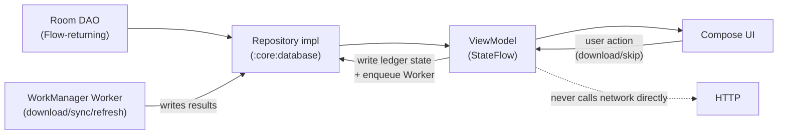

---

## 4. Database schema

**Five tables.** The first four are exactly as specified in CLAUDE.md §5 — deliberately not a typical
podcast app's schema. The fifth, `ERROR_LOG`, was added by the UI design (`docs/UI.md` §11's error
log had no data source at all); it is purely additive and changes no existing type.
Room entities live in `:core:database`; the plain-Kotlin equivalents (`Feed`, `Episode`,
`EpisodeLedgerRow`, `SyncState`, `LogEntry`) live in `:core:model` and are what everything outside
`:core:database` actually sees. The repository implementation maps entity ↔ domain type at the
boundary.

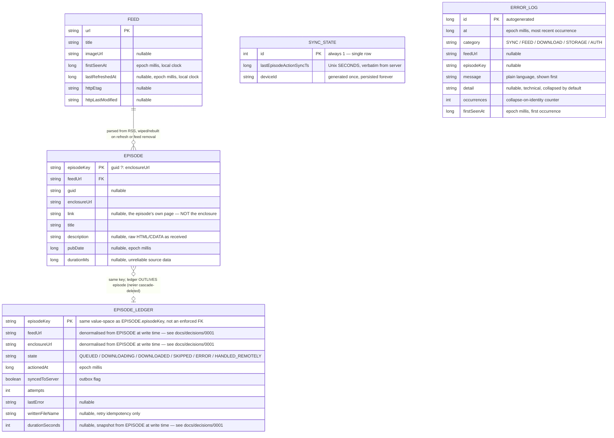

**The one relationship that must not be a real foreign key:** `EPISODE_LEDGER.episodeKey` shares a
key space with `EPISODE.episodeKey` but must **not** have `ON DELETE CASCADE` (or any FK constraint
at all) back to `EPISODE`. CLAUDE.md §5's subscription-mirroring rule requires: when a feed
disappears from the server, its `Episode` rows are deleted, but its `EpisodeLedger` rows are kept —
otherwise a re-subscribe would re-download the whole back catalogue. Model this as two independent
tables with a shared key convention, not a Room `@ForeignKey`.

### Field reference

**Feed**

| Field | Type | Nullable | Source | Notes |
|---|---|---|---|---|
| `url` | `String` | No (PK) | GPodder `subscriptions.add[i]` | Also the value written into `EpisodeAction.podcast` on outbound actions. |
| `title` | `String` | No | RSS `<channel><title>` | GPodder API has no titles — only known after the first successful feed fetch; use the URL as a placeholder until then. |
| `imageUrl` | `String` | Yes | RSS `<itunes:image>` / `<image><url>` | |
| `firstSeenAt` | `Long` | No | Local clock, set once when the URL first appears in `add[]` | **No longer a query predicate** (ADR 0013): the "New" filter is `no ledger row`, full stop. It is now the default cutoff date offered for a newly-appearing feed in S4's *Mark old episodes as played*. Never updated after first write. |
| `lastRefreshedAt` | `Long` | Yes | Local clock, after a successful (200, not 304) feed fetch | |
| `httpEtag` | `String` | Yes | Response `ETag` header | For conditional `GET`. |
| `httpLastModified` | `String` | Yes | Response `Last-Modified` header | For conditional `GET`. |

**Episode**

| Field | Type | Nullable | Source | Notes |
|---|---|---|---|---|
| `episodeKey` | `String` | No (PK) | `guid ?: enclosureUrl` | Mirrors the server's identification rule exactly (CLAUDE.md §5) — this is not a free choice. |
| `feedUrl` | `String` | No | Parent `Feed.url` | |
| `guid` | `String` | Yes | RSS `<guid>` | Frequently missing, reused, or changed — see [§12](#12-decision-record--resolved-and-still-open). |
| `enclosureUrl` | `String` | No | RSS `<enclosure url="">` | Used as `episodeKey` fallback and as `EpisodeAction.episode`. |
| `link` | `String` | Yes | RSS `<item><link>` | The episode's own page, for the UI's *Open in browser* affordance (`docs/UI.md` §6). `null` for feeds that omit it — the affordance is then absent, never a dead tap. **Not** derivable from `enclosureUrl`, which points at an audio file. Added in schema v2. |
| `title` | `String` | No | RSS `<title>` | Stored **raw**; cleanup regex rules (§6) and sanitisation apply at naming time, not storage time. |
| `description` | `String` | Yes | RSS `<description>` or `<content:encoded>` | Stored raw (CDATA and all); HTML sanitised at render time in the UI, never at write time. |
| `pubDate` | `Long` | Yes | RSS `<pubDate>`, fallback chain in §6 | Normalised to the device's fixed timezone (document which one is chosen when `:core:naming` lands). |
| `durationMs` | `Long` | Yes | RSS `<itunes:duration>` | Notoriously unreliable — never block anything on this being present. |

**EpisodeLedger** — "the one table that must never be lost" (CLAUDE.md §5)

| Field | Type | Nullable | Written by | Notes |
|---|---|---|---|---|
| `episodeKey` | `String` | No (PK) | — | Shares key space with `Episode.episodeKey`; see FK note above. `guid` is **not** a separate column — it's derived (`episodeKey.takeIf { it != enclosureUrl }`). |
| `feedUrl` | `String` | No | Snapshot of `Episode.feedUrl` at write time | Denormalised, not looked up via `Episode` — see `docs/decisions/0001-episode-ledger-row-denormalized-fields.md`. Needed so a POST retry after the feed is unsubscribed can still build a valid outbound action. |
| `enclosureUrl` | `String` | No | Snapshot of `Episode.enclosureUrl` at write time | Same rationale as `feedUrl`. |
| `state` | `String`/enum | No | UI (QUEUED/SKIPPED), `DownloadWorker` (DOWNLOADING/DOWNLOADED/ERROR), `SyncOrchestrator` (HANDLED_REMOTELY) | See [§9](#9-episode-ledger-state-machine) for the full transition table. There is **no persisted "NEW" value** — new means no row exists at all. |
| `actionedAt` | `Long` | No | Whoever writes `state` | Epoch millis. For rows created from a remote action, parsed from the action's ISO-8601 `timestamp` field, interpreted as UTC — see `docs/decisions/0003-gpodder-action-timestamp-as-utc.md`. |
| `syncedToServer` | `Boolean` | No | `false` on local write, `true` only on confirmed 2xx POST | This is literally the outbox flag — `getUnsynced()` is `WHERE syncedToServer = 0`. |
| `attempts` | `Int` | No | `DownloadWorker` / outbox push | Retry counter. |
| `lastError` | `String` | Yes | `DownloadWorker` / outbox push | Human-readable, for the error state UI. |
| `writtenFileName` | `String` | Yes | `DownloadWorker`, after a successful SAF copy | Retry idempotency **only** — never used as an existence check (CLAUDE.md §11's single most important invariant). |
| `durationSeconds` | `Int` | Yes | Snapshot of `Episode.durationMs` (converted to seconds) at write time | Used only to encode a skip's `PLAY` `total`/`position` — see `docs/decisions/0001-...` and `docs/decisions/0002-skip-as-play-encoding.md`. `null` when the feed never supplied a usable duration. |

**SyncState** — single row, `id = 1` always

| Field | Type | Nullable | Source | Notes |
|---|---|---|---|---|
| `id` | `Int` | No (PK) | Hardcoded `1` | Not a real multi-row table; Room needs a PK regardless. |
| `lastEpisodeActionSyncTs` | `Long` | No | Verbatim from the GPodder `episode_action` response's top-level `timestamp` | **Unix seconds**, sent back as the next `since`. Never computed from local device time — see CLAUDE.md §11's clock-skew gotcha. |
| `deviceId` | `String` | No | Generated once (e.g. `UUID.randomUUID()`) on first run, persisted forever | Lets us recognise our own echoed-back actions in the remote action stream. |

**Built so far (Tier 4a):** `:core:database` implements this schema in Room (`PodsiloDatabase`,
version 1, schema exported under `core/database/schemas/`) and the four repository ports (extended
in Tier 4b with the read-side methods the workers need — `FeedRepository.getAll`/`get`/
`updateRefreshMetadata`, `EpisodeRepository.get`, `EpisodeLedgerRepository.get`), with
entity↔domain mapping at the module boundary. The episodes→feeds foreign key cascades (feed removal
prunes episodes); the ledger has **no** foreign key (verified in the exported schema), so it
survives — `SubscriptionMirroringTest` proves a re-subscribe doesn't re-download. `FeedDao.replaceAll`
uses `@Upsert` (not `@Insert(REPLACE)`, whose delete-then-insert would fire the episodes' cascade
and wipe an existing feed's cache on every refresh). Tests are Robolectric in-memory-DB (headless, no
emulator — CLAUDE.md §4). `:core:datastore` implements `SettingsRepository` over DataStore
Preferences, app password encrypted via `AppPasswordCipher` (`docs/decisions/0010`).

**Built (Tier 4c, first step):** the DAO layer was split — `EpisodeLedgerDao` owns the ledger table
and the outbox, `EpisodeListDao` owns the joins against `episodes` that the UI list and its count
badges read. Keeping the list queries and `countUndecidedByFeed` together is what guarantees a badge,
its list, and a bulk-confirmation dialog all resolve the same "no ledger row" predicate. `:core:model`
also gained `EpochTime` (`docs/decisions/0016`) and the four settings S4 persists.

**Built (Tier 4b):** all three workers (`DownloadWorker`, `FeedRefreshWorker`, `:app`'s
`SyncWorker`) and the Hilt graph that constructs them — `:app`'s `di/` package provides every port
its adapter, so the repositories stay plain constructor-injectable classes with no DI annotations
of their own. Hilt arrived a tier earlier than TODO.md scheduled it because a `@HiltWorker` is the
only way to give a worker its dependencies without hand-rolling the service locator CLAUDE.md §3
forbids.

---

## 5. Domain model & repository ports

All of the following live in `:core:model`. Structure shown as a Mermaid class diagram; exact
signatures follow in Kotlin (mermaid's generic syntax gets unreadable fast, so treat the diagrams as
"what talks to what" and the code blocks as the actual contract).

> **Everything below is implemented**, including every Tier 4c addition the UI needs — `LogRepository`
> over the `error_log` table, `ConnectivityMonitor` over `ConnectivityManager`,
> `NextcloudLoginFlowClient` over Login Flow v2, and `Episode.link` mapped in `:core:feed` and stored
> in schema v2.
> The ports also carry read-side methods this listing elides for brevity
> (`FeedRepository.getAll`/`get`/`updateRefreshMetadata`, `EpisodeRepository.get`,
> `EpisodeLedgerRepository.get`/`observeEpisodes`, plus `SettingsRepository` and
> `GpodderClientFactory`, which this listing does not show at all). The source in
> `core/model/.../port/` is the contract; this section is the map.

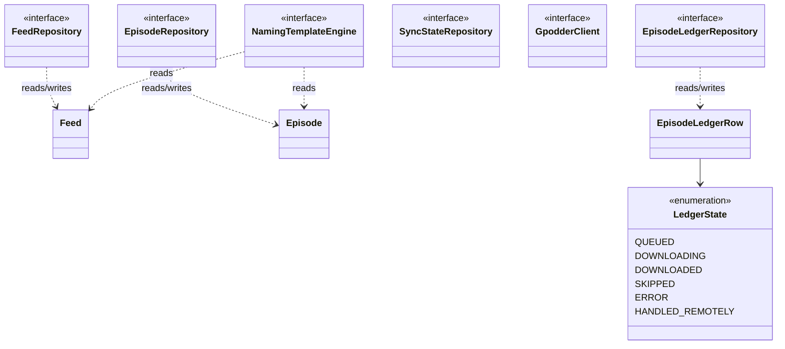

```kotlin
// :core:model — domain types
data class Feed(
    val url: String,
    val title: String,
    val imageUrl: String?,
    val firstSeenAt: Long,
    val lastRefreshedAt: Long?,
    val httpEtag: String?,
    val httpLastModified: String?,
)

data class Episode(
    val episodeKey: String,
    val feedUrl: String,
    val guid: String?,
    val enclosureUrl: String,
    val link: String?, // the episode's own page — schema v2, see §4
    val title: String,
    val description: String?,
    val pubDate: Long?,
    val durationMs: Long?,
)

enum class LedgerState { QUEUED, DOWNLOADING, DOWNLOADED, SKIPPED, ERROR, HANDLED_REMOTELY }

// guid ?: enclosureUrl — the server's identification rule (CLAUDE.md §5). Episode.episodeKey and
// the key used to match incoming EpisodeActions both go through this one function.
fun episodeKey(guid: String?, enclosureUrl: String): String = guid ?: enclosureUrl

data class EpisodeLedgerRow(
    val episodeKey: String,
    val feedUrl: String, // denormalised from Episode at write time — docs/decisions/0001
    val enclosureUrl: String, // denormalised from Episode at write time — docs/decisions/0001
    val state: LedgerState,
    val actionedAt: Long,
    val syncedToServer: Boolean,
    val attempts: Int,
    val lastError: String?,
    val writtenFileName: String?,
    val durationSeconds: Int? = null, // snapshot from Episode at write time — docs/decisions/0001
) {
    val guid: String? get() = episodeKey.takeIf { it != enclosureUrl } // derived, not stored
}

sealed interface SyncOutcome {
    data object Success : SyncOutcome
    data class Retry(val reason: String) : SyncOutcome // transient (network) — worth WorkManager retrying
    data class Failure(val reason: String) : SyncOutcome // non-transient — retrying won't help
}

data class SyncState(val lastEpisodeActionSyncTs: Long, val deviceId: String)

// Every stored timestamp above is a Long. The UI renders java.time values (docs/UI_interface.md
// §0.6), and this is the ONLY conversion between the two — see docs/decisions/0016. Its value is
// the function names: everything here is epoch MILLIS except SyncState.lastEpisodeActionSyncTs,
// which is Unix SECONDS verbatim from the server and must never be computed locally (CLAUDE.md §11).
// No now(): a Clock is injected where the current time is needed (CLAUDE.md §7).
object EpochTime {
    fun ofMillis(millis: Long): Instant
    fun ofMillisOrNull(millis: Long?): Instant?
    fun ofServerSeconds(seconds: Long): Instant
    fun toMillis(instant: Instant): Long
    fun durationOfMillis(millis: Long?): Duration?
}

// :core:model — ports (implemented in Android modules, consumed by :core:sync)
interface FeedRepository {
    fun observeAll(): Flow<List<Feed>>
    suspend fun replaceAll(feeds: List<Feed>) // add - remove, wholesale; cascades episode deletion for removed feeds
}

interface EpisodeRepository {
    fun observeForFeed(feedUrl: String): Flow<List<Episode>>
    suspend fun replaceForFeed(feedUrl: String, episodes: List<Episode>)
    suspend fun deleteForFeed(feedUrl: String)
}

interface EpisodeLedgerRepository {
    fun observe(filter: LedgerFilter): Flow<List<EpisodeLedgerRow>>
    // "New" is the ABSENCE of a ledger row (§9), so it can't be an EpisodeLedgerRow — the UI list is
    // EpisodeListItem(episode, ledger?), resolved in one SQL join. Since ADR 0013 the "to decide"
    // predicate is exactly `no ledger row`: no date clause, and the same query backs S1's count
    // badge, so a badge can never disagree with the list it opens.
    fun observeEpisodes(filter: LedgerFilter): Flow<List<EpisodeListItem>>
    suspend fun upsert(row: EpisodeLedgerRow)
    suspend fun getUnsynced(): List<EpisodeLedgerRow>
    suspend fun markSynced(episodeKeys: List<String>)
    // Bulk triage (docs/UI.md §7's "mark old/all as played"): one transaction and one Flow
    // emission, not 412 of each. Both scopes select only episodes with no ledger row.
    suspend fun upsertAll(rows: List<EpisodeLedgerRow>)
    suspend fun previewUndecided(scope: BulkScope): List<FeedUndecidedCount> // per-feed counts for the dialog
}

// S8's store. Implemented in :core:database over the error_log table (schema v2); collapse and
// eviction are DAO queries, never UI logic or an app-start sweep.
interface LogRepository {
    fun observe(category: LogCategory?): Flow<List<LogEntry>>
    suspend fun record(entry: NewLogEntry) // collapses on identity: category + feed/episode + normalised message
    suspend fun clear()
    suspend fun exportPlainText(): String
}

// Implemented as AndroidConnectivityMonitor. Connectivity is checked BEFORE a request is started,
// never inferred from a timeout — so a pull-to-refresh with no network fails instantly (docs/UI.md §12.10).
interface ConnectivityMonitor { fun observe(): Flow<Connectivity> }
data class Connectivity(val online: Boolean, val metered: Boolean)

// Nextcloud Login Flow v2. Implemented in :core:gpodder, which stays a JVM module (ADR 0007) —
// nothing here touches an Android API; the browser launch is the UI's concern.
interface NextcloudLoginFlowClient {
    suspend fun start(baseUrl: String): Result<LoginFlow>
    suspend fun poll(flow: LoginFlow): Result<LoginResult>
    suspend fun verifyGpodderSync(creds: NextcloudCredentials): Result<Unit> // 200 or it did not work
}

interface SyncStateRepository {
    suspend fun get(): SyncState
    suspend fun save(state: SyncState)
}

interface GpodderClient {
    suspend fun fetchSubscriptions(since: Long? = null): SubscriptionDelta
    suspend fun postEpisodeActions(actions: List<EpisodeAction>): Result<Unit>
    suspend fun fetchEpisodeActions(since: Long): EpisodeActionPage
}

data class SubscriptionDelta(val add: List<String>, val remove: List<String>, val timestamp: Long)
enum class EpisodeActionType { DOWNLOAD, PLAY, DELETE, NEW }
data class EpisodeAction(
    val podcast: String,
    val episode: String,
    val guid: String?,
    val action: EpisodeActionType,
    val timestamp: String, // ISO-8601, no offset, interpreted as UTC — see §6 and docs/decisions/0003
    val started: Int? = null,
    val position: Int? = null,
    val total: Int? = null,
)
data class EpisodeActionPage(val actions: List<EpisodeAction>, val timestamp: Long)

// :core:naming — port + result type
interface NamingTemplateEngine {
    fun resolve(feed: Feed, episode: Episode, folderTemplate: String, fileTemplate: String): ResolvedName
}
data class ResolvedName(val folder: String, val fileNameWithoutExtension: String, val extension: String)
```

`LedgerFilter` above is whatever `:feature:episodes` needs for its New/Downloaded/Skipped/All ×
per-feed combinations — define it alongside `EpisodeLedgerRepository`, not as a separate module.

---

## 6. External interface: Nextcloud GPodder API

Four endpoints total (CLAUDE.md §5) — we implement three; `subscription_change/create` is
permanently out of scope (§1).

| Endpoint | Method | Query/body | Response |
|---|---|---|---|
| `/index.php/apps/gpoddersync/subscriptions` | GET | `since` (Unix seconds, optional) | `{add: [url], remove: [url], timestamp}` |
| `/index.php/apps/gpoddersync/episode_action` | GET | `since` (Unix seconds, optional) | `{actions: [EpisodeAction], timestamp}` |
| `/index.php/apps/gpoddersync/episode_action/create` | POST | `[EpisodeAction]` | 2xx |
| ~~`/index.php/apps/gpoddersync/subscription_change/create`~~ | — | **never called** | — |

### Timestamp formats — the gotcha CLAUDE.md calls out hardest

| Where | Format | Example |
|---|---|---|
| `since` query param (both endpoints) | Unix seconds, `Long` | `1752480000` |
| Top-level `timestamp` in both responses | Unix seconds, `Long` | `1752483600` — persist verbatim, send back as next `since` |
| `EpisodeAction.timestamp` field (inside each action) | ISO-8601, **no timezone offset** | `2026-07-14T09:00:00` |

Two different formatters, two different meanings. Getting this wrong doesn't crash anything — it
silently breaks incremental sync in a way that looks like "sync just doesn't work." Unit-test the
round-trip explicitly (CLAUDE.md §11).

> **Corrected in Tier 3:** the per-action `timestamp` row above (and CLAUDE.md §11) describes an
> older reality. Both reference servers now emit an offset — `nextcloud-gpodder` sends
> `2021-10-06T11:49:23+00:00` (PHP `format("c")`), `opodsync` sends a trailing `Z`. Podsilo parses
> all three forms and emits the bare one, which both servers read as UTC. See
> `docs/decisions/0009` for the full verified contract and `0003` for the amended timestamp
> decision.

**Built so far (Tier 3):** `:core:gpodder`'s `RetrofitGpodderClient` implements all three endpoints
above, with DTOs and mapping that absorb the differences between the two reference servers
(action-name casing, the `-1` absent-playback-value sentinel, `opodsync`'s extra `update_urls`
field). `RetrofitGpodderClientTest` drives it against MockWebServer — exact paths, query params,
bare-array POST body, Basic auth header, and the 401/500/timeout/malformed-body paths.

⚠️ **`POST episode_action/create` is not as reliable as a 2xx implies.** `nextcloud-gpodder` >=
3.13.3 discards any non-`PLAY` action and still returns 200, so `DOWNLOAD` never lands on a real
Nextcloud. Podsilo emits it regardless — see `docs/decisions/0008` before designing anything that
depends on downloads being visible to other clients.

### Sequence: full sync pass

Order of operations exactly per CLAUDE.md §5: pull subscriptions (full) → push unsynced ledger rows
→ pull episode actions since last timestamp → reconcile → persist new timestamps atomically.

```mermaid
sequenceDiagram
    participant W as SyncWorker (:app)
    participant O as SyncOrchestrator (:core:sync)
    participant FR as FeedRepository impl (:core:database)
    participant LR as EpisodeLedgerRepository impl (:core:database)
    participant SR as SyncStateRepository impl (:core:database)
    participant GC as GpodderClient impl (:core:gpodder)
    participant NC as Nextcloud

    W->>O: sync()
    O->>GC: fetchSubscriptions(since = null)
    GC->>NC: GET /subscriptions
    NC-->>GC: 200 {add, remove, timestamp}
    GC-->>O: SubscriptionDelta
    O->>FR: replaceAll(add - remove)
    Note over FR: wholesale replace; episodes of removed feeds deleted, ledger rows kept

    O->>LR: getUnsynced()
    LR-->>O: rows where syncedToServer = false
    alt unsynced rows exist
        O->>GC: postEpisodeActions(rows.map(::toAction))
        GC->>NC: POST /episode_action/create
        NC-->>GC: 2xx
        GC-->>O: success
        O->>LR: markSynced(keys)
    end

    O->>SR: get()
    SR-->>O: SyncState(lastEpisodeActionSyncTs, deviceId)
    O->>GC: fetchEpisodeActions(since = lastEpisodeActionSyncTs)
    GC->>NC: GET /episode_action?since=...
    NC-->>GC: 200 {actions, timestamp}
    GC-->>O: actions, newTimestamp

    O->>O: reconcile(localLedger, remoteActions)
    Note over O: match by guid, falling back to episode URL (§5) — a DOWNLOAD/PLAY/DELETE for any episode not locally queued/downloaded becomes HANDLED_REMOTELY
    O->>LR: upsertAll(reconciledRows)
    O->>SR: save(SyncState(newTimestamp, deviceId))
    O-->>W: SyncOutcome.Success
```

### `EpisodeLedgerRow` → `EpisodeAction` mapping (outbound)

| Ledger state | Emitted `action` | `started` | `position` | `total` |
|---|---|---|---|---|
| `DOWNLOADED` | `DOWNLOAD` | — | — | — |
| `SKIPPED` | `PLAY` | `0` | equal to `total` | `EpisodeLedgerRow.durationSeconds` if known, else `0` |

Resolved per AntennaPod's own convention — see `docs/decisions/0002-skip-as-play-encoding.md`.
Implemented in `net.drehtuer.podsilo.core.sync.toOutboundAction()` (`:core:sync`).

### Remote `EpisodeAction` → ledger state mapping (inbound)

| Incoming `action` | Effect on local ledger |
|---|---|
| `DOWNLOAD`, `PLAY`, or `DELETE` for an episode we don't have a terminal local state for | `state = HANDLED_REMOTELY` — do not download it here |
| Any action for an episode not in any subscribed feed | Still processed (§5 explicitly lists this as a test case) — the ledger is keyed by episode, not by current subscription |
| Our own device's echoed-back action | Idempotent no-op (identified via `deviceId`, or simply because the local state already matches) |

Identification rule for both directions: **`guid`, falling back to `episode` (enclosure URL) when
`guid` is absent** — matches `episodeKey`'s definition exactly (§4).

---

## 7. External interface: podcast RSS/Atom feeds

One feed per `Feed.url`, fetched independently — the GPodder API has no episode catalogue at all
(§5), so this is the *only* source of episode data.

### RSS → `Episode`/`Feed` field mapping

| Local field | RSS/Atom source (via rssparser -- docs/decisions/0005) | Fallback chain |
|---|---|---|
| `Feed.title` | `<channel><title>` | — |
| `Feed.imageUrl` | `<itunes:image>` or `<image><url>` | none → `null` |
| `Episode.guid` | `<guid>` | none → `null` (falls back to enclosure URL for `episodeKey`) |
| `Episode.enclosureUrl` | `<enclosure url="">` | episode without an enclosure is not downloadable — exclude or flag, decide during `:core:feed` implementation |
| `Episode.title` | `<title>` | — |
| `Episode.description` | `<description>` or `<content:encoded>` | none → `null` |
| `Episode.pubDate` | `<pubDate>` | other date field the parser exposes → date first locally seen (§6) |
| `Episode.durationMs` | `<itunes:duration>` | none → `null`, never invented |
| `Episode.link` | `<item><link>` / Atom `<link rel="alternate">` | none → `null` |

**Built (Tier 2):** `FeedXmlParser`/`decodeFeedXml`/`RssMapping.kt` in `:core:feed` implement
this table's mapping from raw bytes to `ParsedFeed` (episodes + feed title/image) — see
`docs/decisions/0005` for why rssparser, not Stalla. The one row **not** yet mapped is
`Episode.link`, which needs schema v2 (§4). `decodeFeedXml` also rewrites the XML prolog's
declared encoding to `UTF-8` after decoding, not just the characters — rssparser re-serialises the
string as UTF-8 bytes before re-parsing it, so a stale non-UTF-8 declaration left in the text causes
a double-decode of non-ASCII characters; discovered via the "wrong encoding" fixture test failing.

### Sequence: feed refresh

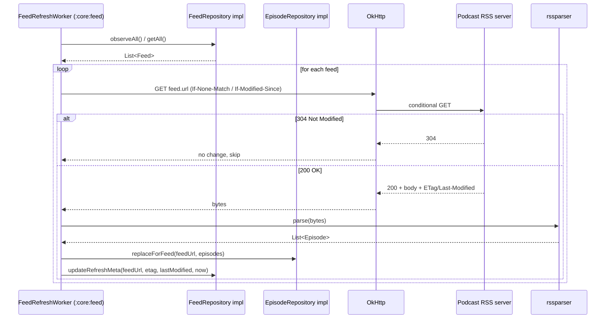

Malformed-feed handling (missing GUIDs, duplicate GUIDs, missing enclosures, bad dates, wrong
encoding, CDATA HTML, no `itunes:duration`) is rssparser's problem to survive and `:core:feed`'s tests
to cover with fixtures — never a hand-rolled parser fallback (CLAUDE.md §3).

**Built (Tier 3 + Tier 4b):** the whole sequence. `FeedFetcher` does the conditional GET — sends
`If-None-Match`/`If-Modified-Since` from stored validators, maps 304 to
`FeedFetchResult.NotModified`, follows redirects, and returns 4xx/5xx/timeout/unreachable-host as
`FeedFetchResult` values rather than throwing (CLAUDE.md §8). `FeedRefresher` drives the loop and
performs the `replaceForFeed` + `updateRefreshMetadata` writes; `FeedRefreshWorker` is the thin
WorkManager wrapper that decides only whether a pass is worth retrying.

Failure policy, since the diagram doesn't show it: one feed failing never aborts the pass. A 4xx is
permanent (and is *not* an unsubscribe — the subscription list is the server's, CLAUDE.md §1), a
5xx or network error is transient and asks WorkManager to retry, and XML that rssparser cannot
parse at all keeps the previously cached episodes rather than wiping them. `FeedRefresher` has no
ledger, download or GPodder dependency at all, which is what makes "refreshing never downloads"
structural rather than a matter of care.

---

## 8. External interface: Storage Access Framework

Two distinct interactions: the one-time folder grant, and the per-download write pipeline.

### Sequence: folder grant + persistence

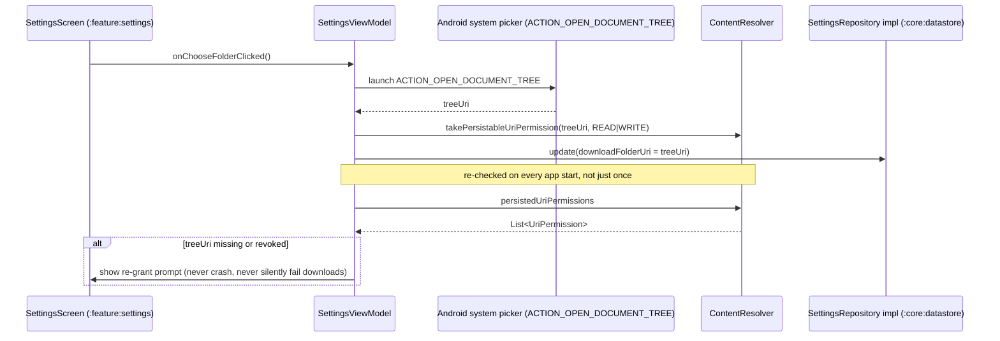

### Sequence: download cache→tag→SAF-copy pipeline

This is the pipeline CLAUDE.md §6/§11 mandates and explains *why*: tagging libraries need a real
`java.io.File`, not a SAF `OutputStream`, so tagging must happen in the app cache, before the file
ever reaches the user's folder. A useful side effect: partial or untagged files never appear where
the user can see them.

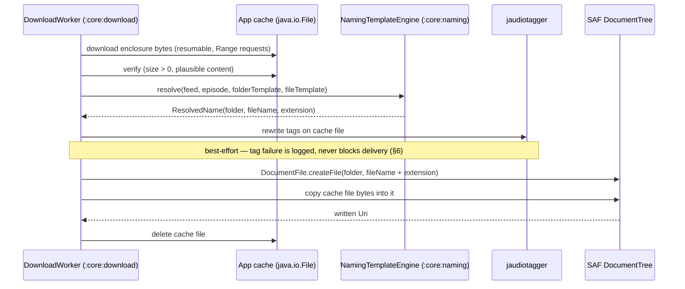

See [§11](#11-naming--tagging-pipeline) for the same pipeline as a flowchart with the ledger write
folded in.

---

## 9. Episode ledger state machine

**"New" is not a stored state** — it's the absence of any `EpisodeLedger` row for that
`episodeKey`. The six states below are the only values `EpisodeLedgerRow.state` ever holds
(CLAUDE.md §5).

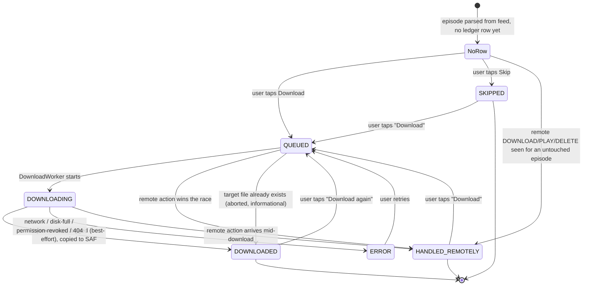

`DOWNLOADED`, `SKIPPED`, and `HANDLED_REMOTELY` are terminal **with respect to automatic logic** —
sync never revisits them. A later remote action arriving for an already-`DOWNLOADED` episode is a
no-op (idempotent), not a state change; test this explicitly (§7 item 8, "triage durability" — the
highest-value test in the project).

The **user** may re-open any of the three via *Download again* (`docs/UI.md` §12.3), which is the
four extra edges above. The mechanism is an explicit `userRequested` flag on the work request
(`:core:download`, `KEY_USER_REQUESTED`), settable **only** from a UI event and never from a worker
or a sync path — that is what keeps `DownloadWorker`'s refusal of terminal rows intact as the thing
that makes the no-auto-download invariant provable. The same flag is the only thing that enables the
pre-flight duplicate-file guard, so `writtenFileName` never becomes the general "have I downloaded
this?" test; that stays the ledger (§11's central invariant). See §12's first open item — ADR 0012 is still a draft, so these four edges are designed but not yet buildable.

---

## 10. Key flows

### Download → mark-on-download

Ledger write happens **before** any network push, and the push itself is not a direct HTTP call from
the download path — it's a trigger. `DownloadWorker` writes the durable ledger row and then enqueues
an expedited `SyncWorker` run, which performs the actual outbox drain (the same code path §6's sync
sequence already covers). This keeps `:core:download` free of any GPodder-client dependency and
means there is exactly one piece of code that POSTs episode actions, not two — see
[§12](#12-decision-record--resolved-and-still-open) for the rationale flagged as a decision
to confirm.

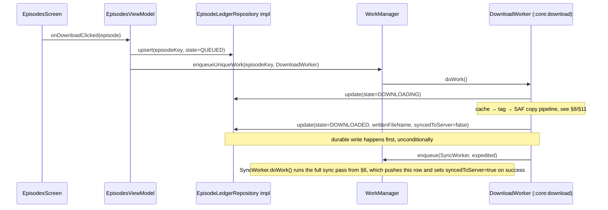

### Skip → mark-on-skip

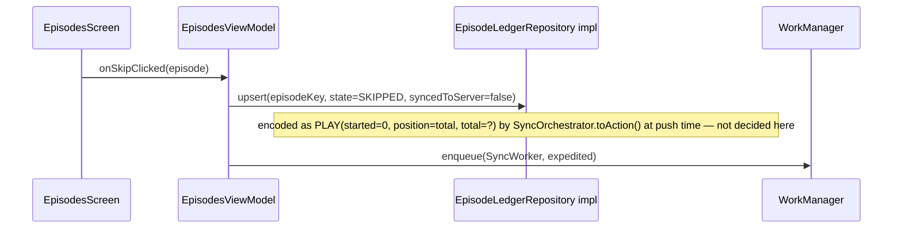

### Failed-POST recovery (durability proof)

No separate diagram needed — this is just "the sync pass runs again later." Because
`syncedToServer` stays `false` until a confirmed 2xx, a failed POST self-heals on the next periodic
`SyncWorker` run (WorkManager's own retry/backoff, not hand-rolled — CLAUDE.md §3) with no special
recovery code. This is precisely why the outbox flag is durable in the DB rather than tracked
in-memory (§5).

---

## 11. Naming & tagging pipeline

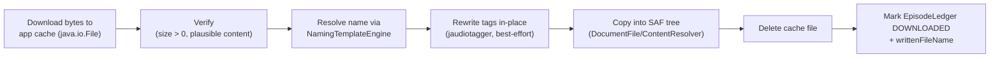

Extension resolution order (§6): response `Content-Type` → URL path extension (query string ignored)
→ `.mp3` fallback. Collision suffixing (` (2)`, ` (3)`, ...) and the UTF-8-byte-safe truncation rules
belong entirely inside `NamingTemplateEngine` (`:core:naming`) — `:core:download` just calls
`resolve()` and uses whatever comes back; it should contain zero string-sanitisation logic of its
own.

**Built (Tier 2 + Tier 4b):** the whole flowchart. `EnclosureDownloader` does A/B (resumable HTTP
into the app cache, `Range` continuation, truncated-body detection), `EpisodeDownloader` sequences
C→F, `AudioTagWriter` is step D (see `docs/decisions/0006` for why the Adonai/Kaned1as Android
fork), and `DownloadWorker` writes G. Tag writes are per-field best-effort
(`TagWriteOutcome.PartialSuccess` lists any `FieldKey` the container wouldn't accept) with a
container-level `Failure` for an unreadable file — never an exception, matching CLAUDE.md §6's
"never lose a successful download because a tag write failed."

Two things the flowchart doesn't show, both discovered by building it:

- **The cache file is renamed before tagging.** jaudiotagger picks its reader from the *file
  extension*, so tagging a `.partial` scratch file always fails ("no reader associated with this
  extension") and every download would have arrived untagged. The download keeps the stable
  `.partial` name so a resume knows what to look for; step D renames it to the extension the file
  is about to be delivered under. Caught by a test, not by review.
- **Step E goes through the `DownloadTarget` port** (`docs/decisions/0011`), not `DocumentFile`
  directly — a test seam, since a SAF write needs a real `DocumentsProvider`. `SafDownloadTarget`
  is the only implementation and is itself untested.

---

## 12. Decision record — resolved, and still open

Every architectural choice this project has had to make is either an accepted ADR in
`docs/decisions/` or one of the four open items at the end. Nothing lives only in prose here: this
section is the index, the ADR is the record.

### Accepted ADRs

| # | Decision | Where it bites |
|---|---|---|
| [0001](decisions/0001-episode-ledger-row-denormalized-fields.md) | `EpisodeLedgerRow` denormalises `feedUrl`, `enclosureUrl`, `durationSeconds` at write time | §4 schema; keeps `:core:sync` free of `EpisodeRepository` |
| [0002](decisions/0002-skip-as-play-encoding.md) | Skip is `PLAY(started=0, position=total, total=duration ?: 0)` — AntennaPod's own convention | §6 outbound mapping |
| [0003](decisions/0003-gpodder-action-timestamp-as-utc.md) | Per-action timestamps: emit bare UTC, parse bare/`+HH:MM`/`Z`, always via `OffsetDateTime` | §6 timestamp table |
| [0004](decisions/0004-naming-date-timezone-and-missing-date-fallback.md) | `ZoneId` injected into the naming engine; a missing `pubDate` formats as the sortable `"00000000"` | §11 |
| [0005](decisions/0005-rssparser-over-stalla-for-feed-parsing.md) | `com.prof18.rssparser`, not Stalla (unmaintained since 2021) — and why `:core:feed` needs Robolectric | §7 |
| [0006](decisions/0006-jaudiotagger-android-fork-via-jitpack.md) | `com.github.Adonai:jaudiotagger` via JitPack, not the stale upstream artifact | §11 |
| [0007](decisions/0007-core-gpodder-is-a-jvm-module.md) | `:core:gpodder` is `kotlin("jvm")`, so "no Android" is compiled in rather than review-enforced | §2 |
| [0008](decisions/0008-nextcloud-gpodder-discards-download-actions.md) | `nextcloud-gpodder` ≥ 3.13.3 silently discards `DOWNLOAD` on POST and still returns 200 — we emit it anyway | §6 — **a real limitation, not a choice** |
| [0009](decisions/0009-gpodder-api-wire-contract.md) | The verified wire contract: `add − remove`, action-name casing, the `-1` sentinel, bare-array POST, Basic auth, `since` inclusivity | §6 |
| [0010](decisions/0010-app-password-cipher-behind-interface.md) | The app password is encrypted behind `AppPasswordCipher`, keeping the Keystore out of the JVM test path | §2 `:core:datastore` |
| [0011](decisions/0011-download-target-port-for-the-saf-write.md) | `DownloadTarget` in front of the SAF write — a test seam, not a portability layer | §8, §11 |
| [0012](decisions/0012-terminal-states-reopenable-by-user.md) | Terminal states re-open **only** on a UI event (`KEY_USER_REQUESTED`); a re-decision behaves exactly like a first one | §9, §10 |
| [0013](decisions/0013-backlog-cutoff-is-written-skipped-rows.md) | The backlog cutoff is **written `SKIPPED` rows**, not a read-time `firstSeenAt` filter — amends CLAUDE.md §5 | §4, §5 |
| [0014](decisions/0014-bulk-user-initiated-download-is-allowed.md) | Bulk download is allowed as a *command*, never as a *rule* — amends CLAUDE.md §1 and README | §10 |
| [0015](decisions/0015-coil-and-lucide-compose-for-the-ui.md) | Coil for image loading, Lucide's Compose artifact for icons | `docs/UI.md` §18 |
| [0016](decisions/0016-time-is-java-time-behind-an-epochtime-seam.md) | Storage stays `Long` epoch millis; UI state is `java.time`; `EpochTime` is the only seam | §5 |

Four further decisions were made while building and are recorded here rather than as ADRs, because
each follows from an accepted one rather than being a choice with live alternatives:

- **`SyncWorker` lives in `:app`** — a `CoroutineWorker` needs `androidx.work`, which the
  Android-free `:core:sync` may not have (§2).
- **`DownloadWorker` triggers a sync pass, it does not POST** — through the `SyncTrigger` port, so
  exactly one piece of code posts episode actions and `:core:download` has no GPodder dependency at
  all (§10).
- **Hilt arrived in Tier 4b, not 4c** — `@HiltWorker` is how a worker gets its dependencies; the
  alternative was the hand-rolled service locator CLAUDE.md §3 forbids.
- **`ktlintCheck` is the sole authority on formatting** — detekt's duplicate formatting rules are
  off and `.editorconfig` sets `max_line_length = 120`, because no code shape satisfies both
  bundled ktlint versions on an annotated constructor. See `docs/dev-environment.md` §8.6.

### Still open

**Nothing.** The four items that blocked Tier 4c were settled by the author on 2026-08-01 and are
ADRs 0012–0016 above. Three of them changed a rule rather than filling a hole, so the documents
holding those rules were amended in the same pass rather than left to contradict the ADR:

| Rule that changed | Was | Is | Amended in |
|---|---|---|---|
| The backlog cutoff | read-time `pubDate >= firstSeenAt` filter | written `SKIPPED` rows | CLAUDE.md §5, §4/§5 here |
| Bulk download | "no download all" | no download *rules*; a scoped, confirmed *command* is allowed | CLAUDE.md §1, README |
| UI scope | "two destinations is the target" | eight screens, each covering a state the app can be in | CLAUDE.md §10 step 8 |

Three things remain **unverified rather than undecided**, and are not blockers — they are what the
first device run will test: `SafDownloadTarget` (ADR 0011), `KeystoreAppPasswordCipher` (ADR 0010),
and the foreground-service notification. None has ever run.

When the next open decision appears, it goes here, and the section stops saying "nothing".

---

## 13. Build-order checklist

Maps CLAUDE.md §10's build order to the sections above. Use this as the implementation tracker —
check a step complete only once its linked section's diagrams/tables/interfaces are actually
implemented and tested, per the Definition of Done (CLAUDE.md §12).

| # | CLAUDE.md §10 step | Status | Relevant section(s) here |
|---|---|---|---|
| 1 | Dev container + Gradle skeleton | ✅ done | `docs/dev-environment.md`, `docs/journal.md` |
| 2 | `:core:model` + `:core:database` (+ `:core:datastore`) | ✅ done (Tier 1 / 4a) | [§4](#4-database-schema), [§5](#5-domain-model--repository-ports) |
| 3 | `:core:feed` | ✅ done (Tier 2/3 parse + fetch, 4b refresh worker) | [§7](#7-external-interface-podcast-rssatom-feeds) |
| 4 | `:core:naming` | ✅ done (Tier 1) | [§5](#5-domain-model--repository-ports) (`NamingTemplateEngine`), [§11](#11-naming--tagging-pipeline) |
| 5 | `:core:download` | ✅ done (Tier 4b) — `SafDownloadTarget` unrun | [§8](#8-external-interface-storage-access-framework), [§10](#10-key-flows), [§11](#11-naming--tagging-pipeline) |
| 6 | `:core:gpodder` | ✅ done (Tier 3) | [§6](#6-external-interface-nextcloud-gpodder-api) |
| 7 | `:core:sync` | ✅ done (Tier 1, extended in 3/4b) | [§2](#2-module-architecture) (ports/adapters rule), [§6](#6-external-interface-nextcloud-gpodder-api), [§9](#9-episode-ledger-state-machine) |
| 8 | UI (`:feature:settings`, `:feature:episodes`, `:app`) | ◐ **S2 built**; S1, S3–S8 and the `NavHost` not written | [§3](#3-data-flow), [§8](#8-external-interface-storage-access-framework), `docs/UI.md`, `docs/UI_interface.md` |
| 9 | Polish (error surfacing, per-feed counts) | ◐ partly — the foreground-service notification exists but has never been displayed | [§9](#9-episode-ledger-state-machine) (`ERROR` state), [§10](#10-key-flows) |

**Everything below the UI is built and green** (386 tests, 3 skipped as of 2026-08-02), and so is
everything the UI *binds to* — every port in `docs/UI_interface.md` §8 is implemented, not just
declared. **S2 (episode list) is the first screen that renders**, view model and Composable, and it
has been exercised on the in-container emulator. What is missing is S1, S3–S8, their state types and
ViewModels, and the `NavHost` — so nothing yet routes to S2 inside the app. Nothing blocks them.
