# Podsilo Architecture

This document is the implementation reference for Podsilo. It turns CLAUDE.md's requirements (§5, §6)
into a concrete module design, database schema, interface contracts, and sequence diagrams. Follow
CLAUDE.md's build order (§10) for *when* to build each piece; use this document for *what* to build
and *how the pieces fit together*. The checklist at the end cross-references both.

Diagrams use [Mermaid](https://mermaid.js.org/), which GitHub renders natively in Markdown.

## Table of contents

1. [System context](#1-system-context)
2. [Module architecture](#2-module-architecture)
3. [Data flow](#3-data-flow)
4. [Database schema](#4-database-schema)
5. [Domain model & repository ports](#5-domain-model--repository-ports)
6. [External interface: Nextcloud GPodder API](#6-external-interface-nextcloud-gpodder-api)
7. [External interface: podcast RSS/Atom feeds](#7-external-interface-podcast-rssatom-feeds)
8. [External interface: Storage Access Framework](#8-external-interface-storage-access-framework)
9. [Episode ledger state machine](#9-episode-ledger-state-machine)
10. [Key flows](#10-key-flows)
11. [Naming & tagging pipeline](#11-naming--tagging-pipeline)
12. [Open decisions — resolve before/while implementing](#12-open-decisions--resolve-beforewhile-implementing)
13. [Build-order checklist](#13-build-order-checklist)

---

## 1. System context

Podsilo talks to three external systems and one external human process (the user's own audio
player, which we never call into — it just reads the folder). Nothing here is optional or
swappable; all three integrations are core requirements from CLAUDE.md §1.

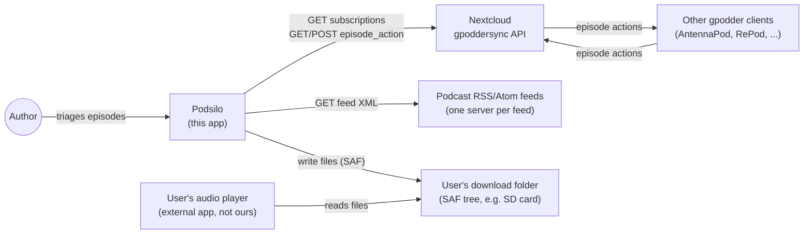

Podsilo never writes to the subscription list (no `subscription_change/create`, ever — CLAUDE.md
§1/§5) and never talks to the user's audio player. The only two-way relationship with another system
is the GPodder episode-action log, and that's mediated entirely through Nextcloud, not directly with
other clients.

---

## 2. Module architecture

### The constraint that shapes everything else

CLAUDE.md §5 mandates `:core:model` and `:core:sync` (and §10 adds `:core:naming`) have **no Android
dependency**, so their logic is plain-JVM testable (Tier 1, no emulator). But sync reconciliation
needs the Room-backed ledger and the GPodder HTTP client — and both Room (`:core:database`) and, as
built, `:core:gpodder` are Android library modules. **A `kotlin("jvm")` module cannot depend on a
`com.android.library` module** (Gradle/AGP variant resolution doesn't support that direction) — only
the reverse works.

**Resolution: ports and adapters.** `:core:model` — already the one dependency-free module every
other module can safely depend on — hosts plain Kotlin **repository/client interfaces** ("ports").
`:core:sync` depends only on `:core:model` and orchestrates against those interfaces; it never
imports Room, Retrofit, or any Android type. The concrete implementations ("adapters") live in the
Android modules that actually need Android APIs (`:core:database` for Room, `:core:gpodder` for
Retrofit) and are bound to the interfaces via Hilt `@Binds` in each adapter module's own Hilt module
— `:app` doesn't need bespoke wiring code beyond `@HiltAndroidApp`.

This is the single most important structural decision in this document — every module boundary below
follows from it.

### Module responsibilities

| Module | Type | Responsibility |
|---|---|---|
| `:core:model` | JVM | Domain types (`Feed`, `Episode`, `EpisodeLedgerRow`, ...), repository/client **interfaces**, `LedgerState` enum, `SyncOutcome` sealed result types. Zero dependencies beyond Kotlin stdlib + coroutines-core (for `Flow`). |
| `:core:naming` | JVM | Template resolution, sanitisation, truncation, collision suffixing (CLAUDE.md §6). Depends on `:core:model` for `Feed`/`Episode`. |
| `:core:sync` | JVM | Reconciliation logic + `SyncOrchestrator` (order-of-operations per CLAUDE.md §5). Depends on `:core:model` only — receives repository/client implementations via constructor injection. |
| `:core:database` | Android library | Room entities, DAOs, migrations; **implements** `FeedRepository`, `EpisodeRepository`, `EpisodeLedgerRepository`, `SyncStateRepository` from `:core:model`. |
| `:core:datastore` | Android library | Settings storage (Nextcloud URL/credentials, folder URI, sync interval, naming templates) via Jetpack DataStore + Keystore-backed encryption for the app password. Implements `SettingsRepository`. |
| `:core:feed` | Android library | Wraps rssparser (docs/decisions/0005, not Stalla); fetches + parses feed XML into `Feed`/`Episode`. Hosts `FeedRefreshWorker`. |
| `:core:gpodder` | **JVM** (converted from Android library — `docs/decisions/0007`) | Retrofit client for the three GPodder endpoints Podsilo calls; **implements** `GpodderClient` from `:core:model`. |
| `:core:download` | Android library | Download queue (`DownloadWorker`), cache→tag→SAF-copy pipeline, WorkManager state. Depends on `:core:model`, `:core:naming`. |
| `:feature:episodes` | Android library (Compose) | Episode list + filters + triage actions. Depends on `:core:model` (ports only); Hilt-injected ViewModel gets real repositories from `:app`'s graph. |
| `:feature:settings` | Android library (Compose) | Credentials, folder picker, naming template editor + live preview. |
| `:app` | Android application | Hilt wiring (binds every port to its adapter), navigation, `SyncWorker` (see below), app-level `WorkManager` scheduling. |

### Why `SyncWorker` lives in `:app`, not `:core:sync`

A `CoroutineWorker` subclass requires `androidx.work`, an Android dependency — so it cannot live in
the Android-free `:core:sync`. `:core:sync` exposes a plain `SyncOrchestrator` class (constructor
takes the four ports); `:app` contains a thin `SyncWorker : CoroutineWorker` that Hilt-injects a
`SyncOrchestrator` and calls `orchestrator.sync()`, translating `SyncOutcome` to
`Result.success()/retry()/failure()`. `DownloadWorker` and `FeedRefreshWorker` have no such problem
— `:core:download` and `:core:feed` are already Android modules — and live where the architecture
table above says.

### Dependency graph

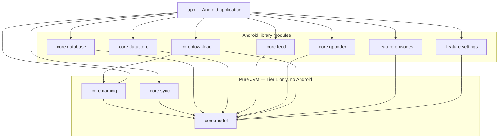

**Rule to enforce in code review:** an arrow only ever points from an Android module to a JVM module,
or from any module to `:core:model`. If `:core:sync` (or `:core:naming`) ever needs to `import`
anything from `:core:database` or `:core:gpodder` directly, that's a sign the port interface in
`:core:model` is missing a method — add to the interface, don't reach around it.

---

## 3. Data flow

Unidirectional, per CLAUDE.md §5: DAO `Flow` → repository → ViewModel `StateFlow` → Compose. The UI
never triggers network directly — it writes ledger state and enqueues `WorkManager` work; workers do
the I/O and write back to the database; the UI observes the database.

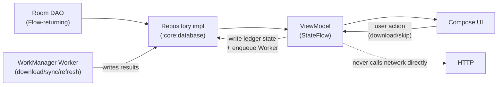

---

## 4. Database schema

Four tables, exactly as specified in CLAUDE.md §5 — deliberately not a typical podcast app's schema.
Room entities live in `:core:database`; the plain-Kotlin equivalents (`Feed`, `Episode`,
`EpisodeLedgerRow`, `SyncState`) live in `:core:model` and are what everything outside
`:core:database` actually sees. The repository implementation maps entity ↔ domain type at the
boundary.

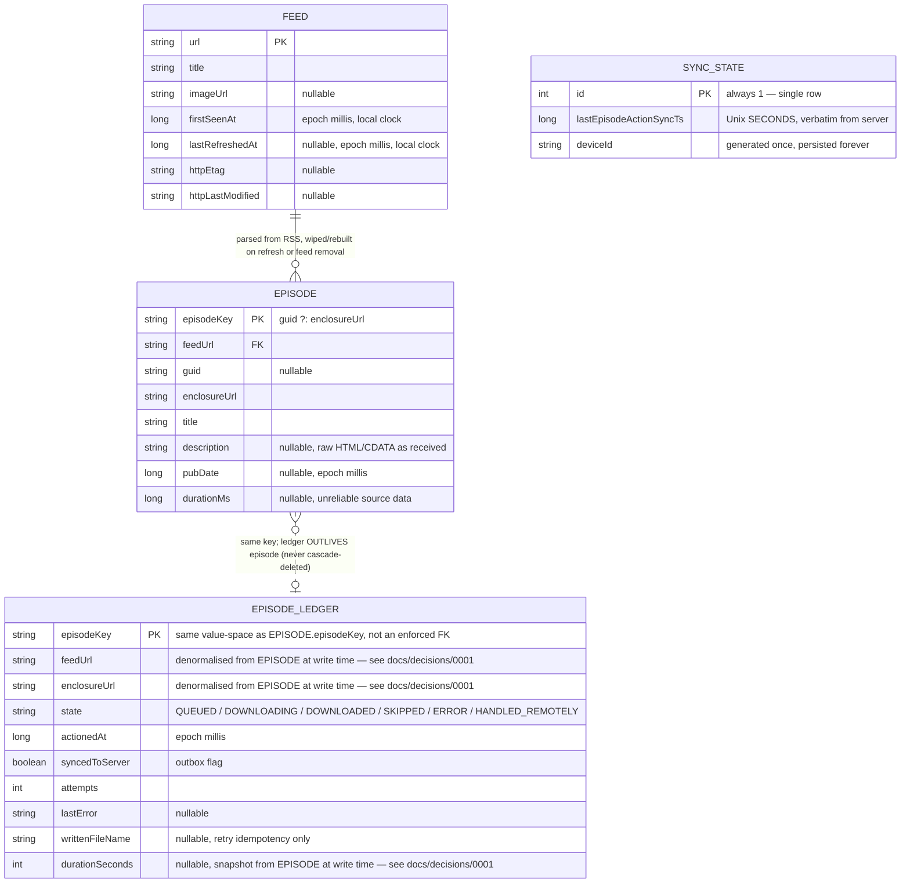

**The one relationship that must not be a real foreign key:** `EPISODE_LEDGER.episodeKey` shares a
key space with `EPISODE.episodeKey` but must **not** have `ON DELETE CASCADE` (or any FK constraint
at all) back to `EPISODE`. CLAUDE.md §5's subscription-mirroring rule requires: when a feed
disappears from the server, its `Episode` rows are deleted, but its `EpisodeLedger` rows are kept —
otherwise a re-subscribe would re-download the whole back catalogue. Model this as two independent
tables with a shared key convention, not a Room `@ForeignKey`.

### Field reference

**Feed**

| Field | Type | Nullable | Source | Notes |
|---|---|---|---|---|
| `url` | `String` | No (PK) | GPodder `subscriptions.add[i]` | Also the value written into `EpisodeAction.podcast` on outbound actions. |
| `title` | `String` | No | RSS `<channel><title>` | GPodder API has no titles — only known after the first successful feed fetch; use the URL as a placeholder until then. |
| `imageUrl` | `String` | Yes | RSS `<itunes:image>` / `<image><url>` | |
| `firstSeenAt` | `Long` | No | Local clock, set once when the URL first appears in `add[]` | Drives the backlog cutoff (§5's "New" filter: `pubDate >= firstSeenAt`). Never updated after first write. |
| `lastRefreshedAt` | `Long` | Yes | Local clock, after a successful (200, not 304) feed fetch | |
| `httpEtag` | `String` | Yes | Response `ETag` header | For conditional `GET`. |
| `httpLastModified` | `String` | Yes | Response `Last-Modified` header | For conditional `GET`. |

**Episode**

| Field | Type | Nullable | Source | Notes |
|---|---|---|---|---|
| `episodeKey` | `String` | No (PK) | `guid ?: enclosureUrl` | Mirrors the server's identification rule exactly (CLAUDE.md §5) — this is not a free choice. |
| `feedUrl` | `String` | No | Parent `Feed.url` | |
| `guid` | `String` | Yes | RSS `<guid>` | Frequently missing, reused, or changed — see [§12](#12-open-decisions--resolve-beforewhile-implementing). |
| `enclosureUrl` | `String` | No | RSS `<enclosure url="">` | Used as `episodeKey` fallback and as `EpisodeAction.episode`. |
| `title` | `String` | No | RSS `<title>` | Stored **raw**; cleanup regex rules (§6) and sanitisation apply at naming time, not storage time. |
| `description` | `String` | Yes | RSS `<description>` or `<content:encoded>` | Stored raw (CDATA and all); HTML sanitised at render time in the UI, never at write time. |
| `pubDate` | `Long` | Yes | RSS `<pubDate>`, fallback chain in §6 | Normalised to the device's fixed timezone (document which one is chosen when `:core:naming` lands). |
| `durationMs` | `Long` | Yes | RSS `<itunes:duration>` | Notoriously unreliable — never block anything on this being present. |

**EpisodeLedger** — "the one table that must never be lost" (CLAUDE.md §5)

| Field | Type | Nullable | Written by | Notes |
|---|---|---|---|---|
| `episodeKey` | `String` | No (PK) | — | Shares key space with `Episode.episodeKey`; see FK note above. `guid` is **not** a separate column — it's derived (`episodeKey.takeIf { it != enclosureUrl }`). |
| `feedUrl` | `String` | No | Snapshot of `Episode.feedUrl` at write time | Denormalised, not looked up via `Episode` — see `docs/decisions/0001-episode-ledger-row-denormalized-fields.md`. Needed so a POST retry after the feed is unsubscribed can still build a valid outbound action. |
| `enclosureUrl` | `String` | No | Snapshot of `Episode.enclosureUrl` at write time | Same rationale as `feedUrl`. |
| `state` | `String`/enum | No | UI (QUEUED/SKIPPED), `DownloadWorker` (DOWNLOADING/DOWNLOADED/ERROR), `SyncOrchestrator` (HANDLED_REMOTELY) | See [§9](#9-episode-ledger-state-machine) for the full transition table. There is **no persisted "NEW" value** — new means no row exists at all. |
| `actionedAt` | `Long` | No | Whoever writes `state` | Epoch millis. For rows created from a remote action, parsed from the action's ISO-8601 `timestamp` field, interpreted as UTC — see `docs/decisions/0003-gpodder-action-timestamp-as-utc.md`. |
| `syncedToServer` | `Boolean` | No | `false` on local write, `true` only on confirmed 2xx POST | This is literally the outbox flag — `getUnsynced()` is `WHERE syncedToServer = 0`. |
| `attempts` | `Int` | No | `DownloadWorker` / outbox push | Retry counter. |
| `lastError` | `String` | Yes | `DownloadWorker` / outbox push | Human-readable, for the error state UI. |
| `writtenFileName` | `String` | Yes | `DownloadWorker`, after a successful SAF copy | Retry idempotency **only** — never used as an existence check (CLAUDE.md §11's single most important invariant). |
| `durationSeconds` | `Int` | Yes | Snapshot of `Episode.durationMs` (converted to seconds) at write time | Used only to encode a skip's `PLAY` `total`/`position` — see `docs/decisions/0001-...` and `docs/decisions/0002-skip-as-play-encoding.md`. `null` when the feed never supplied a usable duration. |

**SyncState** — single row, `id = 1` always

| Field | Type | Nullable | Source | Notes |
|---|---|---|---|---|
| `id` | `Int` | No (PK) | Hardcoded `1` | Not a real multi-row table; Room needs a PK regardless. |
| `lastEpisodeActionSyncTs` | `Long` | No | Verbatim from the GPodder `episode_action` response's top-level `timestamp` | **Unix seconds**, sent back as the next `since`. Never computed from local device time — see CLAUDE.md §11's clock-skew gotcha. |
| `deviceId` | `String` | No | Generated once (e.g. `UUID.randomUUID()`) on first run, persisted forever | Lets us recognise our own echoed-back actions in the remote action stream. |

**Built so far (Tier 4a):** `:core:database` implements this schema in Room (`PodsiloDatabase`,
version 1, schema exported under `core/database/schemas/`) and the four repository ports (extended
in Tier 4b with the read-side methods the workers need — `FeedRepository.getAll`/`get`/
`updateRefreshMetadata`, `EpisodeRepository.get`, `EpisodeLedgerRepository.get`), with
entity↔domain mapping at the module boundary. The episodes→feeds foreign key cascades (feed removal
prunes episodes); the ledger has **no** foreign key (verified in the exported schema), so it
survives — `SubscriptionMirroringTest` proves a re-subscribe doesn't re-download. `FeedDao.replaceAll`
uses `@Upsert` (not `@Insert(REPLACE)`, whose delete-then-insert would fire the episodes' cascade
and wipe an existing feed's cache on every refresh). Tests are Robolectric in-memory-DB (headless, no
emulator — CLAUDE.md §4). `:core:datastore` implements `SettingsRepository` over DataStore
Preferences, app password encrypted via `AppPasswordCipher` (`docs/decisions/0010`).

**Built (Tier 4b):** all three workers (`DownloadWorker`, `FeedRefreshWorker`, `:app`'s
`SyncWorker`) and the Hilt graph that constructs them — `:app`'s `di/` package provides every port
its adapter, so the repositories stay plain constructor-injectable classes with no DI annotations
of their own. Hilt arrived a tier earlier than TODO.md scheduled it because a `@HiltWorker` is the
only way to give a worker its dependencies without hand-rolling the service locator CLAUDE.md §3
forbids.

---

## 5. Domain model & repository ports

All of the following live in `:core:model`. Structure shown as a Mermaid class diagram; exact
signatures follow in Kotlin (mermaid's generic syntax gets unreadable fast, so treat the diagrams as
"what talks to what" and the code blocks as the actual contract).

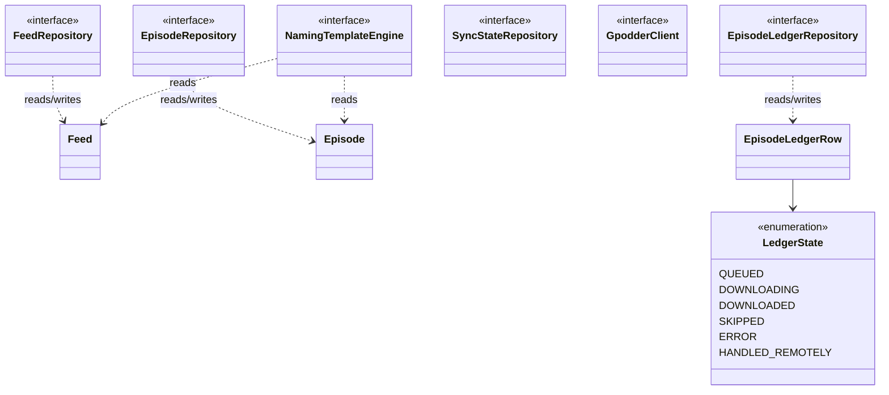

```kotlin
// :core:model — domain types
data class Feed(
    val url: String,
    val title: String,
    val imageUrl: String?,
    val firstSeenAt: Long,
    val lastRefreshedAt: Long?,
    val httpEtag: String?,
    val httpLastModified: String?,
)

data class Episode(
    val episodeKey: String,
    val feedUrl: String,
    val guid: String?,
    val enclosureUrl: String,
    val title: String,
    val description: String?,
    val pubDate: Long?,
    val durationMs: Long?,
)

enum class LedgerState { QUEUED, DOWNLOADING, DOWNLOADED, SKIPPED, ERROR, HANDLED_REMOTELY }

// guid ?: enclosureUrl — the server's identification rule (CLAUDE.md §5). Episode.episodeKey and
// the key used to match incoming EpisodeActions both go through this one function.
fun episodeKey(guid: String?, enclosureUrl: String): String = guid ?: enclosureUrl

data class EpisodeLedgerRow(
    val episodeKey: String,
    val feedUrl: String, // denormalised from Episode at write time — docs/decisions/0001
    val enclosureUrl: String, // denormalised from Episode at write time — docs/decisions/0001
    val state: LedgerState,
    val actionedAt: Long,
    val syncedToServer: Boolean,
    val attempts: Int,
    val lastError: String?,
    val writtenFileName: String?,
    val durationSeconds: Int? = null, // snapshot from Episode at write time — docs/decisions/0001
) {
    val guid: String? get() = episodeKey.takeIf { it != enclosureUrl } // derived, not stored
}

sealed interface SyncOutcome {
    data object Success : SyncOutcome
    data class Retry(val reason: String) : SyncOutcome // transient (network) — worth WorkManager retrying
    data class Failure(val reason: String) : SyncOutcome // non-transient — retrying won't help
}

data class SyncState(val lastEpisodeActionSyncTs: Long, val deviceId: String)

// :core:model — ports (implemented in Android modules, consumed by :core:sync)
interface FeedRepository {
    fun observeAll(): Flow<List<Feed>>
    suspend fun replaceAll(feeds: List<Feed>) // add - remove, wholesale; cascades episode deletion for removed feeds
}

interface EpisodeRepository {
    fun observeForFeed(feedUrl: String): Flow<List<Episode>>
    suspend fun replaceForFeed(feedUrl: String, episodes: List<Episode>)
    suspend fun deleteForFeed(feedUrl: String)
}

interface EpisodeLedgerRepository {
    fun observe(filter: LedgerFilter): Flow<List<EpisodeLedgerRow>>
    suspend fun upsert(row: EpisodeLedgerRow)
    suspend fun getUnsynced(): List<EpisodeLedgerRow>
    suspend fun markSynced(episodeKeys: List<String>)
}

interface SyncStateRepository {
    suspend fun get(): SyncState
    suspend fun save(state: SyncState)
}

interface GpodderClient {
    suspend fun fetchSubscriptions(since: Long? = null): SubscriptionDelta
    suspend fun postEpisodeActions(actions: List<EpisodeAction>): Result<Unit>
    suspend fun fetchEpisodeActions(since: Long): EpisodeActionPage
}

data class SubscriptionDelta(val add: List<String>, val remove: List<String>, val timestamp: Long)
enum class EpisodeActionType { DOWNLOAD, PLAY, DELETE, NEW }
data class EpisodeAction(
    val podcast: String,
    val episode: String,
    val guid: String?,
    val action: EpisodeActionType,
    val timestamp: String, // ISO-8601, no offset, interpreted as UTC — see §6 and docs/decisions/0003
    val started: Int? = null,
    val position: Int? = null,
    val total: Int? = null,
)
data class EpisodeActionPage(val actions: List<EpisodeAction>, val timestamp: Long)

// :core:naming — port + result type
interface NamingTemplateEngine {
    fun resolve(feed: Feed, episode: Episode, folderTemplate: String, fileTemplate: String): ResolvedName
}
data class ResolvedName(val folder: String, val fileNameWithoutExtension: String, val extension: String)
```

`LedgerFilter` above is whatever `:feature:episodes` needs for its New/Downloaded/Skipped/All ×
per-feed combinations — define it alongside `EpisodeLedgerRepository`, not as a separate module.

---

## 6. External interface: Nextcloud GPodder API

Four endpoints total (CLAUDE.md §5) — we implement three; `subscription_change/create` is
permanently out of scope (§1).

| Endpoint | Method | Query/body | Response |
|---|---|---|---|
| `/index.php/apps/gpoddersync/subscriptions` | GET | `since` (Unix seconds, optional) | `{add: [url], remove: [url], timestamp}` |
| `/index.php/apps/gpoddersync/episode_action` | GET | `since` (Unix seconds, optional) | `{actions: [EpisodeAction], timestamp}` |
| `/index.php/apps/gpoddersync/episode_action/create` | POST | `[EpisodeAction]` | 2xx |
| ~~`/index.php/apps/gpoddersync/subscription_change/create`~~ | — | **never called** | — |

### Timestamp formats — the gotcha CLAUDE.md calls out hardest

| Where | Format | Example |
|---|---|---|
| `since` query param (both endpoints) | Unix seconds, `Long` | `1752480000` |
| Top-level `timestamp` in both responses | Unix seconds, `Long` | `1752483600` — persist verbatim, send back as next `since` |
| `EpisodeAction.timestamp` field (inside each action) | ISO-8601, **no timezone offset** | `2026-07-14T09:00:00` |

Two different formatters, two different meanings. Getting this wrong doesn't crash anything — it
silently breaks incremental sync in a way that looks like "sync just doesn't work." Unit-test the
round-trip explicitly (CLAUDE.md §11).

> **Corrected in Tier 3:** the per-action `timestamp` row above (and CLAUDE.md §11) describes an
> older reality. Both reference servers now emit an offset — `nextcloud-gpodder` sends
> `2021-10-06T11:49:23+00:00` (PHP `format("c")`), `opodsync` sends a trailing `Z`. Podsilo parses
> all three forms and emits the bare one, which both servers read as UTC. See
> `docs/decisions/0009` for the full verified contract and `0003` for the amended timestamp
> decision.

**Built so far (Tier 3):** `:core:gpodder`'s `RetrofitGpodderClient` implements all three endpoints
above, with DTOs and mapping that absorb the differences between the two reference servers
(action-name casing, the `-1` absent-playback-value sentinel, `opodsync`'s extra `update_urls`
field). `RetrofitGpodderClientTest` drives it against MockWebServer — exact paths, query params,
bare-array POST body, Basic auth header, and the 401/500/timeout/malformed-body paths.

⚠️ **`POST episode_action/create` is not as reliable as a 2xx implies.** `nextcloud-gpodder` >=
3.13.3 discards any non-`PLAY` action and still returns 200, so `DOWNLOAD` never lands on a real
Nextcloud. Podsilo emits it regardless — see `docs/decisions/0008` before designing anything that
depends on downloads being visible to other clients.

### Sequence: full sync pass

Order of operations exactly per CLAUDE.md §5: pull subscriptions (full) → push unsynced ledger rows
→ pull episode actions since last timestamp → reconcile → persist new timestamps atomically.

```mermaid
sequenceDiagram
    participant W as SyncWorker (:app)
    participant O as SyncOrchestrator (:core:sync)
    participant FR as FeedRepository impl (:core:database)
    participant LR as EpisodeLedgerRepository impl (:core:database)
    participant SR as SyncStateRepository impl (:core:database)
    participant GC as GpodderClient impl (:core:gpodder)
    participant NC as Nextcloud

    W->>O: sync()
    O->>GC: fetchSubscriptions(since = null)
    GC->>NC: GET /subscriptions
    NC-->>GC: 200 {add, remove, timestamp}
    GC-->>O: SubscriptionDelta
    O->>FR: replaceAll(add - remove)
    Note over FR: wholesale replace; episodes of removed feeds deleted, ledger rows kept

    O->>LR: getUnsynced()
    LR-->>O: rows where syncedToServer = false
    alt unsynced rows exist
        O->>GC: postEpisodeActions(rows.map(::toAction))
        GC->>NC: POST /episode_action/create
        NC-->>GC: 2xx
        GC-->>O: success
        O->>LR: markSynced(keys)
    end

    O->>SR: get()
    SR-->>O: SyncState(lastEpisodeActionSyncTs, deviceId)
    O->>GC: fetchEpisodeActions(since = lastEpisodeActionSyncTs)
    GC->>NC: GET /episode_action?since=...
    NC-->>GC: 200 {actions, timestamp}
    GC-->>O: actions, newTimestamp

    O->>O: reconcile(localLedger, remoteActions)
    Note over O: match by guid, falling back to episode URL (§5) — a DOWNLOAD/PLAY/DELETE for any episode not locally queued/downloaded becomes HANDLED_REMOTELY
    O->>LR: upsertAll(reconciledRows)
    O->>SR: save(SyncState(newTimestamp, deviceId))
    O-->>W: SyncOutcome.Success
```

### `EpisodeLedgerRow` → `EpisodeAction` mapping (outbound)

| Ledger state | Emitted `action` | `started` | `position` | `total` |
|---|---|---|---|---|
| `DOWNLOADED` | `DOWNLOAD` | — | — | — |
| `SKIPPED` | `PLAY` | `0` | equal to `total` | `EpisodeLedgerRow.durationSeconds` if known, else `0` |

Resolved per AntennaPod's own convention — see `docs/decisions/0002-skip-as-play-encoding.md`.
Implemented in `net.drehtuer.podsilo.core.sync.toOutboundAction()` (`:core:sync`).

### Remote `EpisodeAction` → ledger state mapping (inbound)

| Incoming `action` | Effect on local ledger |
|---|---|
| `DOWNLOAD`, `PLAY`, or `DELETE` for an episode we don't have a terminal local state for | `state = HANDLED_REMOTELY` — do not download it here |
| Any action for an episode not in any subscribed feed | Still processed (§5 explicitly lists this as a test case) — the ledger is keyed by episode, not by current subscription |
| Our own device's echoed-back action | Idempotent no-op (identified via `deviceId`, or simply because the local state already matches) |

Identification rule for both directions: **`guid`, falling back to `episode` (enclosure URL) when
`guid` is absent** — matches `episodeKey`'s definition exactly (§4).

---

## 7. External interface: podcast RSS/Atom feeds

One feed per `Feed.url`, fetched independently — the GPodder API has no episode catalogue at all
(§5), so this is the *only* source of episode data.

### RSS → `Episode`/`Feed` field mapping

| Local field | RSS/Atom source (via rssparser -- docs/decisions/0005) | Fallback chain |
|---|---|---|
| `Feed.title` | `<channel><title>` | — |
| `Feed.imageUrl` | `<itunes:image>` or `<image><url>` | none → `null` |
| `Episode.guid` | `<guid>` | none → `null` (falls back to enclosure URL for `episodeKey`) |
| `Episode.enclosureUrl` | `<enclosure url="">` | episode without an enclosure is not downloadable — exclude or flag, decide during `:core:feed` implementation |
| `Episode.title` | `<title>` | — |
| `Episode.description` | `<description>` or `<content:encoded>` | none → `null` |
| `Episode.pubDate` | `<pubDate>` | other date field the parser exposes → date first locally seen (§6) |
| `Episode.durationMs` | `<itunes:duration>` | none → `null`, never invented |

**Built so far (Tier 2):** `FeedXmlParser`/`decodeFeedXml`/`RssMapping.kt` in `:core:feed` implement
this table's mapping from raw bytes to `ParsedFeed` (episodes + feed title/image) — see
`docs/decisions/0005` for why rssparser, not Stalla. **Not yet built:** the HTTP-fetch layer this
section's sequence diagram shows (conditional `GET`, `FeedRefreshWorker`, `FeedRepository`/
`EpisodeRepository` wiring) — that's Tier 3/4b. `decodeFeedXml` also rewrites the XML prolog's
declared encoding to `UTF-8` after decoding, not just the characters — rssparser re-serialises the
string as UTF-8 bytes before re-parsing it, so a stale non-UTF-8 declaration left in the text causes
a double-decode of non-ASCII characters; discovered via the "wrong encoding" fixture test failing.

### Sequence: feed refresh

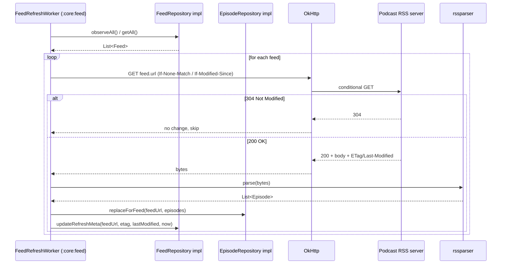

Malformed-feed handling (missing GUIDs, duplicate GUIDs, missing enclosures, bad dates, wrong
encoding, CDATA HTML, no `itunes:duration`) is rssparser's problem to survive and `:core:feed`'s tests
to cover with fixtures — never a hand-rolled parser fallback (CLAUDE.md §3).

**Built (Tier 3 + Tier 4b):** the whole sequence. `FeedFetcher` does the conditional GET — sends
`If-None-Match`/`If-Modified-Since` from stored validators, maps 304 to
`FeedFetchResult.NotModified`, follows redirects, and returns 4xx/5xx/timeout/unreachable-host as
`FeedFetchResult` values rather than throwing (CLAUDE.md §8). `FeedRefresher` drives the loop and
performs the `replaceForFeed` + `updateRefreshMetadata` writes; `FeedRefreshWorker` is the thin
WorkManager wrapper that decides only whether a pass is worth retrying.

Failure policy, since the diagram doesn't show it: one feed failing never aborts the pass. A 4xx is
permanent (and is *not* an unsubscribe — the subscription list is the server's, CLAUDE.md §1), a
5xx or network error is transient and asks WorkManager to retry, and XML that rssparser cannot
parse at all keeps the previously cached episodes rather than wiping them. `FeedRefresher` has no
ledger, download or GPodder dependency at all, which is what makes "refreshing never downloads"
structural rather than a matter of care.

---

## 8. External interface: Storage Access Framework

Two distinct interactions: the one-time folder grant, and the per-download write pipeline.

### Sequence: folder grant + persistence

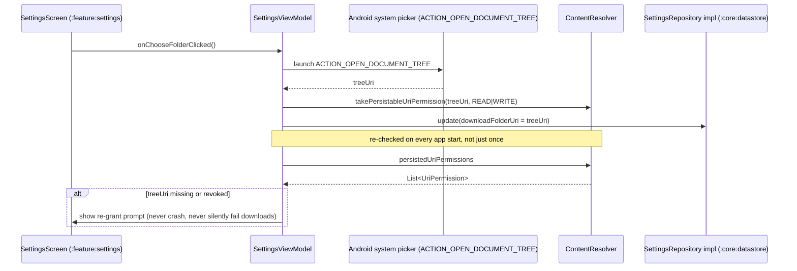

### Sequence: download cache→tag→SAF-copy pipeline

This is the pipeline CLAUDE.md §6/§11 mandates and explains *why*: tagging libraries need a real
`java.io.File`, not a SAF `OutputStream`, so tagging must happen in the app cache, before the file
ever reaches the user's folder. A useful side effect: partial or untagged files never appear where
the user can see them.

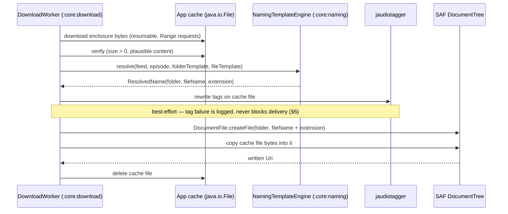

See [§11](#11-naming--tagging-pipeline) for the same pipeline as a flowchart with the ledger write
folded in.

---

## 9. Episode ledger state machine

**"New" is not a stored state** — it's the absence of any `EpisodeLedger` row for that
`episodeKey`. The six states below are the only values `EpisodeLedgerRow.state` ever holds
(CLAUDE.md §5).

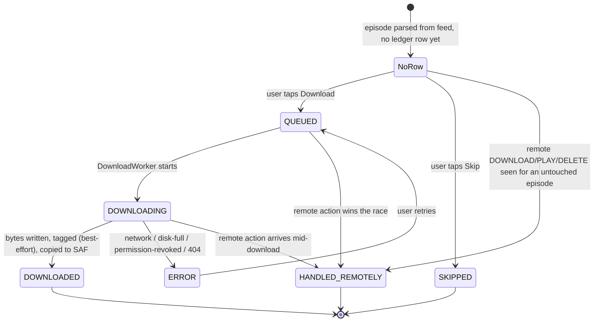

`DOWNLOADED`, `SKIPPED`, and `HANDLED_REMOTELY` are all terminal — none of them are ever
automatically revisited by sync logic. A later remote action arriving for an already-`DOWNLOADED`
episode is a no-op (idempotent), not a state change; test this explicitly (§7 item 8, "triage
durability" — the highest-value test in the project).

---

## 10. Key flows

### Download → mark-on-download

Ledger write happens **before** any network push, and the push itself is not a direct HTTP call from
the download path — it's a trigger. `DownloadWorker` writes the durable ledger row and then enqueues
an expedited `SyncWorker` run, which performs the actual outbox drain (the same code path §6's sync
sequence already covers). This keeps `:core:download` free of any GPodder-client dependency and
means there is exactly one piece of code that POSTs episode actions, not two — see
[§12](#12-open-decisions--resolve-beforewhile-implementing) for the rationale flagged as a decision
to confirm.

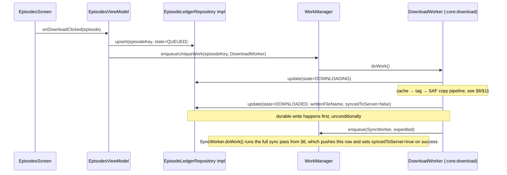

### Skip → mark-on-skip

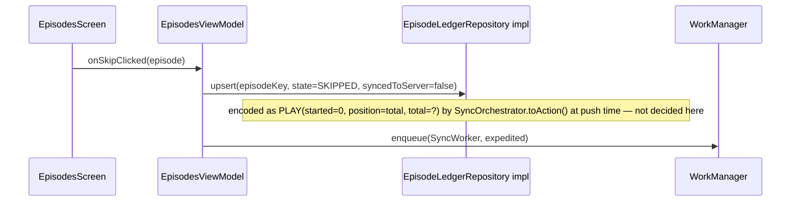

### Failed-POST recovery (durability proof)

No separate diagram needed — this is just "the sync pass runs again later." Because
`syncedToServer` stays `false` until a confirmed 2xx, a failed POST self-heals on the next periodic
`SyncWorker` run (WorkManager's own retry/backoff, not hand-rolled — CLAUDE.md §3) with no special
recovery code. This is precisely why the outbox flag is durable in the DB rather than tracked
in-memory (§5).

---

## 11. Naming & tagging pipeline

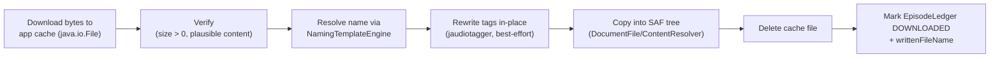

Extension resolution order (§6): response `Content-Type` → URL path extension (query string ignored)
→ `.mp3` fallback. Collision suffixing (` (2)`, ` (3)`, ...) and the UTF-8-byte-safe truncation rules
belong entirely inside `NamingTemplateEngine` (`:core:naming`) — `:core:download` just calls
`resolve()` and uses whatever comes back; it should contain zero string-sanitisation logic of its
own.

**Built (Tier 2 + Tier 4b):** the whole flowchart. `EnclosureDownloader` does A/B (resumable HTTP
into the app cache, `Range` continuation, truncated-body detection), `EpisodeDownloader` sequences
C→F, `AudioTagWriter` is step D (see `docs/decisions/0006` for why the Adonai/Kaned1as Android
fork), and `DownloadWorker` writes G. Tag writes are per-field best-effort
(`TagWriteOutcome.PartialSuccess` lists any `FieldKey` the container wouldn't accept) with a
container-level `Failure` for an unreadable file — never an exception, matching CLAUDE.md §6's
"never lose a successful download because a tag write failed."

Two things the flowchart doesn't show, both discovered by building it:

- **The cache file is renamed before tagging.** jaudiotagger picks its reader from the *file
  extension*, so tagging a `.partial` scratch file always fails ("no reader associated with this
  extension") and every download would have arrived untagged. The download keeps the stable
  `.partial` name so a resume knows what to look for; step D renames it to the extension the file
  is about to be delivered under. Caught by a test, not by review.
- **Step E goes through the `DownloadTarget` port** (`docs/decisions/0011`), not `DocumentFile`
  directly — a test seam, since a SAF write needs a real `DocumentsProvider`. `SafDownloadTarget`
  is the only implementation and is itself untested.

---

## 12. Open decisions — resolve before/while implementing

CLAUDE.md is explicit that some of these must be **verified against AntennaPod's source**, not
guessed, because gpodder-sync semantics beyond the four endpoints are convention, not specification.
Recording them here so they don't get silently decided mid-implementation; each should graduate to a
short ADR in `docs/decisions/` once resolved.

1. **Resolved** — Skip-as-`PLAY` when duration is unknown. See
   `docs/decisions/0002-skip-as-play-encoding.md`: matches AntennaPod's own convention
   (`started = 0`, `position = total`, `total = duration` if known else `0`, never fabricated).
   Implemented and tested in `:core:sync` (`toOutboundAction()`, `OutboundEpisodeActionTest`).
2. **Resolved** — Subscriptions `add`/`remove` response shape. See
   `docs/decisions/0009-gpodder-api-wire-contract.md`: `gpodder_subscriptions` is a state table,
   not an append-only log, so without `since`, `add` is the **complete current set** and is
   **disjoint** from `remove` by construction. CLAUDE.md §5's `set = add − remove` is correct as
   specified; `SyncOrchestrator.pullSubscriptions()` needed no change. Verified by reading both
   servers' source **and confirmed against a live `opodsync` 0.5.3 container** (2026-07-31) —
   `.devcontainer/docker-compose.yml` now works and `OpodsyncIntegrationTest` passes against it.
3. **Resolved** — `:core:gpodder` is now `kotlin("jvm")`, not `com.android.library`. See
   `docs/decisions/0007-core-gpodder-is-a-jvm-module.md`: nothing in the module touches an Android
   API, so a JVM module compiles that property in rather than leaving it to review, and its
   MockWebServer tests run on the plain `test` task with no Robolectric.
4. **Resolved (Tier 4b).** "Trigger a sync pass" vs. "download worker POSTs directly" — settled as
   §10 documents it: `DownloadWorker` writes the durable ledger row and then asks for a pass through
   the `SyncTrigger` interface (`:core:download`), which `:app`'s `WorkScheduler` implements by
   enqueueing an expedited `SyncWorker`. Exactly one piece of code posts episode actions, and
   `:core:download` has no GPodder dependency at all. `DownloadWorkerTest` asserts the trigger fires
   once on a delivery and never on a failure; `SyncOrchestratorTest`'s "download, failed POST, app
   restart" case still covers the durability property behind it.
5. **Resolved** — Fallback for `pubDate`'s device timezone. See
   `docs/decisions/0004-naming-date-timezone-and-missing-date-fallback.md`: `ZoneId` is injected
   into `DefaultNamingTemplateEngine` at construction (never re-resolved mid-call); the "same
   episode, same date across retries" guarantee is upheld by reusing `EpisodeLedgerRow.writtenFileName`
   on retry (§6/§11), not by anything inside `:core:naming` itself. A genuinely missing `pubDate`
   formats as the sortable placeholder `"00000000"`, never an empty string.
6. **New, resolved** — `EpisodeLedgerRow` needed two more denormalised fields than originally
   specified in §4. See `docs/decisions/0001-episode-ledger-row-denormalized-fields.md`: `feedUrl`,
   `enclosureUrl`, and `durationSeconds` are captured at write time so the outbox can build a valid
   `EpisodeAction` even if the originating `Episode` row has since been pruned (feed unsubscribed
   before a failed push retries). `:core:sync` still only depends on `FeedRepository`,
   `EpisodeLedgerRepository`, `SyncStateRepository`, and `GpodderClient` — never `EpisodeRepository`
   — exactly as §2/§5 originally specified.
7. **New, resolved (and amended in Tier 3)** — Which clock the `EpisodeAction.timestamp` field
   represents. See `docs/decisions/0003-gpodder-action-timestamp-as-utc.md`: Podsilo emits the bare
   UTC form, and parses bare / `+HH:MM` / `Z` alike. The original assumption that servers only ever
   send the offset-less form was **wrong** — see decision #8 below.
8. **New, unresolvable — a real limitation, not a design choice.** `nextcloud-gpodder` >= 3.13.3
   silently discards every posted episode action that isn't `PLAY` (`filterOnlyPlays` in
   `EpisodeActionController`) and still returns HTTP 200. **`DOWNLOAD` actions therefore never reach
   the shared log on a real Nextcloud**, making CLAUDE.md §1 requirement 9's cross-client half
   unachievable there. Author-approved decision: keep emitting `DOWNLOAD` (honest, and correct
   against `opodsync`/older servers), document the gap. Full analysis of what still works and what
   doesn't: `docs/decisions/0008-nextcloud-gpodder-discards-download-actions.md`. **Do not** "fix"
   this by emitting `PLAY` on download — CLAUDE.md §5 forbids it, and 0008 explains why.
9. **New, resolved** — The rest of the wire contract (action-name casing, the `-1` absent-value
   sentinel, bare-array POST body, auth headers, `since` boundary inclusivity, and where the two
   reference servers disagree). See `docs/decisions/0009-gpodder-api-wire-contract.md`; handled at
   the DTO boundary in `:core:gpodder` so no caller sees the differences.
10. **New, resolved (Tier 4a)** — App-password encryption is abstracted behind an `AppPasswordCipher`
    interface (production: `KeystoreAppPasswordCipher`, AES-256/GCM in the Android Keystore; tests: a
    fake), so `:core:datastore`'s store/serialise logic is JVM-testable while the Keystore stays out
    of the Robolectric path. See `docs/decisions/0010-app-password-cipher-behind-interface.md`. The
    real Keystore round-trip is verified on-device only (Tier 4b) — stated as a known gap, not tested.
11. **New, resolved (Tier 4a)** — `EpisodeLedgerRepository` needed an `observeEpisodes(filter):
    Flow<List<EpisodeListItem>>` method in addition to the row-typed `observe(filter)`. "New" is the
    *absence* of a ledger row (§9), so it can't be an `EpisodeLedgerRow`; the UI list is
    `EpisodeListItem(episode, ledger?)`, and the Room impl resolves the filter — including the
    `pubDate >= Feed.firstSeenAt` backlog cutoff — in one SQL join (`EpisodeLedgerDao.observeNewEpisodes`).
    `:core:sync` is unaffected (it only reads the ledger via `getUnsynced`).
12. **New, resolved (Tier 4b)** — the SAF write sits behind a `DownloadTarget` port
    (`docs/decisions/0011`). A test seam, not a portability layer: a `DocumentFile` write needs a
    real `DocumentsProvider`, so without it the entire download pipeline would be testable only on
    an emulator this project has never booted. `SafDownloadTarget` is the sole implementation and is
    itself unverified except by running the app.
13. **New, resolved (Tier 4b)** — Hilt moved from Tier 4c into 4b. `@HiltWorker` is how a worker
    gets its dependencies; the alternative was the hand-written service locator CLAUDE.md §3
    forbids. Hilt 2.60.1 against AGP 9.3.1 was unproven here and was smoke-tested first — it works.
14. **New, resolved (Tier 4b)** — the recurring ktlint-vs-detekt formatting fight is settled by
    configuration rather than by reformatting code every tier: `ktlintCheck` is the sole authority
    on formatting, detekt's duplicate copies of those rules (`Indentation`, `ParameterListWrapping`,
    `ArgumentListWrapping`, `Wrapping`, `MaximumLineLength`) are off, and `.editorconfig` now sets
    `max_line_length = 120` so ktlint stops producing lines detekt's own `MaxLineLength` rejects.
    An annotated constructor (`class W @AssistedInject constructor`, i.e. every Hilt worker) is
    formatted incompatibly by the two bundled ktlint versions, so no code shape satisfies both.

---

## 13. Build-order checklist

Maps CLAUDE.md §10's build order to the sections above. Use this as the implementation tracker —
check a step complete only once its linked section's diagrams/tables/interfaces are actually
implemented and tested, per the Definition of Done (CLAUDE.md §12).

| # | CLAUDE.md §10 step | Relevant section(s) here |
|---|---|---|
| 1 | Dev container + Gradle skeleton | *(done — see `docs/journal.md`)* |
| 2 | `:core:model` + `:core:database` (+ `:core:datastore`) *(done — Tier 4a)* | [§4](#4-database-schema), [§5](#5-domain-model--repository-ports) |
| 3 | `:core:feed` *(done — Tier 2/3 parsing + fetch, Tier 4b refresh worker)* | [§7](#7-external-interface-podcast-rssatom-feeds) |
| 4 | `:core:naming` | [§5](#5-domain-model--repository-ports) (`NamingTemplateEngine`), [§11](#11-naming--tagging-pipeline) |
| 5 | `:core:download` *(done — Tier 4b)* | [§8](#8-external-interface-storage-access-framework), [§10](#10-key-flows) (download flow), [§11](#11-naming--tagging-pipeline) |
| 6 | `:core:gpodder` | [§6](#6-external-interface-nextcloud-gpodder-api) |
| 7 | `:core:sync` | [§2](#2-module-architecture) (ports/adapters rule), [§6](#6-external-interface-nextcloud-gpodder-api) (sync-pass sequence), [§9](#9-episode-ledger-state-machine) |
| 8 | UI (`:feature:settings`, `:feature:episodes`) | [§3](#3-data-flow), [§8](#8-external-interface-storage-access-framework) (folder grant sequence) |
| 9 | Polish (foreground service, error surfacing, per-feed counts) | [§9](#9-episode-ledger-state-machine) (`ERROR` state), [§10](#10-key-flows) |

Before starting step 6 or 7, resolve open decisions #1, #2, and #4 from [§12](#12-open-decisions--resolve-beforewhile-implementing) — they change what the sync-pass sequence diagram actually does.
